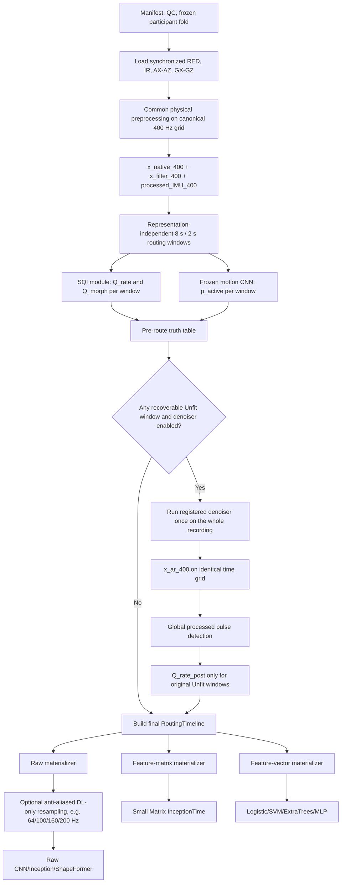

# Codex Implementation Contract — Variable-Length Feature Matrix, Small Matrix InceptionTime, and Representation-Independent SQI–Motion Routing

**Repository:** `KaifengXuuu/PPG-Frailty-pipeline`  
**Branch:** `dev0`  
**Baseline audited commit:** `21369a8e75ca6b534c0da510c50907c0430fb7e7`  
**Decision revision:** `2026-08-23`  
**Scope:** implement only the algorithm changes specified below. Do not broaden the task.

> **Authoritative routing correction:**  
> `Q_rate pass + Q_morph pass + high motion -> Unfit candidate`  
> It must **not** be downgraded to Acceptable.

---

## 0. Hard scope boundary

Implement only:

1. the ordered feature-matrix algorithm;
2. its Small single-network Matrix InceptionTime model;
3. the new representation-independent SQI–motion–denoiser routing system.

The routing system contains three separately configurable modules:

```text
SQI module
motion-detector module
denoiser module
```

Do **not** change:

- manifest, labels, roles, frozen participant splits, class order, or participant roster;
- optimizer, learning rate, weight decay, epochs, loss, sampler, class weights, seeds, or early-stopping policy;
- file -> role -> participant aggregation, metrics, ranking, reporting, or sweep logic;
- raw-model, feature-vector, fusion, ShapeFormer, peak-detector, reducer, or denoiser algorithms and parameters;
- historical scripts, historical results, or result directories;
- trained motion-detector weights, threshold, channel order, native window plan, preprocessing contract, or artifact identity;
- trained denoiser parameters or registered reducer defaults;
- thesis prose, README content, dashboards, reports, or unrelated refactors.

Only focused unit tests and smoke tests are authorized. Do not start a formal sweep. Do not retrain the motion detector.

---

# 1. Adjust the feature matrix

## 1.1 Replace the current fixed matrix

Replace:

```text
115 engineering features
× fixed K = 150
→ uniformly subsample long recordings
→ right-pad short recordings
```

with:

```text
146 pure window-level features
× variable K_i
```

For recording `i`:

\[
K_i=1+\left\lfloor\frac{L_i-W}{H}\right\rfloor
\]

where:

- `W = windows.engineering.length_s`;
- `H = windows.engineering.hop_s`;
- reference: `W=10 s`, `H=2 s` (80% overlap);
- named sensitivity profile: `W=10 s`, `H=5 s` (50% overlap).

Keep every complete chronological engineering window. Do not truncate, uniformly resample, or force a dataset-wide fixed `K`.

Padding is permitted only inside a mini-batch to that batch's maximum `K_i`. The row mask must exclude padded positions from the model.

## 1.2 Exact 146-channel window schema

| Group | Exact content | Count |
|---|---|---:|
| Existing engineering features | Current optical, statistical, spectral, IMU-axis, magnitude, and RED–IR window descriptors | 115 |
| Local morphology | Median and MAD of amplitude, half-width, rise time, decay time, rise slope, decay slope, and positive area | 14 |
| Interval-level descriptors | PPI mean, median, SD, IQR, MAD, CV; HR mean, median, SD | 9 |
| Successive-difference descriptors | Mean, median, SD, and MAD of `Delta PPI`; mean and median of `abs(Delta PPI)` | 6 |
| Local PRV contributions | `mean(Delta PPI^2)` and local `pNN50` | 2 |
| **Total** | Pure window-level predictors | **146** |

Do not add:

- the 282-field recording-level fixed vector;
- recording features repeated across windows;
- window-minus-file or window-minus-fixed-vector differences;
- file duration, row count, number of windows, filenames, participant IDs, file IDs, or role IDs;
- SQI scores, motion probabilities, quality tiers, source routes, denoiser status, coverage, or reason codes as predictors;
- explicit validity channels as extra predictor channels.

## 1.3 Event extraction and assignment

Do not rerun the peak detector independently in overlapping feature windows.

For each signal route:

```text
direct route    -> one global detection run on x_filter_400
processed route -> one global detection run on x_ar_400, only when x_ar exists
```

Each detection run must preserve:

- global peak identity;
- peak timestamps on the canonical 400 Hz time grid;
- PPI endpoints and original adjacency;
- detection-run identity;
- source route (`direct` or `processed`);
- complete valley-to-valley beat identity where morphology is eligible.

Assign events to each 10 s matrix window by timestamp:

- morphology beat: pulse-peak timestamp;
- PPI: interval midpoint;
- successive PPI pair: pair midpoint, only when the two PPIs are originally adjacent, valid, and belong to the same detection run and source route.

Minimum support:

```text
local morphology:
    at least 3 complete Q_morph-eligible direct beats

interval-level descriptors:
    at least 4 valid PPIs

successive-difference / local PRV contributions:
    at least 3 valid adjacent PPI pairs
```

If support is insufficient:

```text
value = NaN
validity = false
```

Fit imputation and robust scaling on outer-training recordings only. After transformation, an unavailable value may be represented by the training-fold centre (`0`), but validity remains provenance/QC and is not appended as a predictor channel.

## 1.4 Apply the common RoutingTimeline to matrix rows

Feature-matrix windows are generated only after the common routing system in Section 3 has produced a final `RoutingTimeline`.

For each 10 s matrix window, query every routing ownership cell with positive temporal overlap.

Use this deterministic rule:

```text
all overlapped cells = Excellent direct
    -> matrix row tier = Excellent
    -> all 146 channels may be available

no overlapped cell = Excluded
and at least one overlapped cell = Acceptable direct/processed
    -> matrix row tier = Acceptable
    -> only 17 rate channels are eligible:
       9 interval + 6 successive-difference + 2 local PRV-contribution

at least one overlapped cell = Excluded
    -> row_mask = false
    -> the row does not enter the matrix sequence
```

For an Acceptable row containing both direct and processed route cells:

- rate/PPI events from both routes may contribute;
- events keep their source-route provenance;
- no PPI or successive pair may cross a direct/processed or retained/excluded boundary;
- morphology and waveform-shape features remain unavailable.

For non-identity `x_ar`:

```text
Q_morph_post = not_applicable
morphology and waveform-shape features = unavailable
only rate/PPI-derived channels may be used
```

## 1.5 Required schema identity

Use new explicit identities, for example:

```text
window_feature_set_d146_v1
ordered_window_feature_matrix_d146_variable_k_v1
```

Do not reuse the current fixed-matrix schema name or hash.

---

# 2. Use Small single-network Matrix InceptionTime

Reuse the existing reviewed `InceptionTimeSingleNetwork` implementation. Do not invent a new convolution block.

Resolved model:

```yaml
model_id: InceptionTimeMatrix
variant: small
input_channels: 146
n_classes: 3
ensemble_size: 1
mask_aware_pooling: true
dropout: 0.20
kernel_sizes: [39, 19, 9]
dilation: 1
architecture_parameters:
  bottleneck_channels: 16
  out_channels: 16
  depth: 3
  residual_interval: 3
  branch_count: 4
  global_pooling: mask_aware_global_average
```

Exact structure:

```text
Input: [B, 146, K_batch]

Inception module × 3:
    optional 1×1 bottleneck to 16
    parallel Conv1d kernels 39, 19, 9; 16 outputs each
    MaxPool1d(3) + 1×1 Conv; 16 outputs
    concatenate -> 64 channels
    BatchNorm
    ReLU

Residual:
    after module 3

Head:
    mask-aware global average over valid columns
    Dropout(0.20)
    Linear 64 -> 3
```

Expected trainable parameters for 146 input channels and 3 classes:

```text
70,275
```

Do not add:

- an extra projection stem;
- GroupNorm;
- new kernel sizes;
- attention;
- extra hidden layers;
- a five-member ensemble.

The dataset/collation path must support:

```text
one recording stored as [146, K_i]
→ batch-only padding to max K_i
→ [B, K_batch] row mask
→ existing mask-aware model forward
```

Keep all current training and evaluation settings unchanged.

---

# 3. New representation-independent SQI–motion–denoiser system

## 3.1 Position in the complete pipeline

The routing system is placed after common physical preprocessing and before every representation-specific windowing or DL-only resampling step.



The canonical routing layer must run on the 400 Hz analysis grid before any representation optionally resamples its input to 64 Hz or another DL rate.

## 3.2 Canonical signal objects

The routing layer receives:

```text
record_id
participant_id
role
fs_hz = 400
canonical time coordinates

x_native_400        [N, 2]
x_filter_400        [N, 2]
processed_IMU_400   [N, 6] plus registered magnitudes/jerk
```

When required, the denoiser produces:

```text
x_ar_400            [N, 2]
```

Mandatory invariants:

```text
len(x_ar_400) = len(x_filter_400)
fs(x_ar_400) = 400 Hz
time coordinates unchanged
RED/IR alignment unchanged
all output values finite when status=success
```

Do not physically splice direct and processed sections into a new canonical waveform. Preserve:

```text
x_filter_400
x_ar_400, if available
RoutingTimeline with a source-view reference per final cell
```

A spliced signal may be generated for visualization only, never for canonical pulse/PPI extraction.

## 3.3 Three independent module switches

Use three independently declared runtime controls:

```yaml
quality:
  mode: off | diagnostics_only | route

artifact:
  motion_detector_enabled: true | false
  denoiser_enabled: true | false
```

Their meanings are:

| Module | Off | On |
|---|---|---|
| SQI | `off`: no SQI computed; `diagnostics_only`: SQI computed but cannot change routing | `route`: Q_rate/Q_morph participate in routing |
| Motion detector | `motion_state=off`; no model inference | frozen model emits one probability/state per native routing window |
| Denoiser | Unfit candidates are excluded | one registered reducer may run once per recording when a recoverable Unfit candidate exists |

Rules for switch combinations:

1. The motion detector does not depend on SQI.
2. SQI does not depend on the motion detector; when detector is off, `motion_state=off`.
3. The denoiser may be triggered by SQI failure, motion failure, or both.
4. `quality.mode=diagnostics_only` must not change retention or final routes.
5. If SQI is not in `route` mode, a denoiser result cannot promote a window by `Q_rate_post`; processed output remains diagnostic only and the original Unfit route remains excluded.
6. If SQI and motion detector are both off, the denoiser has no dynamic trigger and must not run.
7. Basic record integrity and canonical preprocessing failures remain fail-closed regardless of module switches.

## 3.4 Common native routing window plan

SQI and the motion detector use the same evidence windows:

```yaml
routing:
  window_s: 8.0
  hop_s: 2.0
  fs_hz: 400.0
  source_grid: canonical_acquisition_grid
```

Each native routing window stores:

```text
record_id
routing_window_id
start_s
stop_s
centre_s
start_sample_400
stop_sample_400
```

The orchestration interface is time-based, but the frozen motion CNN still receives exactly:

```text
8 s × 400 Hz = 3200 samples
```

Do not feed a 64 Hz tensor to the frozen motion CNN. Do not change its sample length.

SQI formulas must receive `fs_hz` and time bounds explicitly. Do not hard-code sample counts when the definition is naturally expressed in seconds or hertz.

## 3.5 Global direct event identities

Before evaluating window-level endpoint SQI:

```text
complete x_filter_400
→ one common direct pulse-detection run
→ global peaks
→ PPI endpoints and adjacency
→ complete valley-to-valley beat identities
```

Do not redetect peaks independently in every overlapping routing window.

Each routing window restricts the global event table by timestamp and uses:

- samples inside the 8 s evidence window;
- peaks and complete beats assigned to that time range;
- valid PPIs and adjacent PPI pairs assigned to that time range;
- physical processed IMU over the same time range.

This global-event rule applies equally to SQI evidence and later feature extraction.

## 3.6 Window-level motion detector

Keep the trained motion detector unchanged:

```text
native window = 8 s
native hop = 2 s
native fs = 400 Hz
native 8-channel order = unchanged
native preprocessing = unchanged
weights = unchanged
frozen threshold = unchanged
```

For each native routing window, expose and preserve:

```text
p_active
frozen threshold
motion_state = low | high | unavailable
model artifact identity and SHA-256
input schema identity and SHA-256
```

The current file-level median may remain in diagnostics, but it must not drive routing.

No motion-model fit, calibration, threshold fit, fine-tuning, or retraining is allowed in this task.

## 3.7 Window-level endpoint SQI

For every native routing window, output:

```text
Q_rate score/state
Q_morph score/state
component raw values
component normalized values
coverage
hard-exclusion evidence
reason codes
```

Use:

```text
amplitude-preserving x_filter_400 / x_native_400
physical processed IMU_400
global beat/PPI identities restricted by timestamp
```

Do not compute amplitude-, clipping-, flatline-, or motion-dependent SQI components from median/IQR-normalized DL tensors.

Preserve:

```text
Q_morph pass implies Q_rate pass
```

Threshold policies:

```text
fixed policy:
    preserve configured Q_rate and Q_morph thresholds

outer-train empirical policy:
    fit from outer-training routing-window component rows only
    each participant contributes equal total calibration weight
    freeze and apply unchanged to held-out participants
```

Do not tune SQI thresholds or component weights using frailty labels.

## 3.8 Window-level pre-route truth table

Run structural integrity first. An irrecoverable structural failure is `Excluded`, not a denoiser candidate.

### When `quality.mode=route`

| Q_rate | Q_morph | Motion detector state | Pre-route result |
|---|---|---|---|
| Pass | Pass | `off` or `low` | `Excellent direct` |
| **Pass** | **Pass** | **`high`** | **`Unfit candidate`** |
| Pass | Fail / unavailable | `off` or `low` | `Acceptable direct` |
| Pass | Fail / unavailable | `high` | `Unfit candidate` |
| Fail / unavailable | any | any non-structural state | `Unfit candidate` |
| any | any | `unavailable` while detector enabled | `Unfit candidate` |
| structural hard failure | — | — | `Excluded` |

The bold row is authoritative:

```text
Q_rate pass + Q_morph pass + high motion
    -> Unfit candidate
```

Do not implement `Acceptable` for this combination.

### When SQI is `off` or `diagnostics_only`

Routing must not use Q states.

```text
motion detector off:
    configured static roles -> direct compatibility route
    non-static roles -> Unfit candidate

motion detector on + low motion:
    direct compatibility route

motion detector on + high/unavailable motion:
    Unfit candidate
```

For compatibility routes created without active SQI, save:

```text
sqi_assessed = false
```

Do not claim that the waveform was endpoint-validated merely because the compatibility route uses the internal label `Excellent`.

## 3.9 Whole-record denoiser execution with selective use

If all conditions below are true:

```text
denoiser_enabled = true
at least one routing window = recoverable Unfit candidate
recording is not structurally hard-invalid
```

run the registered reducer once on the complete recording:

```text
x_filter_400 + synchronized processed IMU_400
→ ArtifactReducer once
→ aligned x_ar_400
```

Do not run one reducer instance per overlapping routing window. Do not overlap-add separately denoised windows.

After successful whole-record reduction:

```text
complete x_ar_400
→ one processed pulse-detection run
→ processed peak/PPI identities
```

Only windows that were `Unfit candidate` before reduction are reassessed.

For those windows:

```text
compute Q_rate_post only
Q_morph_post = not_applicable
```

Final result:

| Post-reduction result | Final route |
|---|---|
| `Q_rate_post pass` and `quality.mode=route` | `Acceptable processed`, source=`x_ar_400` |
| `Q_rate_post fail/unavailable` | `Excluded` |
| reducer failure | `Excluded` |
| SQI not in route mode | processed output is diagnostic only; original Unfit window remains `Excluded` |

Windows already classified as `Excellent direct` or `Acceptable direct` continue to reference `x_filter_400`; they must not silently switch to `x_ar_400` merely because the denoiser ran elsewhere in the recording.

## 3.10 Convert overlapping evidence windows into one RoutingTimeline

The 8 s evidence windows overlap at a 2 s hop. Each sample must nevertheless receive one final route.

Use centre-midpoint ownership cells:

1. calculate each evidence-window centre time;
2. place ownership boundaries at midpoints between consecutive centres;
3. extend the first ownership cell to the first time covered by valid routing evidence;
4. extend the last ownership cell to the last time covered by valid routing evidence;
5. mark any uncovered edge interval as `Excluded / evidence unavailable` rather than inventing a route.

Each ownership cell inherits the final result of its evidence window.

The resulting cells must be:

```text
non-overlapping
chronologically ordered
unique over the covered time axis
stored in seconds and canonical 400 Hz sample indices
```

## 3.11 RoutingTimeline output contract

Each final ownership cell must store at least:

```text
record_id
participant_id
role
routing_window_id
cell_id
cell_start_s
cell_stop_s
start_sample_400
stop_sample_400

sqi_mode
sqi_assessed
direct_q_rate_score/state
direct_q_morph_score/state
motion_detector_enabled
motion_probability
motion_threshold
motion_state
pre_route_tier

denoiser_enabled
denoiser_requested
denoiser_status
post_q_rate_score/state
final_tier
source_route = direct | processed | none
source_view = x_filter_400 | x_ar_400 | none
reason_codes

config hash
SQI/calibrator hash
motion-model/input-schema hash
reducer/version/parameter hash
```

These fields are routing, QC, and provenance metadata. They are not frailty predictors unless a separate future ablation explicitly authorizes them.

## 3.12 Representation materialization after routing

### Raw 8-channel representation

Order of operations:

```text
RoutingTimeline on 400 Hz grid
→ select only time ranges that are Excellent direct
→ generate configured raw windows from x_filter_400 + processed IMU_400
→ optional anti-aliased DL-only resampling to 64/100/160/200 Hz
→ raw model
```

A raw window is eligible only when its complete time support is `Excellent direct`.

Do not feed non-identity `x_ar` into the raw waveform classifier in this task.

### Feature matrix

Use Section 1.4. Generate matrix windows on the 400 Hz feature grid after routing.

### Fixed feature vector

- morphology and dual-wavelength waveform features: only `Excellent direct` beats;
- rate/PPI/eligible PRV: `Excellent direct`, `Acceptable direct`, and `Acceptable processed` blocks;
- no PPI, successive pair, or morphology sequence may cross a route or excluded boundary.

### Fusion

- raw branch: eligible `Excellent direct` windows only;
- feature branch: route-aware fixed vector;
- concatenate once at file level after raw-window embedding pooling.

## 3.13 Sampling-rate boundary

The canonical routing, event, morphology, feature, and audit grid remains 400 Hz.

Downstream DL resampling is representation-specific and occurs only after route eligibility is known.

Required invariant:

```text
changing raw-model dl_fs must not change:
    RoutingTimeline
    SQI values/states
    motion probabilities/states
    denoiser trigger/result
    400 Hz feature values
```

External recordings with another acquisition rate must use an explicitly registered anti-alias conversion to the required canonical/motion-model grid before entering this routing module. Do not make the frozen motion CNN silently accept arbitrary sample counts.

---

# 4. Motion-model CV boundary

Do not train a new motion model in this task.

Loading policy:

```text
formal frailty OOF cell:
    use an already-existing motion artifact whose training/held-out participant
    identities and split hash match that cell

if no matching fold artifact exists:
    fail closed or keep motion routing disabled for that formal OOF cell
    do not silently use the all-29 model and claim leakage-free OOF

algorithm smoke / final all-data inference:
    the existing all-29 frozen bundle may be reused
    preserve its in_sample_for_frailty29 provenance warning
```

Changing the adapter from file-median output to native window output does not authorize retraining.

---

# 5. Permitted code changes

Keep the diff limited to algorithm wiring, contracts, one named config, and focused tests.

Expected paths:

```text
src/ppg_frailty/features/
    registry.py
    engineering.py
    optional new window_matrix.py

src/ppg_frailty/contracts.py
    variable-K matrix contracts
    routing-window / ownership-cell / RoutingTimeline contracts

src/ppg_frailty/training/datasets.py
    variable-length feature-matrix storage and batch padding

src/ppg_frailty/models/factory.py or model registry
    resolve InceptionTimeMatrix variant=small and input_channels=146

src/ppg_frailty/quality/
    endpoint SQI window orchestration
    routing.py
    optional new routing_timeline.py
    motion_bundle_adapter.py: expose native window probabilities; remove file median as route driver

src/ppg_frailty/artifact/
    orchestration only if required for one whole-record call and route metadata
    do not alter reducer algorithms or parameters

src/ppg_frailty/experiment.py
    minimal integration only
    do not change training/evaluation protocol

tests/
    focused unit and smoke tests

configs/
    one named matrix/routing config may be added or updated
    only algorithm fields explicitly listed in Sections 1–3 may differ
```

Do not modify reporting, sweep scheduling, metrics, aggregation, manifests, split files, historical code, result artifacts, or trained model files.

---

# 6. Acceptance tests

The task is complete only when all tests below pass.

## 6.1 Feature matrix

- a 300 s file produces:
  - `K=146` for 10 s / 2 s;
  - `K=59` for 10 s / 5 s;
- no uniform row selection or dataset-wide fixed `K`;
- matrix width is exactly 146;
- no fixed-vector, technical, SQI, motion, route, coverage, or delta channels;
- global pulse identities are reused; no independent peak detection per overlapping matrix window;
- direct/processed/excluded boundaries prevent cross-boundary PPIs and successive pairs;
- extra right-padding with `row_mask=false` does not change logits.

## 6.2 Matrix model

- resolved model is `variant=small`, single network;
- exact parameter count is 70,275 for 146 channels and 3 classes;
- output shape is `[batch, 3]`;
- variable-length recordings can share a batch;
- changing only padded values cannot change the output;
- no extra stem, GroupNorm, attention, new kernel set, or ensemble appears in the resolved config.

## 6.3 Independent switches

Test all eight Boolean combinations of:

```text
SQI route active / inactive
motion detector on / off
denoiser on / off
```

Also separately test `quality.mode=diagnostics_only`.

Required behaviors:

- `diagnostics_only` cannot change retention or final route;
- motion detector can run with SQI off;
- SQI can route with motion detector off;
- denoiser can be triggered by SQI failure even when motion detector is off;
- denoiser does not run when both SQI route and motion detector are inactive;
- without SQI route, denoiser output cannot promote an Unfit window.

## 6.4 SQI and motion native window outputs

- SQI and motion use identical 8 s / 2 s window boundaries;
- each native routing window has exactly one SQI outcome when SQI is computed;
- each native routing window has exactly one motion outcome when detector is enabled;
- routing never uses the whole-file motion median;
- file median, if emitted, is diagnostics only;
- changing downstream raw-model sampling rate does not change SQI or motion outputs.

## 6.5 Authoritative truth-table regression

The following case must be asserted explicitly:

```text
Q_rate = pass
Q_morph = pass
motion = high
expected pre-route tier = Unfit candidate
```

A result of `Acceptable` fails this task.

Also test every other row in Section 3.8.

## 6.6 Denoiser and post-route

- reducer is invoked at most once per recording;
- reducer receives the complete canonical recording, not separate overlapping windows;
- output retains identical length and 400 Hz time coordinates;
- only original Unfit windows are post-evaluated;
- post-reducer `Q_morph` is always `not_applicable`;
- `Q_rate_post pass` can promote only to `Acceptable processed`;
- direct Excellent/Acceptable cells still reference `x_filter_400` after a reducer has run;
- reducer failure produces Excluded cells and never silently falls back while retaining a reducer label.

## 6.7 RoutingTimeline

- ownership cells are non-overlapping and chronological;
- each covered 400 Hz sample belongs to exactly one final cell;
- uncovered edge samples are explicitly Excluded/unavailable;
- every final cell records source route and source view;
- no PPI crosses direct/processed/excluded boundaries;
- no canonical hybrid waveform is used for peak detection.

## 6.8 Frozen motion model

- motion-model artifact SHA-256 is unchanged;
- weights are unchanged;
- frozen threshold is unchanged;
- channel order and preprocessing schema are unchanged;
- no training, fine-tuning, calibration, or threshold-fitting call occurs;
- native model input remains 8 s × 400 Hz.

## 6.9 Scope

`git diff --name-only` must contain only the permitted algorithm/config/test paths in Section 5.

Any change to splits, labels, training hyperparameters, aggregation, evaluation, reporting, historical results, motion-model artifacts, or reducer parameters fails this task.
