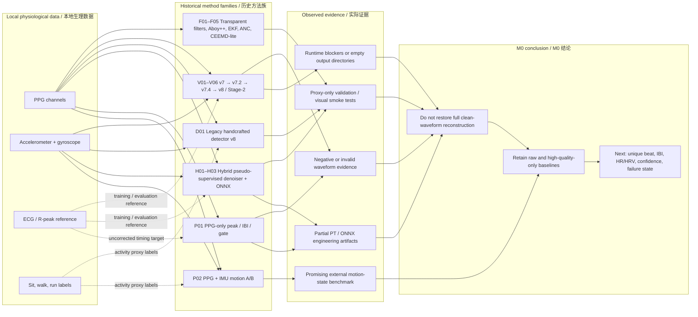

# 项目历史信号处理总图 / Historical Signal-Processing Map

本图把 M0 审计到的历史输入、五类 motion/heartbeat 路线、实际证据和最终研究决策放在同一条可追溯链上。实线表示运行数据流；虚线表示监督、评价或审计引用，不表示部署时输入。

## 图示判读 / Reading guide

- ECG 在图中均以虚线进入历史路线，表示它应当只作为监督/评价reference；v7 setup2 把它变成实质推理输入，是已登记的critical leakage。
- P02 的 external SIM 指标是 motion-state 候选证据，不是 clean-waveform reconstruction证据。
- PT/ONNX artifact只证明工程写出路径存在；没有完整 preprocessing/parity/holdout 时，不进入“strictly validated”。

