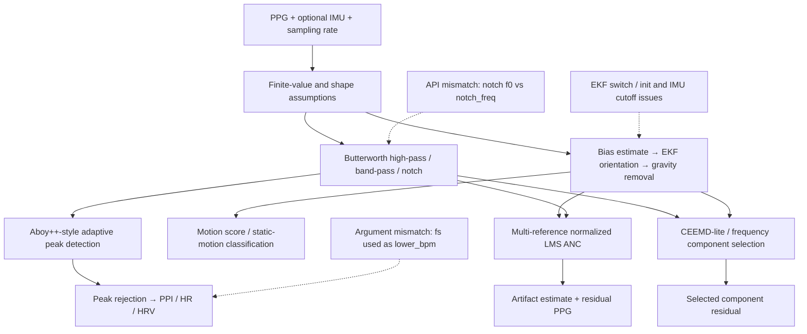
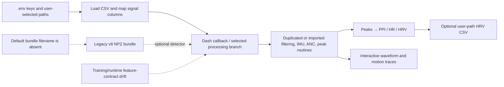

# M0 基础函数与 Dash 算法图 / Foundation Functions and Dash Flow

## A. `funcs.py` 公共算法族

## B. `ppg.py` 交互运行链

## 审计结论

基础算法透明且可作为 M3 候选，但当前双实现、参数错位、边界coverage和runtime默认路径使其处于 `implemented_unverified`；不得直接当作统一公共实现。

