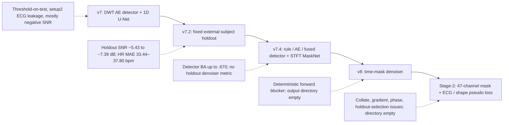
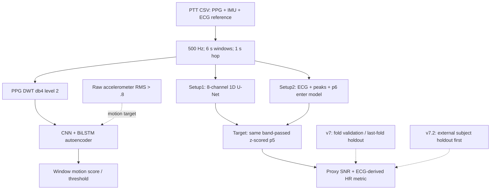
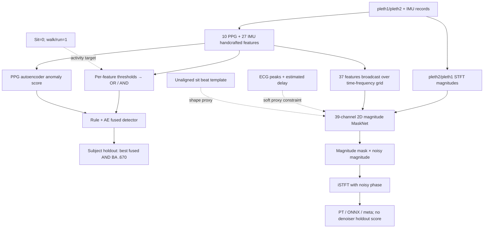
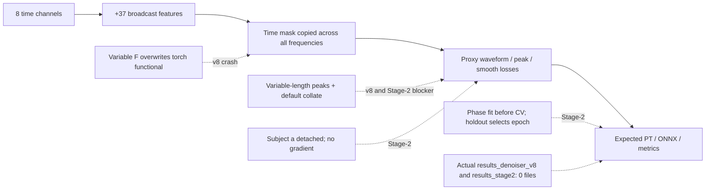

# v7 至 Stage-2 演化图 / v7-to-Stage-2 Evolution

## A. 版本演化与证据变化

```mermaid
flowchart LR
    V7["v7: DWT AE detector + 1D U-Net"] --> V72["v7.2: fixed external subject holdout"]
    V72 --> V74["v7.4: rule / AE / fused detector + STFT MaskNet"]
    V74 --> V8["v8: time-mask denoiser"]
    V8 --> S2["Stage-2: 47-channel mask + ECG / shape pseudo loss"]

    E7["Threshold-on-test, setup2 ECG leakage, mostly negative SNR"] -.-> V7
    E72["Holdout SNR −5.43 to −7.39 dB; HR MAE 33.44–37.80 bpm"] -.-> V72
    E74["Detector BA up to .670; no holdout denoiser metric"] -.-> V74
    E8["Deterministic forward blocker; output directory empty"] -.-> V8
    ES2["Collate, gradient, phase, holdout-selection issues; directory empty"] -.-> S2
```

## B. v7/v7.2 核心结构

```mermaid
flowchart TD
    CSV["PTT CSV: PPG + IMU + ECG reference"] --> WIN["500 Hz; 6 s windows; 1 s hop"]
    WIN --> DWT["PPG DWT db4 level 2"]
    DWT --> AE["CNN + BiLSTM autoencoder"]
    IMURMS["Raw accelerometer RMS > .8"] -. "motion target" .-> AE
    AE --> DET["Window motion score / threshold"]

    WIN --> U1["Setup1: 8-channel 1D U-Net"]
    WIN --> U2["Setup2: ECG + peaks + p6 enter model"]
    U1 --> PROXY["Target: same band-passed z-scored p5"]
    U2 --> PROXY
    PROXY --> SCORE["Proxy SNR + ECG-derived HR metric"]

    SPLIT7["v7: fold validation / last-fold holdout"] -.-> SCORE
    SPLIT72["v7.2: external subject holdout first"] -.-> SCORE
```

## C. v7.4 detector 与 MaskNet

```mermaid
flowchart TD
    REC["pleth1/pleth2 + IMU records"] --> FEAT["10 PPG + 27 IMU handcrafted features"]
    FEAT --> RULE["Per-feature thresholds → OR / AND"]
    FEAT --> PAE["PPG autoencoder anomaly score"]
    RULE --> FUSE["Rule + AE fused detector"]
    PAE --> FUSE
    ACT["Sit=0; walk/run=1"] -. "activity target" .-> RULE
    FUSE --> HOLD["Subject holdout: best fused AND BA .670"]

    REC --> STFT["pleth2/pleth1 STFT magnitudes"]
    FEAT --> BC["37 features broadcast over time-frequency grid"]
    STFT --> M39["39-channel 2D magnitude MaskNet"]
    BC --> M39
    M39 --> MASK["Magnitude mask × noisy magnitude"]
    MASK --> ISTFT["iSTFT with noisy phase"]
    ECG["ECG peaks + estimated delay"] -. "soft proxy constraint" .-> M39
    SIT["Unaligned sit beat template"] -. "shape proxy" .-> M39
    ISTFT --> ART["PT / ONNX / meta; no denoiser holdout score"]
```

## D. v8 与 Stage-2 阻断链

```mermaid
flowchart LR
    T8["8 time channels"] --> B37["+37 broadcast features"]
    B37 --> TM["Time mask copied across all frequencies"]
    TM --> LOSS["Proxy waveform / peak / smooth losses"]
    LOSS --> OUT["Expected PT / ONNX / metrics"]

    VARF["Variable F overwrites torch functional"] -. "v8 crash" .-> TM
    COLL["Variable-length peaks + default collate"] -. "v8 and Stage-2 blocker" .-> LOSS
    DETACH["Subject a detached; no gradient"] -. "Stage-2" .-> LOSS
    LEAK["Phase fit before CV; holdout selects epoch"] -. "Stage-2" .-> OUT
    EMPTY["Actual results_denoiser_v8 and results_stage2: 0 files"] -.-> OUT
```

