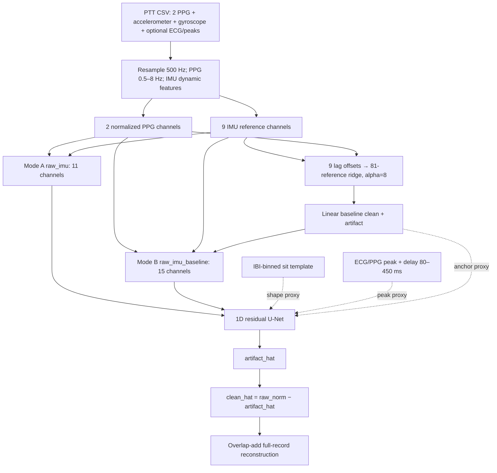
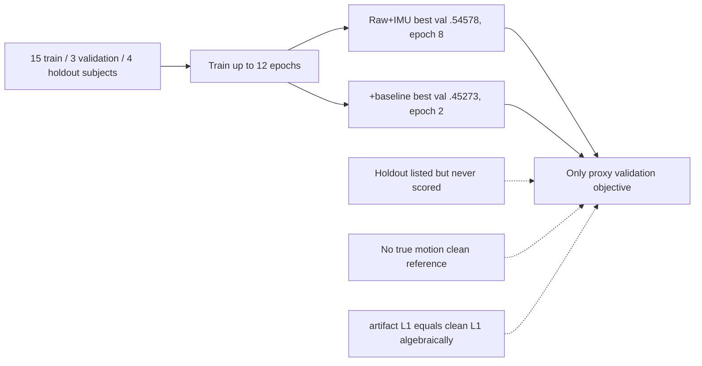
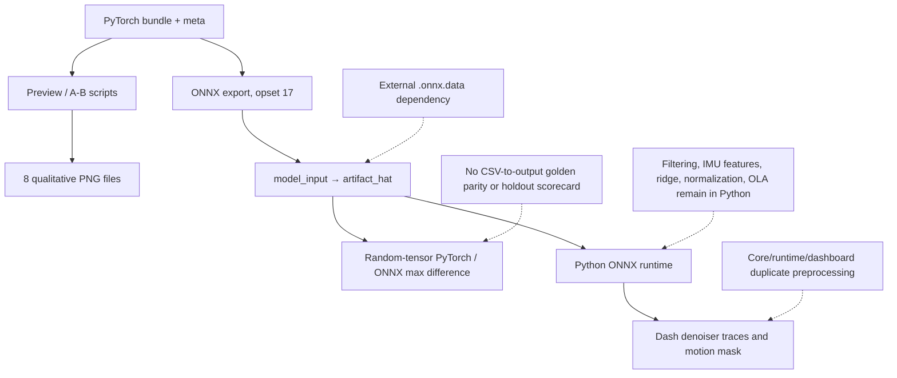

# Hybrid 去噪、导出与运行图 / Hybrid Denoiser Suite

## A. 数据、代理监督与模型

```mermaid
flowchart TD
    CSV["PTT CSV: 2 PPG + accelerometer + gyroscope + optional ECG/peaks"] --> PRE["Resample 500 Hz; PPG 0.5–8 Hz; IMU dynamic features"]
    PRE --> IMU9["9 IMU reference channels"]
    PRE --> PPG2["2 normalized PPG channels"]
    IMU9 --> LAG["9 lag offsets → 81-reference ridge, alpha=8"]
    PPG2 --> LAG
    LAG --> BASE["Linear baseline clean + artifact"]

    PPG2 --> A["Mode A raw_imu: 11 channels"]
    PPG2 --> B["Mode B raw_imu_baseline: 15 channels"]
    IMU9 --> A
    IMU9 --> B
    BASE --> B
    A --> UNET["1D residual U-Net"]
    B --> UNET
    UNET --> ART["artifact_hat"]
    ART --> CLEAN["clean_hat = raw_norm − artifact_hat"]

    SIT["IBI-binned sit template"] -. "shape proxy" .-> UNET
    ECG["ECG/PPG peak + delay 80–450 ms"] -. "peak proxy" .-> UNET
    BASE -. "anchor proxy" .-> UNET
    CLEAN --> OLA["Overlap-add full-record reconstruction"]
```

## B. 训练与证据边界

```mermaid
flowchart LR
    SPLIT["15 train / 3 validation / 4 holdout subjects"] --> TRAIN["Train up to 12 epochs"]
    TRAIN --> VAWA["Raw+IMU best val .54578, epoch 8"]
    TRAIN --> VAWB["+baseline best val .45273, epoch 2"]
    VAWA --> CLAIM["Only proxy validation objective"]
    VAWB --> CLAIM
    HOLD["Holdout listed but never scored"] -.-> CLAIM
    NOCLEAN["No true motion clean reference"] -.-> CLAIM
    EQ["artifact L1 equals clean L1 algebraically"] -.-> CLAIM
```

## C. Preview、ONNX 与 Dash runtime

```mermaid
flowchart TD
    PT["PyTorch bundle + meta"] --> PREVIEW["Preview / A-B scripts"]
    PREVIEW --> PNG["8 qualitative PNG files"]
    PT --> EXPORT["ONNX export, opset 17"]
    EXPORT --> ONNX["model_input → artifact_hat"]
    ONNX --> PARITY["Random-tensor PyTorch / ONNX max difference"]
    ONNX --> RUN["Python ONNX runtime"]
    RUN --> DASH["Dash denoiser traces and motion mask"]

    EXT["External .onnx.data dependency"] -.-> ONNX
    PY["Filtering, IMU features, ridge, normalization, OLA remain in Python"] -.-> RUN
    DRIFT["Core/runtime/dashboard duplicate preprocessing"] -.-> DASH
    NOSCORE["No CSV-to-output golden parity or holdout scorecard"] -.-> PARITY
```

