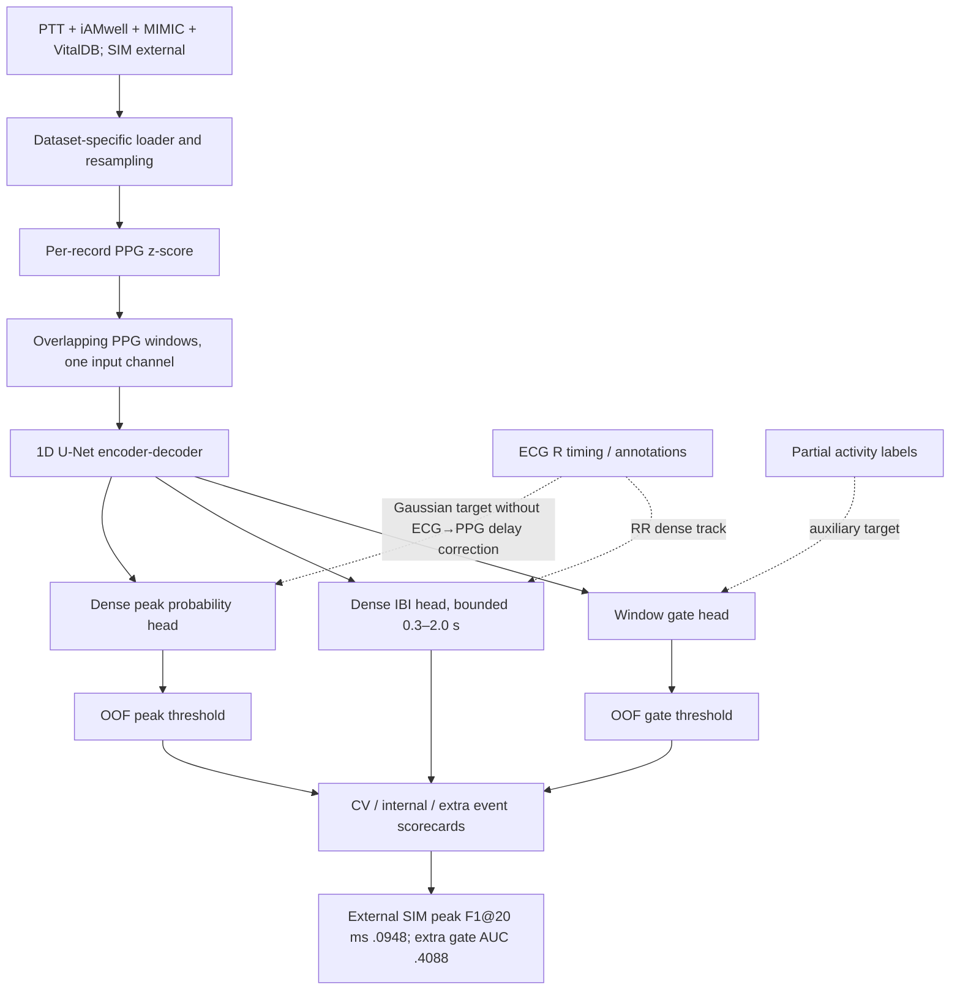
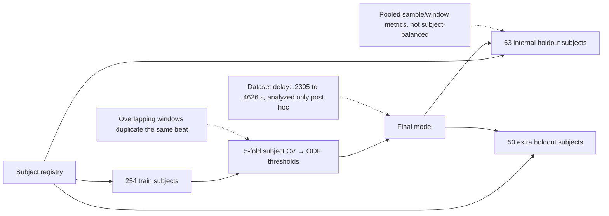
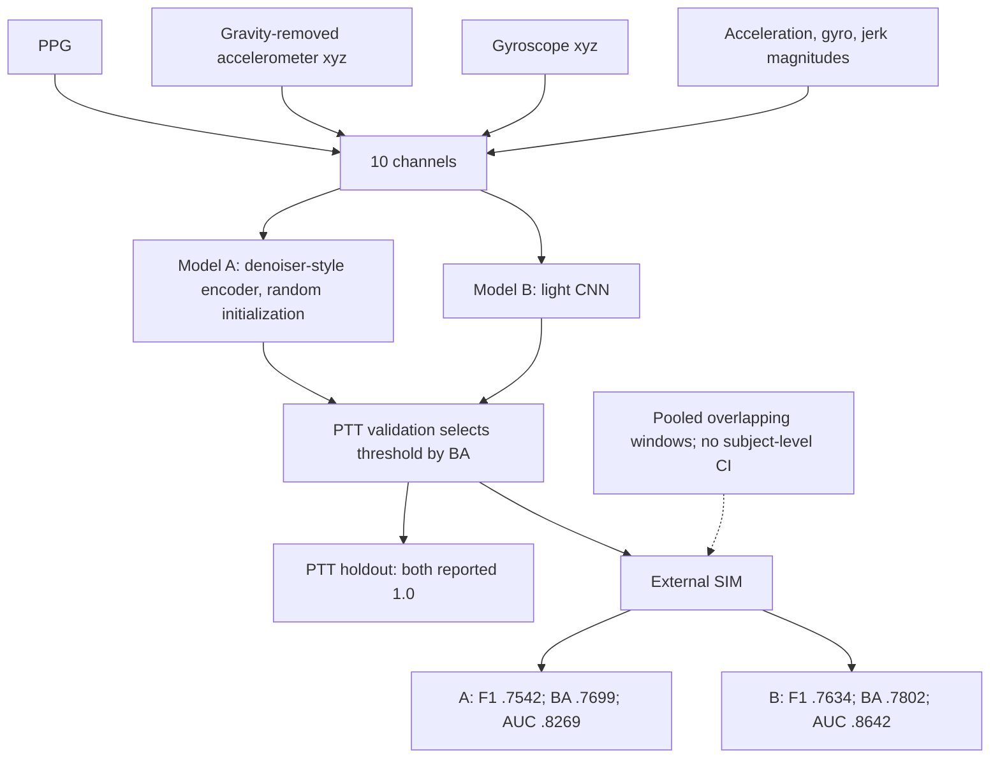

# Heartbeat 与 PPG+IMU Motion A/B 图 / Heartbeat and Motion A/B

## A. PPG-only peak / IBI / auxiliary gate

## B. 数据切分与关键偏置

## C. 独立 PPG+IMU motion detector A/B

## 路线分界

P01 与 P02 虽在同一训练脚本中，但输入、target和证据不同：P01 是 PPG-only 的历史 heartbeat尝试；P02 才是 PPG+IMU motion-state benchmark。后续不得把 P02 的外部性能解释为 P01 gate 或 peak 的性能。

