# M0 逐脚本算法结构图册 / Per-script Algorithm Atlas

本图册覆盖 M0 范围内承担算法、训练、评价、导出或运行职责的每个脚本。每节只画该文件的直接职责；跨脚本关系见上级总图。

## 1. `funcs.py`

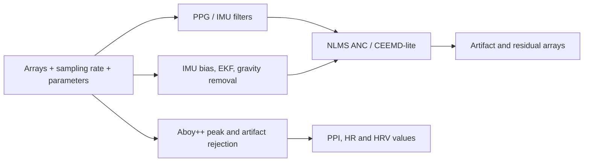

## 2. `ppg.py`

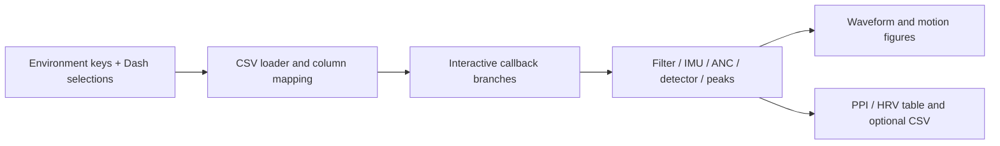

## 3. `pttppg_pipeline_v7.py`

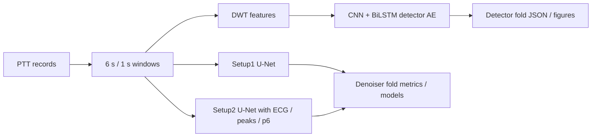

## 4. `cnnppg_v7.py`

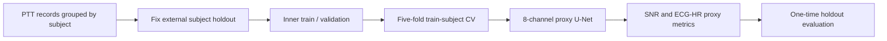

## 5. `pttppg_pipeline_v7_4_noleak_viz_ae.py`

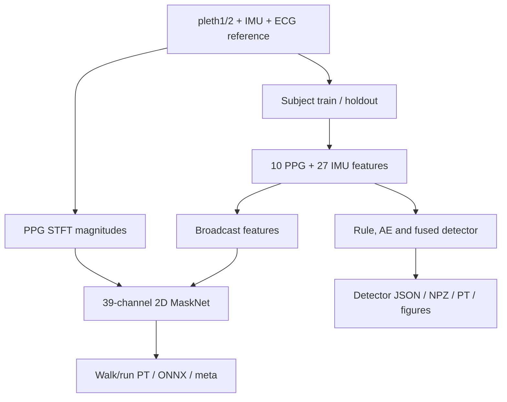

## 6. `pttppg_denoiser_v8_masknet.py`

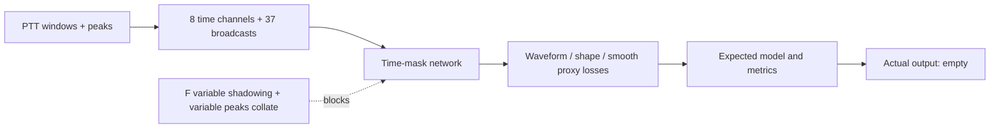

## 7. `pttppg_stage2_denoiser.py`

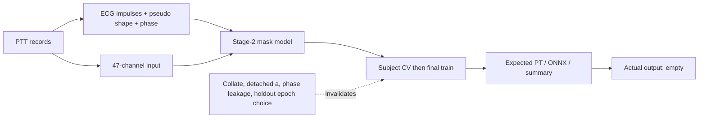

## 8. `pttppg_detector_v8_scores_audit_fix9.py`

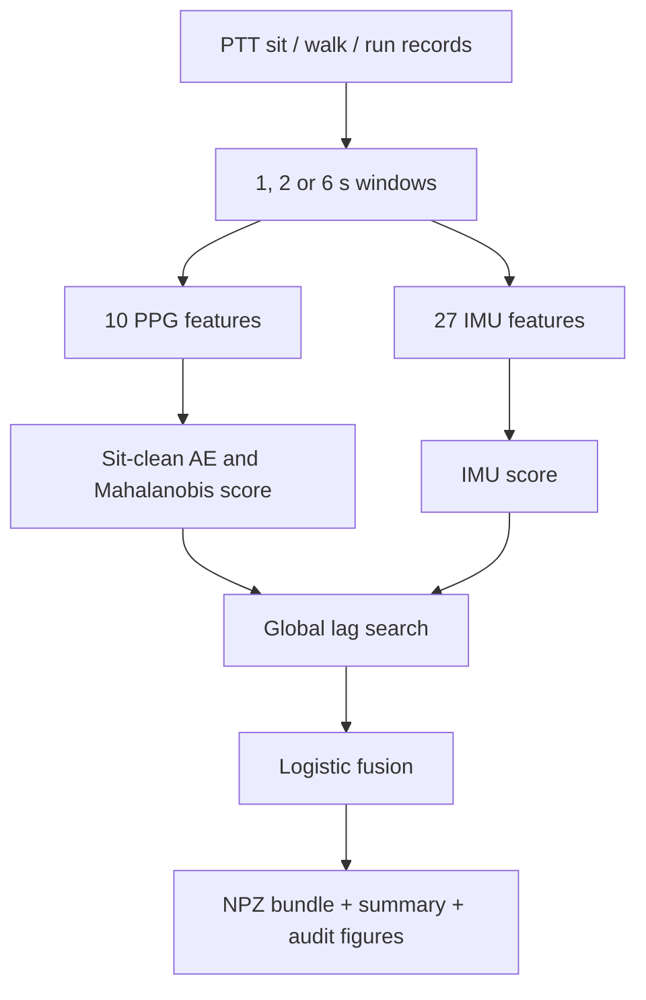

## 9. `pttppg_denoiser_hybrid_core.py`

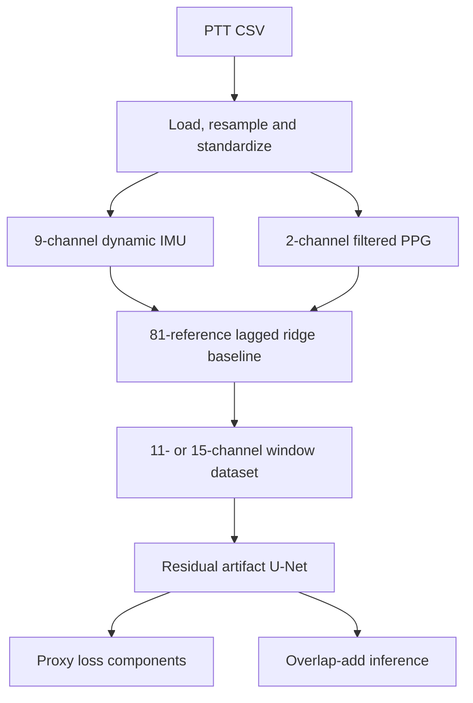

## 10. `pttppg_denoiser_hybrid_train.py`

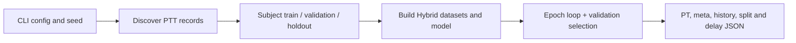

## 11. `pttppg_denoiser_hybrid_preview.py`

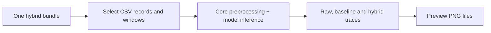

## 12. `pttppg_denoiser_hybrid_ab_compare.py`

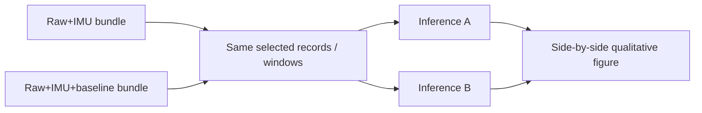

## 13. `pttppg_denoiser_hybrid_export_onnx.py`

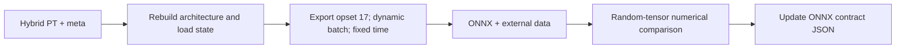

## 14. `pttppg_denoiser_onnx_runtime.py`

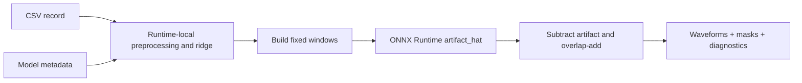

## 15. `ppg_denoiser_dash_utils.py`

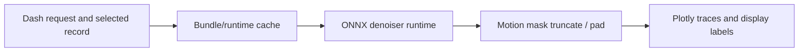

## 16. `ppg_peak_hr_gating_train.py`

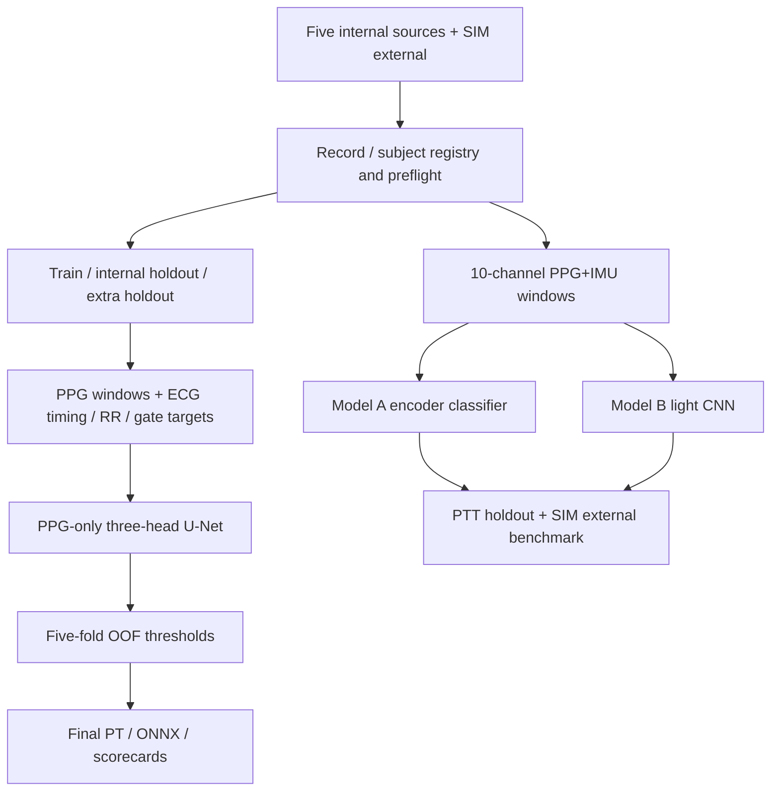

## 图册覆盖声明 / Coverage statement

以上16个入口覆盖 M0 中实际承担算法或运行职责的脚本。`funcs.py` 与 `ppg.py` 的重复实现被分别绘制；同一大脚本中的 PPG-only heartbeat 与 PPG+IMU A/B 被画成两条分支，防止证据混用。

