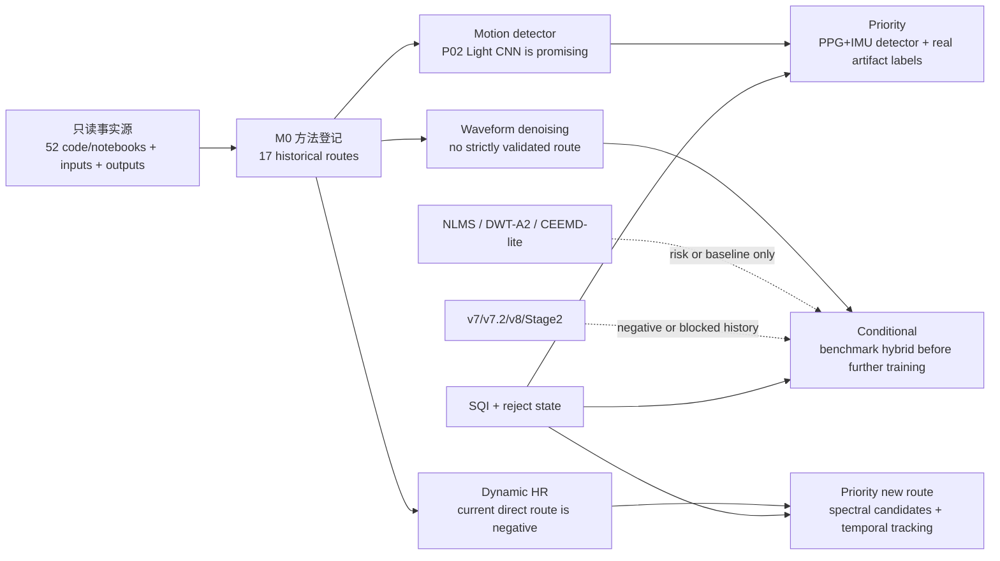
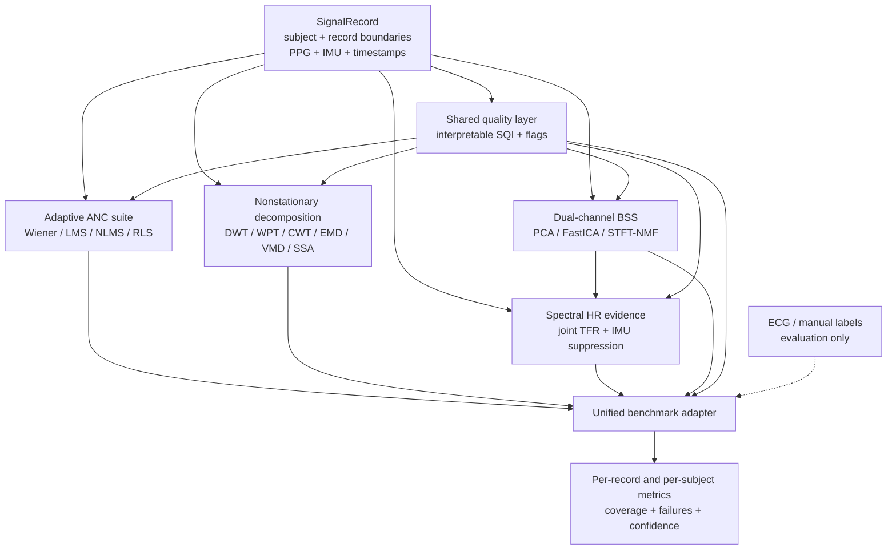
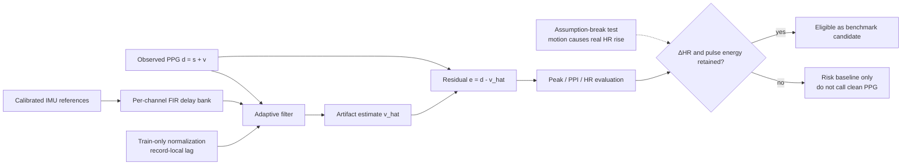
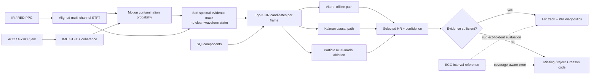
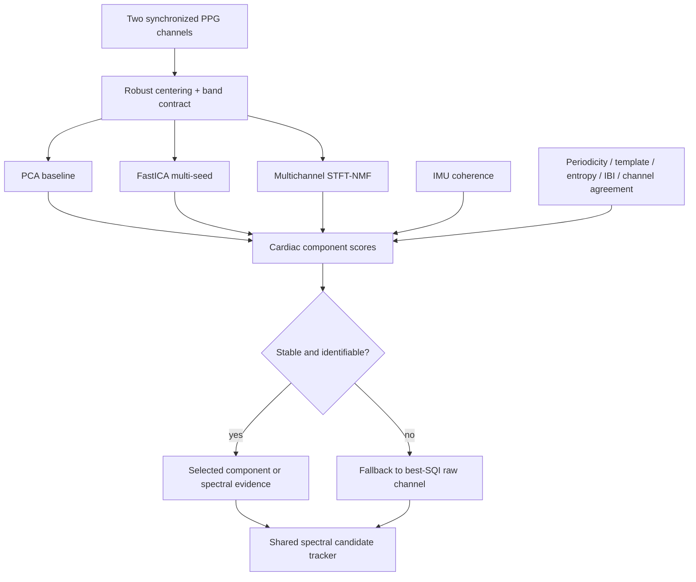
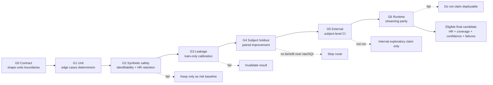

# M0 五类方法、统一实现与 Benchmark 算法图

本图把本轮五类扩展审计连接到三个工程问题：motion detector、denoising 和动态 HR。实线表示未来可执行数据流；虚线表示监督、评价、安全门或失败历史。所有“未实现”节点只是已定义的实现路线，不是现有结果。

## 1. 当前证据到路线选择

## 2. 五类方法与公共数据合同

## 3. Adaptive ANC 及真实 HR 保护门

## 4. 优先谱域动态 HR 路线

## 5. 双波长 BSS 与 SQI

## 6. 测试、证据和路线淘汰门

## 7. 图中状态说明

- 已存在且可复用：STFT/ISTFT utilities、部分 IMU preprocessing、P02 detector benchmark、hybrid工程链、当前SQI消融框架。
- 已存在但只作基线：IMU-NLMS、DWT-A2、CEEMD-lite、v7.4 MaskNet、legacy detector、SoftHRFromFFT。
- 尚未实现：Wiener/LMS/RLS统一suite、真正wavelet threshold/CWT/WPT/EEMD/VMD/SSA、联合IMU谱抑制、候选格与Viterbi/Kalman/Particle、raw PPG BSS、新SQI。
- 所有未来输出均须位于 `final_v0/`，并在每次写入后同步日志、算法索引和详细文件树。
