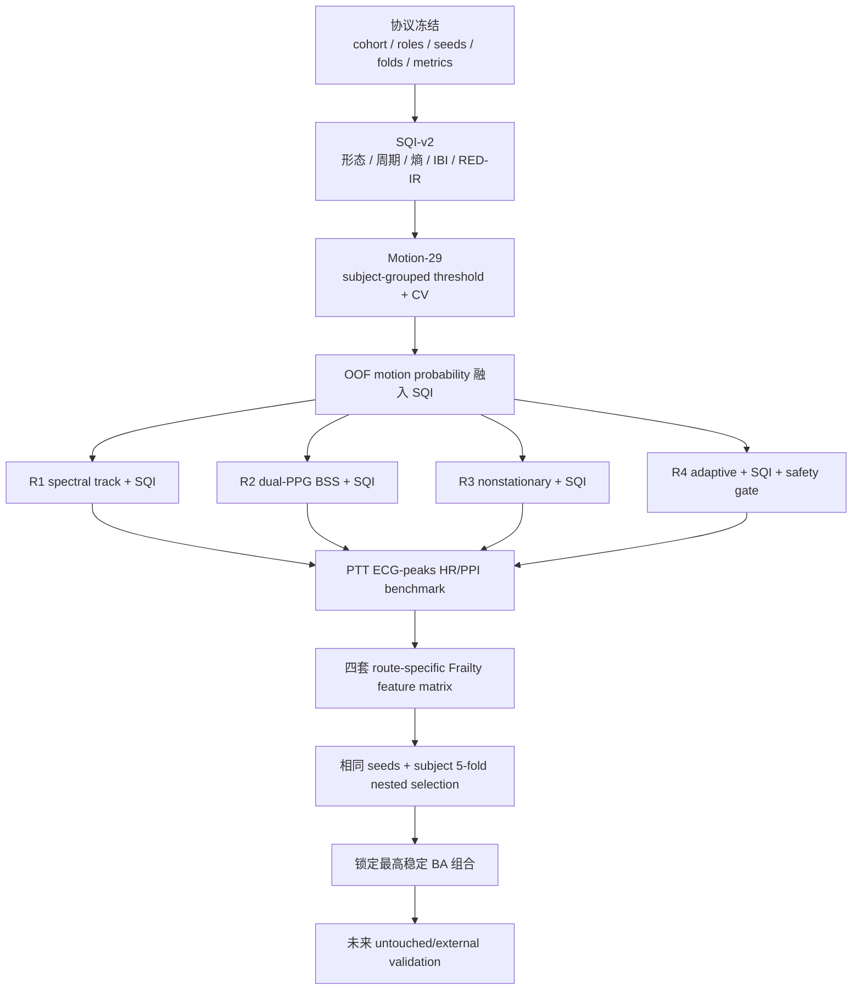
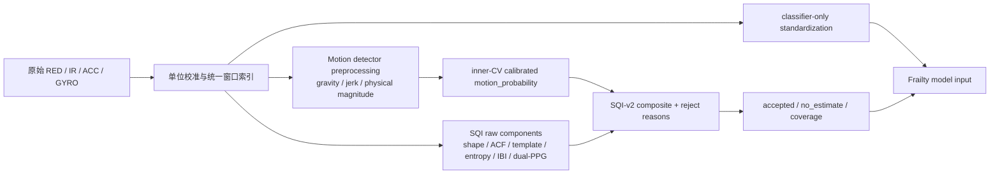
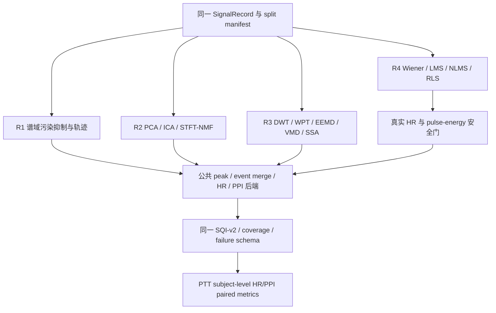
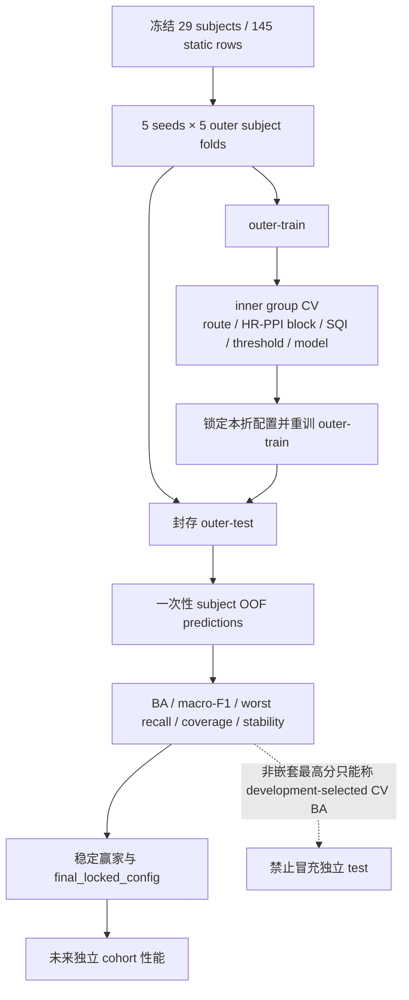

# MAdenoiser 已确认路线到 Frailty 特征选择算法图

状态：路线已确认；实现、训练与 benchmark 尚未开始。

## 1. 串行路线

## 2. SQI 与 Motion detector 的正确接入点

## 3. 四路线公平对照

## 4. Frailty 选择与防泄漏门

## 5. 状态语义

- 实线表示用户确认的未来执行顺序，不表示已完成。
- Motion-29 在监督目标明确前保持 `blocked_on_target_semantics`。
- PTT `peaks` 是 ECG R-peak reference；绝对 PPG pulse timing 必须 delay-aware。
- 最终版本按 nested subject-level BA 选择；非嵌套 CV 最高分只能作开发选择证据。
