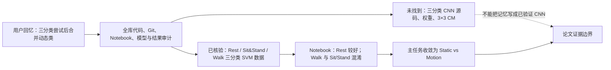
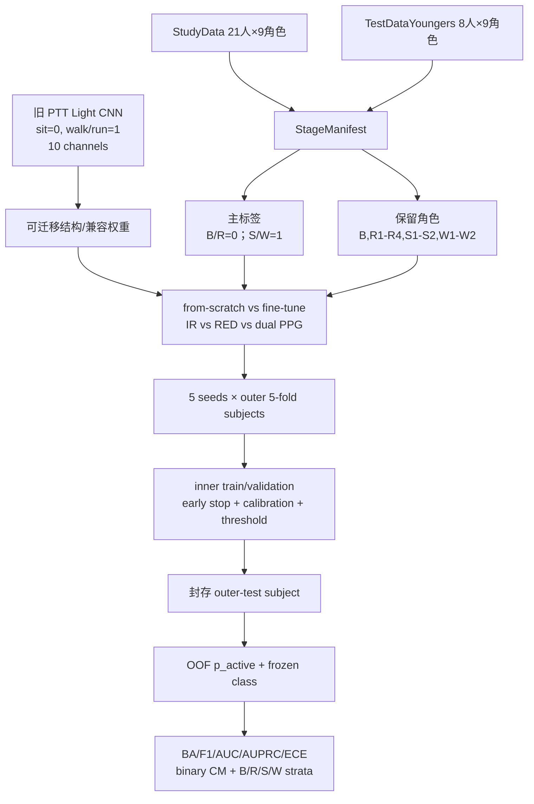
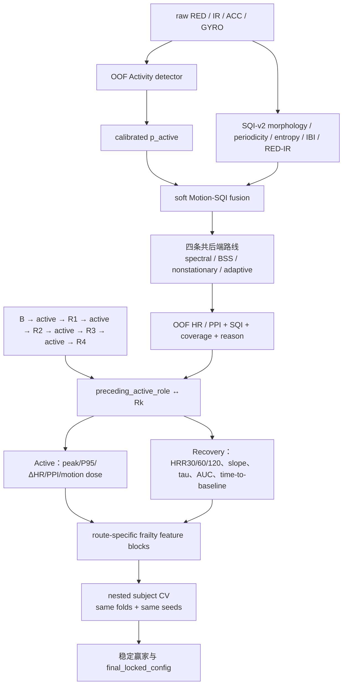

# Activity/Motion 迁移重训、SQI 与恢复特征流程图

> 状态：监督语义已确认；实现、训练与 benchmark 尚未开始。

## 1. 历史证据与路线纠偏

## 2. PTT 结构迁移到 29 人 Activity detector

## 3. Motion→SQI 与 S/W→Recovery→Frailty

## 4. 关键解释

- `Rk` 与它前面的实际活动配对，不按 S/W 编号硬编码。
- `p_active` 是 activity probability，不是 optical-artifact probability。
- PTT 内部满分与 external SIM 明显下降共同说明必须在本地设备域重训并重新校准阈值。
- 四阶段辅助分类可以探索 B/R/S/W 的生理差异，但主 detector 仍以 Static/Motion 二分类为验收目标。
