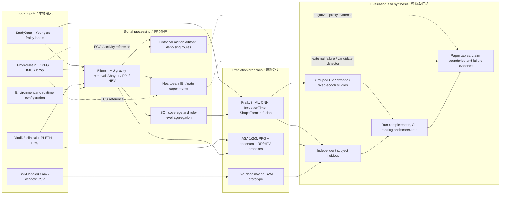

# 当前项目端到端算法总图 / Current End-to-End Project Pipeline

本图表示当前仓库中实际存在的研究路线与产物，而不是未来 M1–M10 的已实现状态。虚线表示监督、评价、分析或历史依赖；实线表示主要数据/产物流。

## 当前证据边界

- Motion/full-waveform 分支已经完成 M0 审计，结论是不恢复完整clean reconstruction。
- Frailty3 存在旧sweep与独立holdout两种证据层；主口径待用户决策。
- ASA最终结果依赖OOF threshold，argmax存在类别坍缩。
- SVM `.py` 当前不可编译且没有持久化论文级指标，只能画为原型分支。

