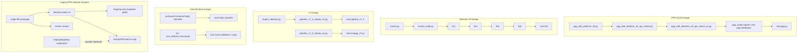

# 归档代码版本关系总图 / Archived-code Lineage Map

```mermaid
flowchart TD
    subgraph DASH["PPG Dash lineage"]
        D0["ppg_with_detector_v8.py"] --> D1["ppg_with_detector_v8_npz_select.py"]
        D1 --> D2["ppg_with_detector_v8_npz_select_viz.py"]
        D2 --> DN["ppg_analy2.ipynb / root ppg notebooks"]
        DN --> DC["root ppg.py"]
    end

    subgraph DET["Detector v8 lineage"]
        S0["scores.py"] --> A0["scores_audit.py"]
        A0 --> F2["fix2"] --> F3["fix3"] --> F6["fix6"] --> F8["fix8"] --> F9["root fix9"]
    end

    subgraph V7["v7 lineage"]
        ST1["stage1_detector.py"] --> V73["pipeline_v7_3_noleak_viz.py"]
        V73 --> V74["root pipeline_v7_4"]
        V72["pipeline_v7_2_noleak_viz.py"] --> C72["root cnnppg_v7.py"]
    end

    subgraph CLASSIFY["Classification lineage"]
        FA["archived 8-channel frailty classifier"] --> FC["root frailty classifier"]
        SO["Arc svm_dataset_train.ipynb"] --> SN["root svm2 notebook / script"]
    end

    subgraph DATA["Legacy PPG dataset analysis"]
        P0["single-file prototype"] --> P2["directory batch v2"]
        P0 --> PE["Esther variant"]
        P2 --> PF["fingertip-only duplicate paths"]
        P2 --> P16["16July2025 batch script"]
        FW["FilteredWalkTest exploration"] -. "parallel notebook" .-> P16
    end
```

## Lineage结论

箭头表示代码演化或直接替代关系，不表示后代自动修复前代的所有方法学问题。归档输出应归因到其实际生产版本；当前根文件只在有明确schema/路径证据时继承结果。

