# 非 M0 根脚本与 Notebook 图册 / Non-M0 Root Script and Notebook Atlas

本图册覆盖根目录中不属于 M0 的8个Python入口和5个Notebook；每节描述当前保存代码的直接职责、输入和输出，不代表未来TODO已完成。

## 1. `frailty_3class_classifier.py`

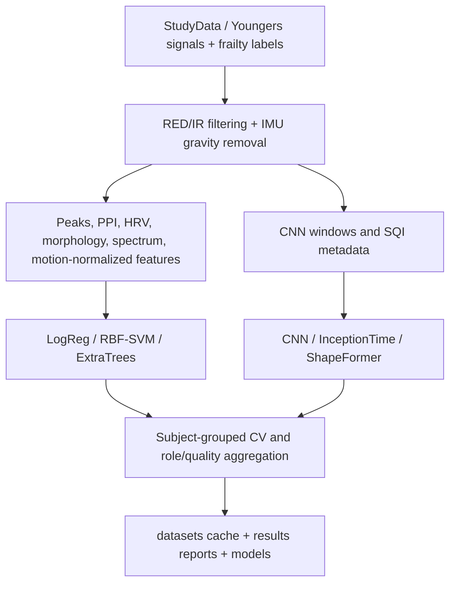

## 2. `frailty_3class_cnn_fusion.py`

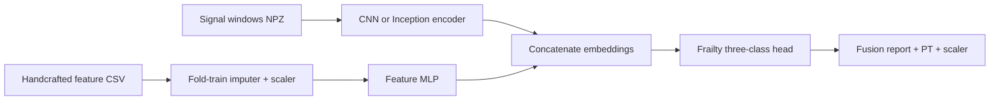

## 3. `frailty_3class_overfitting_sweep.py`

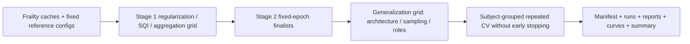

## 4. `analyze_sweep.py`

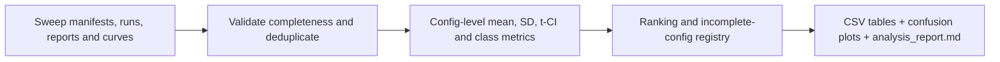

## 5. `frailty_3class_holdout_eval.py`

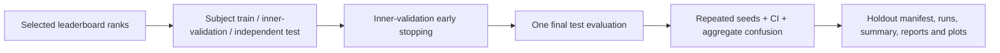

## 6. `shapeformer_port.py`

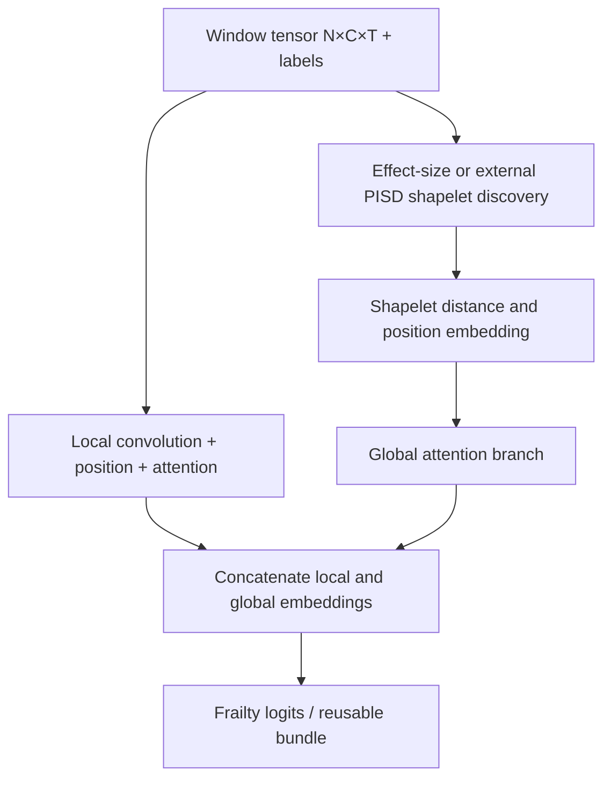

## 7. `asa_classifier.py`

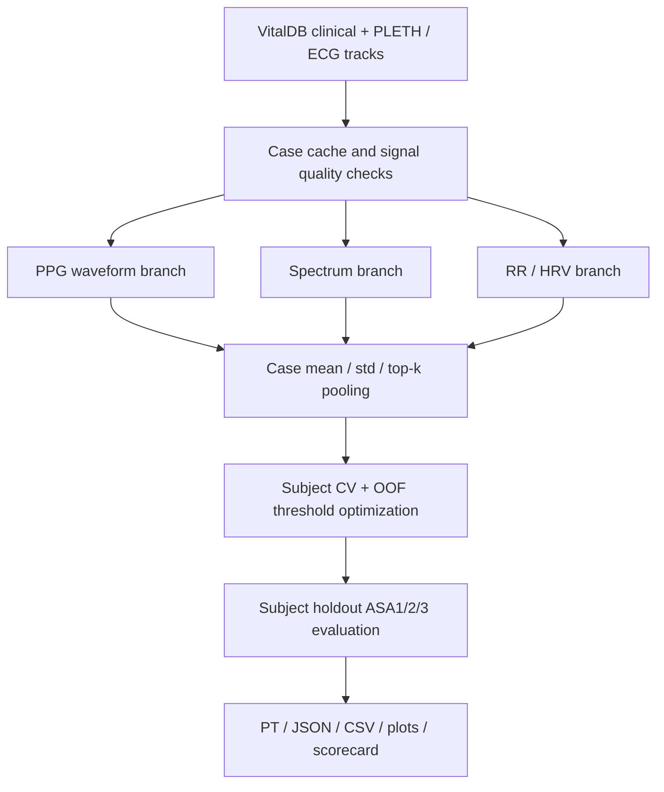

## 8. `svm2_dataset_train.py`

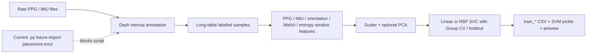

## 9. `PPG_Analy_Visual_test.ipynb`

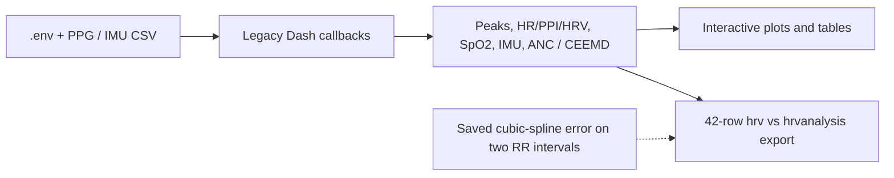

## 10. `ppg_analyse3.ipynb`

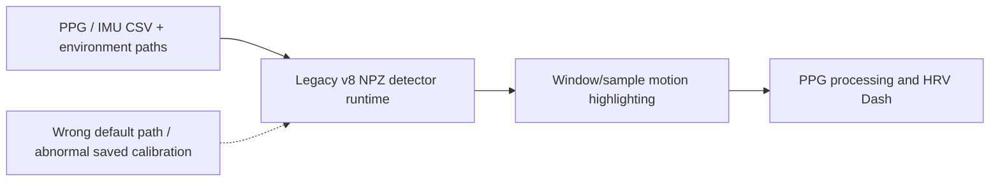

## 11. `ppg_analyse4_calib.ipynb`

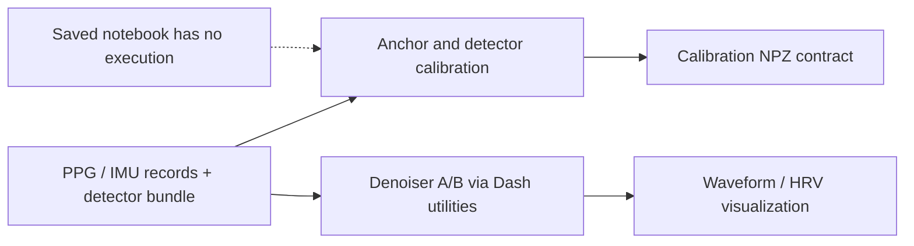

## 12. `svm2_dataset_train.ipynb`

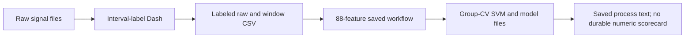

## 13. `template_test.ipynb`

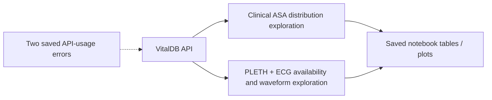

## 覆盖声明

13个图块与 `ROOT_FILE_IO_INVENTORY.md` 的8个非M0 Python脚本、5个Notebook一一对应。M0的16个根代码入口由 `m0/05_SCRIPT_ALGORITHM_ATLAS.md` 覆盖。

