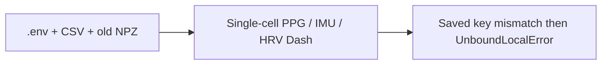
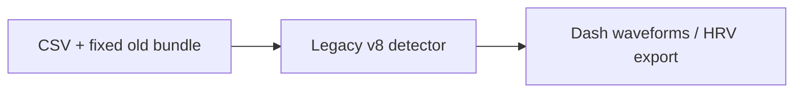
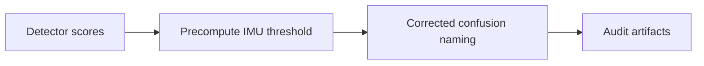
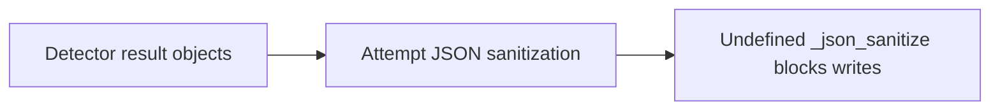
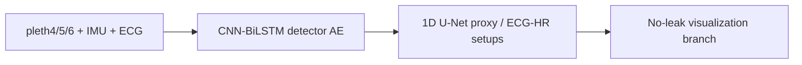
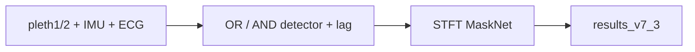
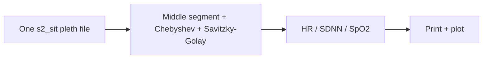
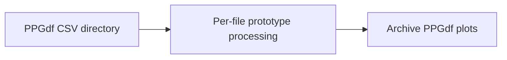
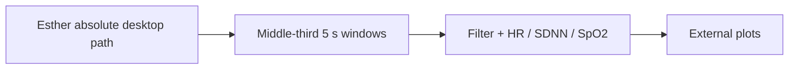

# 23个归档代码/Notebook结构图册 / Archived Script Atlas

## 1. `archiv/frailty_3class_classifier - Copy_8channels_08062026.py`


## 2. `Arc/ppg_analy2.ipynb`


## 3. `Arc/ppg_with_detector_v8.py`


## 4. `Arc/ppg_with_detector_v8_npz_select.py`


## 5. `Arc/ppg_with_detector_v8_npz_select_viz.py`


## 6. `Arc/pttppg_dash.ipynb`


## 7. `Arc/pttppg_detector_v8_scores.py`


## 8. `Arc/pttppg_detector_v8_scores_audit.py`


## 9. `Arc/pttppg_detector_v8_scores_audit_fix2.py`


## 10. `Arc/pttppg_detector_v8_scores_audit_fix3.py`


## 11. `Arc/pttppg_detector_v8_scores_audit_fix6.py`


## 12. `Arc/pttppg_detector_v8_scores_audit_fix8.py`


## 13. `Arc/pttppg_pipeline_v7_2_noleak_viz.py`


## 14. `Arc/pttppg_stage1_detector.py`


## 15. `Arc/pttppg_pipeline_v7_3_noleak_viz.py`


## 16. `Arc/svm_dataset_train.ipynb`


## 17. `PPG_Testing_05_01_2026/Archive/ptt_ppg_dataset_analysis.py`


## 18. `PPG_Testing_05_01_2026/Archive/ptt_ppg_dataset_analysisv2.py`


## 19. `PPG_Testing_05_01_2026/Archive/ptt_ppg_dataset_analysis_esther.py`


## 20. `PPG_Testing_05_01_2026/Archive/ptt_ppg_dataset_analysis_fingertiponly.py`


## 21. `PPG_Testing_05_01_2026/Archive/7-8-2025/ptt_ppg_dataset_analysis_fingertiponly.py`
```mermaid
flowchart LR
    FINGER["7-8-2025 fingertip CSV"] --> WIN["400 Hz filtered windows"] --> BIO["HR / SDNN / SpO2"] --> OUT["9 PNG + 9-row summary"]
```

## 22. `PPG_Testing_05_01_2026/Archive/FilteredWalkTest/FilteredWalkTest.ipynb`
```mermaid
flowchart LR
    BASE["base.csv Timestamp / Ir2 / Red2"] --> CMP["Raw vs baseline subtraction vs Chebyshev vs Butterworth"] --> NB["Embedded exploratory plots"]
```

## 23. `PPG_Testing_05_01_2026/ptt_ppg_dataset_analysis_16July2025.py`
```mermaid
flowchart LR
    CSV["25July25 IR / RED CSV"] --> FILTER["400 Hz Butterworth 0.5–5 Hz"] --> BIO["IR peaks, RR rejection, HR / SDNN / SpO2"] --> OUT["PNG + 12-row current summary mixed with stale plots"]
```

## 覆盖声明

23个图块与 `CODE_FILES.jsonl` 的23个非根路径一一对应。它们只用于历史溯源和输出归因；当前算法候选仍以根代码为准。

