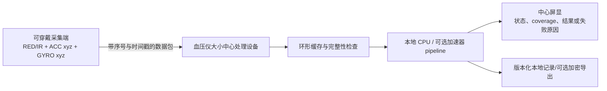
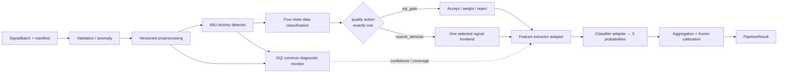
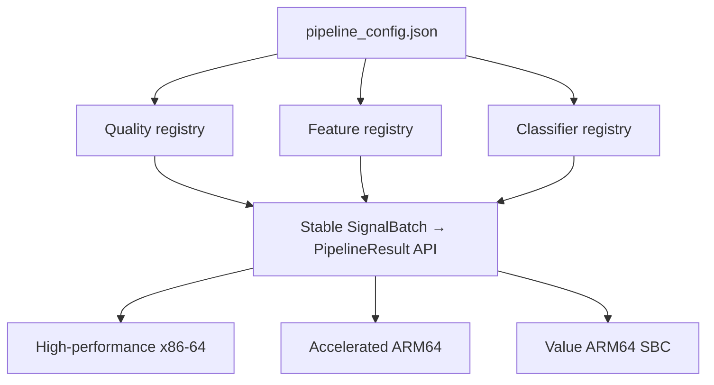
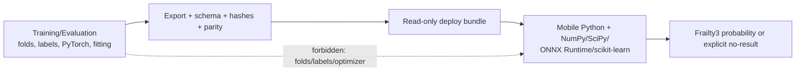

# M1 端到端移动处理中心架构图

> 状态：接口与平台合同已定义；模块实现、硬件实测和最终配置尚未完成。

## 1. 设备拓扑

```mermaid
flowchart LR
    W["可穿戴采集端<br/>RED/IR + ACC xyz + GYRO xyz"] -->|"带序号与时间戳的数据包"| H["血压仪大小中心处理设备"]
    H --> B["环形缓存与完整性检查"]
    B --> P["本地 CPU / 可选加速器 pipeline"]
    P --> D["中心屏显<br/>状态、coverage、结果或失败原因"]
    P --> S["版本化本地记录/可选加密导出"]
```

## 2. 冻结模块顺序

```mermaid
flowchart LR
    I["SignalBatch + manifest"] --> V["Validation / anomaly"]
    V --> PRE["Versioned preprocessing"]
    PRE --> M["IMU Activity detector"]
    M --> C["Four-state data classification"]
    C --> Q{"quality action<br/>exactly one"}
    Q -->|"sqi_gate"| G["Accept / weight / reject"]
    Q -->|"coarse_denoise"| DN["One selected signal frontend"]
    PRE --> SQ["SQI common diagnostic monitor"]
    M --> SQ
    G --> F["Feature extractor adapter"]
    DN --> F
    SQ -. "confidence / coverage" .-> F
    F --> CL["Classifier adapter → 3 probabilities"]
    CL --> A["Aggregation + frozen calibration"]
    A --> O["PipelineResult"]
```

## 3. 可替换配置与稳定接口

```mermaid
flowchart TB
    CFG["pipeline_config.json"] --> QR["Quality registry"]
    CFG --> FR["Feature registry"]
    CFG --> CR["Classifier registry"]
    QR --> API["Stable SignalBatch → PipelineResult API"]
    FR --> API
    CR --> API
    API --> X86["High-performance x86-64"]
    API --> ARMN["Accelerated ARM64"]
    API --> ARMV["Value ARM64 SBC"]
```

## 4. 训练与部署隔离

```mermaid
flowchart LR
    TR["Training/Evaluation<br/>folds, labels, PyTorch, fitting"] --> EX["Export + schema + hashes + parity"]
    EX --> BU["Read-only deploy bundle"]
    BU --> RT["Mobile Python + NumPy/SciPy/<br/>ONNX Runtime/scikit-learn"]
    RT --> OUT["Frailty3 probability or explicit no-result"]
    TR -. "forbidden: folds/labels/optimizer" .-> RT
```

