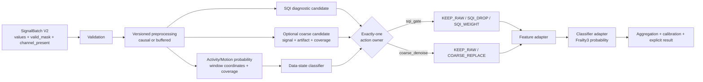
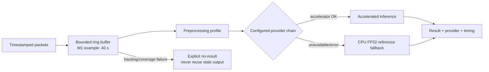
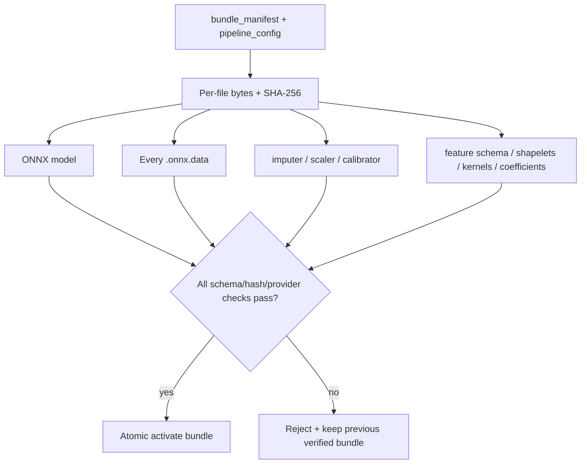

# M1 V2 端到端移动处理中心架构图

> 当前权威图；V1 图保留为初始设计历史。

## 1. 单一动作仲裁

```mermaid
flowchart LR
    I["SignalBatch V2<br/>values + valid_mask + channel_present"] --> V["Validation"]
    V --> P["Versioned preprocessing<br/>causal or buffered"]
    P --> M["Activity/Motion probability<br/>window coordinates + coverage"]
    P --> SQ["SQI diagnostic candidate"]
    P --> DN["Optional coarse candidate<br/>signal + artifact + coverage"]
    M --> S["Data-state classifier"]
    SQ --> A{"Exactly-one<br/>action owner"}
    DN --> A
    S --> A
    A -->|"sqi_gate"| G["KEEP_RAW / SQI_DROP / SQI_WEIGHT"]
    A -->|"coarse_denoise"| C["KEEP_RAW / COARSE_REPLACE"]
    G --> F["Feature adapter"]
    C --> F
    F --> CL["Classifier adapter<br/>Frailty3 probability"]
    CL --> O["Aggregation + calibration + explicit result"]
```

## 2. 有界流式与 provider 回退

```mermaid
flowchart LR
    PKT["Timestamped packets"] --> RB["Bounded ring buffer<br/>M1 example: 40 s"]
    RB --> PP["Preprocessing profile"]
    PP --> EP{"Configured provider chain"}
    EP -->|"accelerator OK"| ACC["Accelerated inference"]
    EP -->|"unavailable/error"| CPU["CPU FP32 reference fallback"]
    ACC --> RES["Result + provider + timing"]
    CPU --> RES
    RB -->|"backlog/coverage failure"| NR["Explicit no-result<br/>never reuse stale output"]
```

## 3. Bundle 完整性

```mermaid
flowchart TB
    MAN["bundle_manifest + pipeline_config"] --> H["Per-file bytes + SHA-256"]
    H --> ON["ONNX model"]
    H --> OD["Every .onnx.data"]
    H --> TF["imputer / scaler / calibrator"]
    H --> FE["feature schema / shapelets / kernels / coefficients"]
    ON --> L{"All schema/hash/provider checks pass?"}
    OD --> L
    TF --> L
    FE --> L
    L -->|"yes"| RT["Atomic activate bundle"]
    L -->|"no"| REJ["Reject + keep previous verified bundle"]
```

