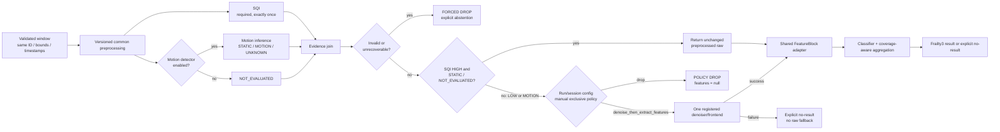
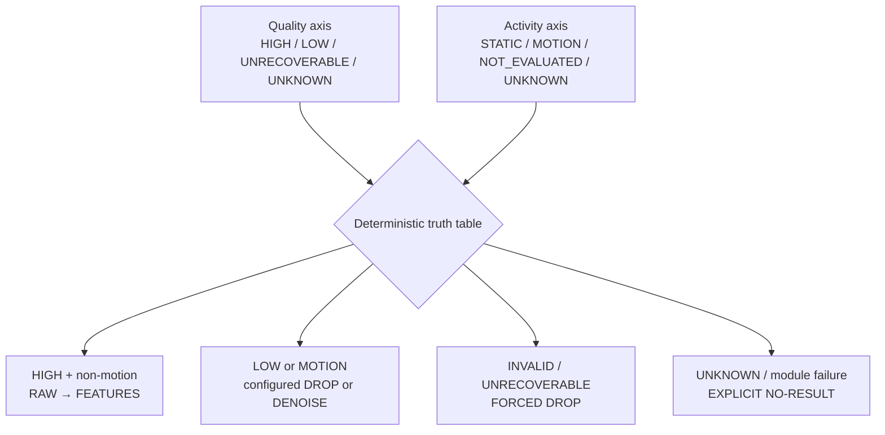
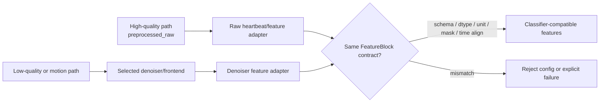
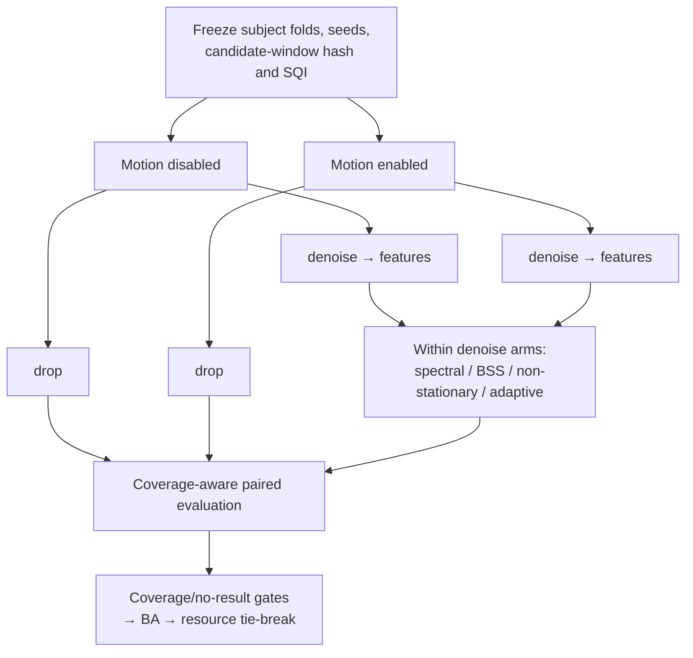

# M1 V3 顺序 SQI–Motion–Denoiser 路由图

> 权威范围：取代 V1/V2 中 quality action owner 的路由图；V2 的输入、流式、bundle 和 provider fallback 图继续有效。

## 1. 运行时主流程 / Runtime flow

图注：

- SQI 与启用后的 Motion detector 可在第一级并行计算；denoiser 不在该并行域中。
- join 之前不得路由；Motion-positive 覆盖 high-SQI 的直返资格。
- `drop` 与 `denoise_then_extract_features` 是配置时互斥分支，不是同窗双算后择优。

## 2. 两个正交判定轴 / Orthogonal axes

29-subject 的 B/R 与 S/W 标签只监督 activity 轴；不能把 S/W 自动改写成 low SQI。

## 3. FeatureBlock 合流合同 / Feature convergence

## 4. M8 最小实验矩阵 / Minimum factorial benchmark

每个 arm 必须保留路由前分母，分别报告 B/R/S/W、dynamic/recovery coverage、HR/PPI error、Frailty BA、risk–coverage、失败率和资源开销。

