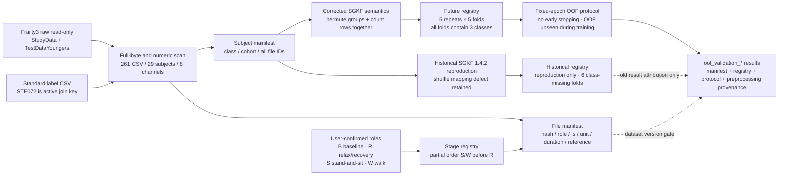

# M2 数据 Manifest、双 Fold 注册表与评估协议图

> 当前权威 M2 数据/分折图；实线为数据或物化 membership，虚线为审计、限制或结果引用。

## 算法不变量

- Group 的最小单位始终是 subject；文件和窗口不得独立重新分折。
- 未来注册表逐折三类齐全且每类 fold count 差不超过 1。
- 历史/未来 registry ID 永不互换；全部候选必须在未来 registry 统一重跑。
- OOF 只在 fixed epochs 全部训练完成后进入一次评估。
