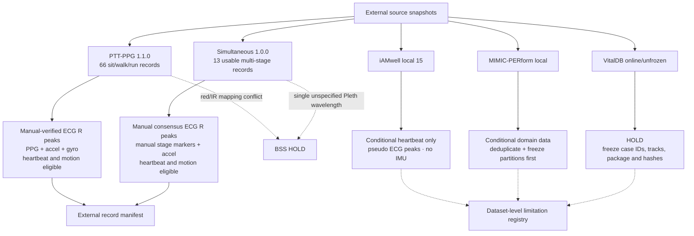

# M2 外部同步 ECG/PPG/IMU 证据与资格图

> 本图区分强人工 ECG reference、pseudo reference、motion 资格与 BSS 元数据门；虚线表示限制，不是模型运行输入。

任何 pseudo-ECG peak 数据不得与人工复核 annotation 使用相同 reference-strength 标签；没有 IMU/activity supervision 的源不得报告 motion detector accuracy。
