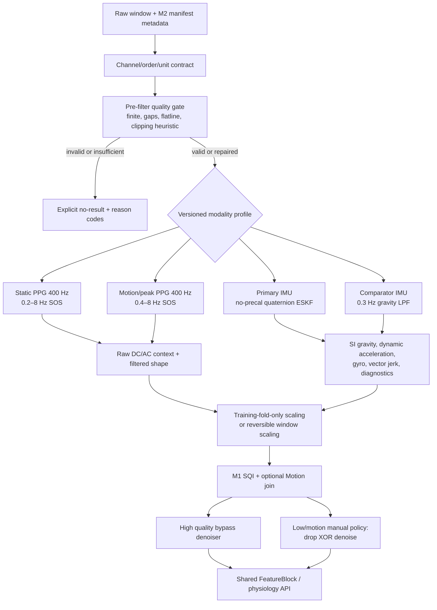

# M3 统一预处理与信号 API / Unified Preprocessing and Signal API

本图固定数据先经过可追溯质量门，再进入任务 profile；EKF 是 IMU 主路线，LPF
只作为输入完全一致的对照。任何 invalid/insufficient 状态都不得伪造特征。

## 强制不变量 / Mandatory invariants

- 主路径不得进行单位猜测、缺失 gyro 无 mask 补零或 PPG 波长推断。
- 离线零相位与移动端因果 profile ID 不得复用。
- EKF 和 LPF 对照只允许重力估计方法不同。
- M4 以后新模块只能调用本包公共实现；根目录脚本标为历史只读。

