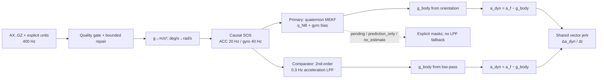
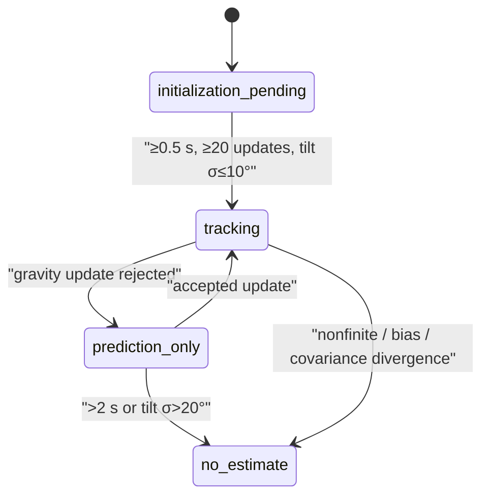

# M3 IMU：无预校准 ESKF 主路线与 LPF 对照

两条路线共享原始六轴、显式单位、质量 mask、20/40 Hz 前端和 jerk；禁止 EKF
失败后自动输出 LPF，确保比较只改变重力估计方法。

```mermaid
flowchart LR
    A["AX..GZ + explicit units<br/>400 Hz"] --> B["Quality gate + bounded repair"]
    B --> C["g→m/s²; deg/s→rad/s"]
    C --> D["Causal SOS<br/>ACC 20 Hz / gyro 40 Hz"]
    D --> E1["Primary: quaternion MEKF<br/>q_NB + gyro bias"]
    D --> E2["Comparator: 2nd-order<br/>0.3 Hz acceleration LPF"]
    E1 --> G1["g_body from orientation"]
    E2 --> G2["g_body from low-pass"]
    G1 --> H1["a_dyn = a_f − g_body"]
    G2 --> H2["a_dyn = a_f − g_body"]
    H1 --> J["Shared vector jerk<br/>Δa_dyn / Δt"]
    H2 --> J
    E1 -. "pending / prediction_only / no_estimate" .-> X["Explicit masks; no LPF fallback"]
```

```mermaid
stateDiagram-v2
    [*] --> initialization_pending
    initialization_pending --> tracking: "≥0.5 s, ≥20 updates, tilt σ≤10°"
    tracking --> prediction_only: "gravity update rejected"
    prediction_only --> tracking: "accepted update"
    prediction_only --> no_estimate: ">2 s or tilt σ>20°"
    tracking --> no_estimate: "nonfinite / bias / covariance divergence"
```

无预校准六轴 IMU 不能区分持续线性加速度与倾角，也不能观测绝对 yaw；这些限制
必须随每次输出保留。

