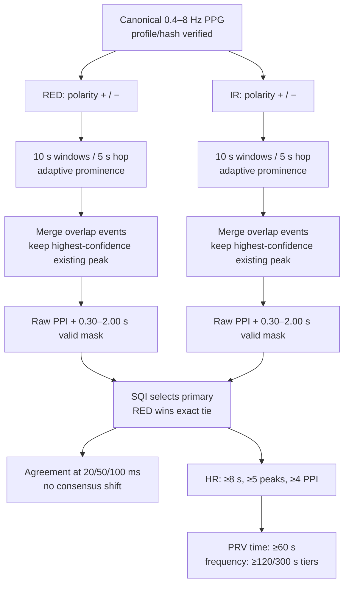

# M3 Peak、PPI、HR 与 PPG-derived PRV 公共后端

corrected_v1 不再让异常 PPI 删除峰，也不生成 RED/IR 共识峰；同一公共后端服务
high-quality raw 与 denoised feature 路线。

```mermaid
flowchart TD
    A["Canonical 0.4–8 Hz PPG<br/>profile/hash verified"] --> B1["RED: polarity + / −"]
    A --> B2["IR: polarity + / −"]
    B1 --> C1["10 s windows / 5 s hop<br/>adaptive prominence"]
    B2 --> C2["10 s windows / 5 s hop<br/>adaptive prominence"]
    C1 --> D1["Merge overlap events<br/>keep highest-confidence existing peak"]
    C2 --> D2["Merge overlap events<br/>keep highest-confidence existing peak"]
    D1 --> E1["Raw PPI + 0.30–2.00 s valid mask"]
    D2 --> E2["Raw PPI + 0.30–2.00 s valid mask"]
    E1 --> F["SQI selects primary<br/>RED wins exact tie"]
    E2 --> F
    F --> G["Agreement at 20/50/100 ms<br/>no consensus shift"]
    F --> H["HR: ≥8 s, ≥5 peaks, ≥4 PPI"]
    H --> I["PRV time: ≥60 s<br/>frequency: ≥120/300 s tiers"]
```

