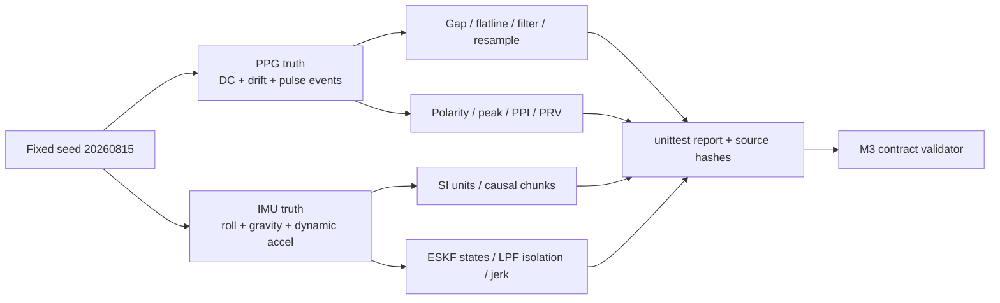

# M3 固定 Reference Test 与 Parity 矩阵

测试从 deterministic fixtures 覆盖质量门、滤波、单位、ESKF/LPF、physiology 和
fold-only scaling；合成真值只作工程验收，不冒充临床验证。

## 验收边界 / Acceptance boundary

- invalid/insufficient 不得产生伪零特征。
- causal 分块与整段计算必须在浮点容差内一致。
- ESKF 与 LPF 各自失败，不互相 fallback。
- corrected 正负极性峰位置一致；legacy mismatch 作为审计证据保存。
- 测试通过不等于 29-subject、PTT 或跨设备 benchmark 已完成。

