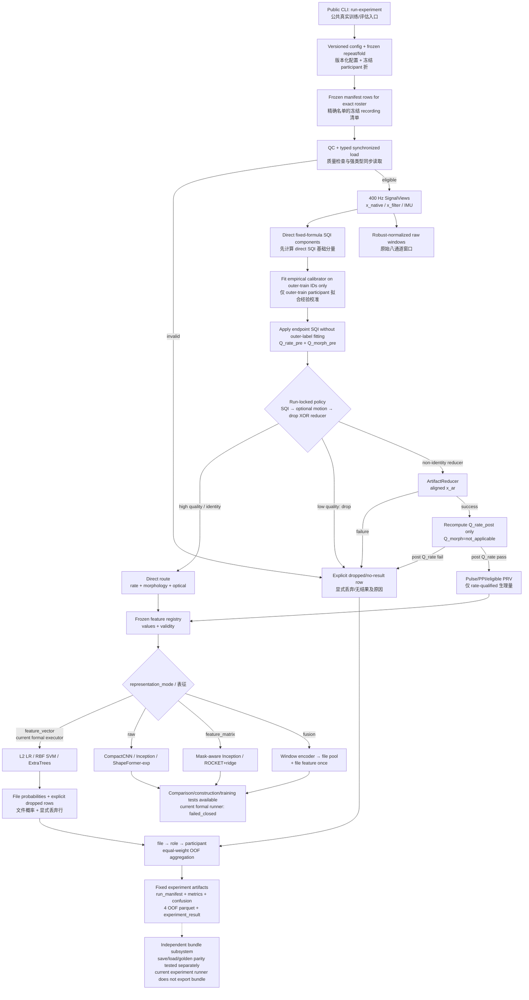

# End-to-end V1 workflow / V1 端到端流程

## Runtime meaning / 运行含义

- `run` is the real-input/protocol audit and emits no trained metric.
- `run-experiment` is the real frozen outer-fold training/evaluation entry.
- The passing reduced command uses `configs/motion_benchmark_v1.yaml`, preserves the
  complete participant roster, and fixes 60 seconds/one record/one epoch-equivalent.
- The current formal cell executor accepts `feature_vector` only. Raw, feature-matrix
  and fusion modules are available for named comparisons and contract tests, but their
  formal scientific-runner requests return `failed_closed`; no implicit conversion occurs.
- Full mode without repeat/fold requests all 25 frozen cells. A supplied repeat/fold pair
  runs one full-length cell with incomplete-5×5 scope.

`run` 只做真实输入/协议审计；`run-experiment` 才执行真实 outer-fold 训练。
当前 passing reduced 使用 motion feature-vector 配置并保留完整 participant 名单；
raw、matrix、fusion 虽已有模块与合同测试，但进入正式 runner 会明确关闭失败，不会
静默改成 feature-vector。

## Fixed evidence / 固定证据

- Authority pointer / 权威指针：
  [reference_registry.json](../../artifacts/experiments/reference_registry.json)
- Current 60 s r0/f0 smoke / 当前 60 秒单折 smoke：
  [experiment_result.json](../../artifacts/experiments/reduced_real_r0_f0_reference_width_preserved_v2/experiment_result.json)
- 12 s fail-closed gate / 12 秒关闭失败门禁：
  [experiment_result.json](../../artifacts/experiments/reduced_real_r0_f0_12s_failed_closed/experiment_result.json)

The 60-second values (5/6 OOF retained, coverage 0.8333, BA 0.5) are implementation
and abstention evidence with `scientific_scope=smoke_not_scientific_benchmark`. They
are not a completed 5×5 candidate result.

## Core invariants / 核心不变量

1. Non-identity `x_ar` never enters morphology or amplitude-dependent features.
2. Reducer or quality failure never silently falls back to identity.
3. SQI calibration, imputation, scaling and model fit use outer-train participants only.
4. Every selected OOF participant remains visible as retained or dropped/no-result.
5. The experiment runner writes fixed OOF artifacts atomically and refuses overwrite.
6. Bundle save/load/golden parity exists as a separately tested subsystem; current
   runner output must not be described as containing a bundle.
