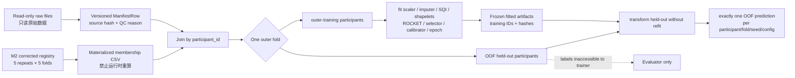

# Data, frozen folds, and fit boundary / 数据、冻结折与拟合边界

- Membership is imported, not regenerated. / 折成员从权威注册表导入，不重新生成。
- Every fitted artifact records training participant IDs and rejects OOF IDs.
- Changing held-out values must not change any fitted training object.
