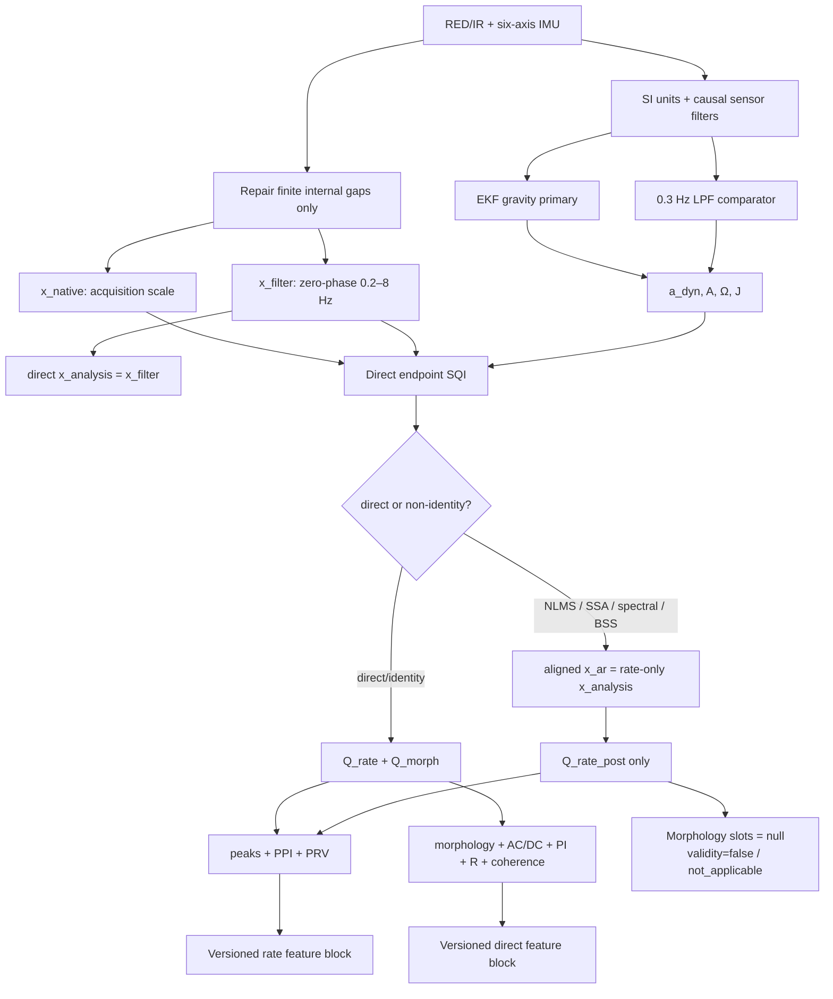

# Signal, SQI, artifact, and feature routes / 信号、SQI、伪影与特征路线

The EKF and LPF branches share units, filtering, masks, timestamps, and output schema;
only the gravity estimator changes. / EKF 与 LPF 只改变重力估计器，其余上游与输出合同一致。
