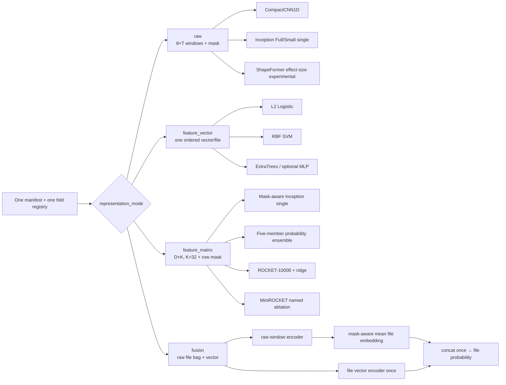

# Representations and parallel model families / 表征与并行模型族

All branches share labels, memberships, role definitions, aggregation, OOF writer, and
participant metrics. / 所有分支共享标签、折、role、聚合、OOF 和 participant 指标。
