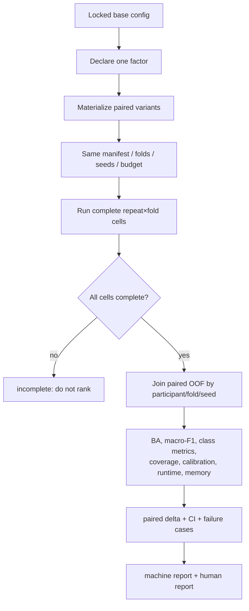

# Ablation and comparison execution / 消融与对照执行

Registered factor families include preprocessing, EKF-vs-LPF, quality/drop policy,
artifact reducers, feature families, sampling rate/kernel duration, representation,
ROCKET/MiniROCKET, single/ensemble, pooling, and aggregation. A comparison command
changes only its declared factor; all other identity fields must hash equally.
