# staged-static-05-pre-motion-ptt-v1

Status: **passed**

## Scientific scope

29-participant grouped OOF motion detector plus frozen-model PTT evaluation and PTT denoiser comparison; PTT is not claimed independent

## Test models, modules, inputs, and fixed parameters

The identical standalone table is in `TEST_COMPONENTS.md`; machine-readable copies are `tables/test_components.csv` and `.json`. Input data are named directly rather than represented by hashes.

### Participation and reporter binding

| Model / module | Component role | Cases / phases | State | Reporter profile | Model reporter extension |
|---|---|---|---|---|---|
| ptt_ppg_1_1_0_local | dataset_adapter | all | enabled | audit_provenance_v1 | audit_provenance_v1 |
| fastica_bss | denoiser | PTT denoiser benchmark | executed | stage5_ecg_ppg_denoiser_v1 | audit_provenance_v1 |
| identity | denoiser | PTT denoiser benchmark | executed | stage5_ecg_ppg_denoiser_v1 | audit_provenance_v1 |
| nlms_imu_anc | denoiser | PTT denoiser benchmark | executed | stage5_ecg_ppg_denoiser_v1 | audit_provenance_v1 |
| nmf_bss | denoiser | PTT denoiser benchmark | executed | stage5_ecg_ppg_denoiser_v1 | audit_provenance_v1 |
| pca_bss | denoiser | PTT denoiser benchmark | executed | stage5_ecg_ppg_denoiser_v1 | audit_provenance_v1 |
| spectral_mask | denoiser | PTT denoiser benchmark | executed | stage5_ecg_ppg_denoiser_v1 | audit_provenance_v1 |
| ssa_decomposition | denoiser | PTT denoiser benchmark | executed | stage5_ecg_ppg_denoiser_v1 | audit_provenance_v1 |
| calibrated_roll_pitch_ekf | imu_preprocessing | all motion-detector phases | executed | audit_provenance_v1 | audit_provenance_v1 |
| formal_local_supervised_motion_detector_v2 | motion_detector | Frailty29 OOF + all-29 final → PTT22 | executed | binary_motion_window_file_v1 | audit_provenance_v1 |
| formal_local_supervised_motion_detector_v2 | motion_detector_reverse_ablation | PTT22 OOF + all-22 final → Frailty29 | disabled | audit_provenance_v1 | not_applicable |
| participant_balanced_midpoint | motion_threshold | Frailty29-trained deployment route | executed | binary_motion_window_file_v1 | audit_provenance_v1 |

Column definitions and formulas

- **Model / module** (`module_id`): Direct identifier, provenance, configuration, grouping, or status value. Formula: `N/A — identifier, provenance, configuration, status, or other non-arithmetic field.`
- **Component role** (`component_role`): Direct identifier, provenance, configuration, grouping, or status value. Formula: `N/A — identifier, provenance, configuration, status, or other non-arithmetic field.`
- **Cases / phases** (`participating_cases`): Persisted source-table value for `participating_cases`; producer-specific semantics are not reinterpreted by the shared table renderer. Formula: `N/A — direct persisted/source-defined value; the table renderer applies no additional arithmetic.`
- **State** (`execution_state`): Direct identifier, provenance, configuration, grouping, or status value. Formula: `N/A — identifier, provenance, configuration, status, or other non-arithmetic field.`
- **Reporter profile** (`reporter_profile_id`): Direct identifier, provenance, configuration, grouping, or status value. Formula: `N/A — identifier, provenance, configuration, status, or other non-arithmetic field.`
- **Model reporter extension** (`model_reporter_extension_id`): Direct identifier, provenance, configuration, grouping, or status value. Formula: `N/A — identifier, provenance, configuration, status, or other non-arithmetic field.`

### Input data and fixed parameters

| Model / module | Component role | Input data (values and paths; no hashes) | Detailed fixed parameters |
|---|---|---|---|
| ptt_ppg_1_1_0_local | dataset_adapter | {"activities":["sit","walk","run"],"channels":{"IR":"pleth_2","RED":"pleth_1"},"dataset_id":"ptt_ppg_1_1_0_local","dataset_root":"physionet.org/files/pulse-transit-time-ppg/1.1.0","ecg_peak_annotation_column":"peaks","participants":22,"pipeline_fs_hz":400.0,"records":66,"source_fs_hz":500.0} | {"activities":["sit","walk","run"],"dataset_id":"ptt_ppg_1_1_0_local","distal_channels":{"IR":"pleth_2","RED":"pleth_1"},"ecg_peak_annotation_column":"peaks","independence_claim":"none_same_ptt_cohort_used_for_external_characterization","participant_count":22,"pipeline_fs_hz":400.0,"record_count":66,"root":"physionet.org/files/pulse-transit-time-ppg/1.1.0","source_fs_hz":500.0} |
| fastica_bss | denoiser | {"activities":["sit","walk","run"],"channels":{"IR":"pleth_2","RED":"pleth_1"},"dataset_id":"ptt_ppg_1_1_0_local","dataset_root":"physionet.org/files/pulse-transit-time-ppg/1.1.0","ecg_peak_annotation_column":"peaks","input_imu":"processed_imu_physical six axes","input_ppg":"shared 0.2-8 Hz filtered RED/IR","participants":22,"pipeline_fs_hz":400.0,"records":66,"scoring_peak_detector":"aboy_project_v1","segments_s":30.0,"source_fs_hz":500.0} | {"fit_scope":"within_record_signal_only","reducer_version":"fastica_component_select_v2","resolved_parameters":{"imu_reference_profile":"imu_axes6_reference_v2","max_iter":1000,"random_state":42,"tolerance":1e-05},"validation":{"alignment":"constant_lag_grid_search_per_segment","beat_tolerance_s":0.2,"interval_delay_property":"ppi_minus_ibi_cancels_constant_ecg_ppg_transit_delay","interval_pairing":"consecutive_one_to_one_matched_ecg_ppg_beats","lag_step_s":0.02,"max_lag_s":10.0,"primary_metric":"participant_macro_ibi_ppi_rmse_ms_dynamic","secondary_metrics":["participant_macro_f1","positive_predictive_value","sensitivity","runtime_s"]}} |
| identity | denoiser | {"activities":["sit","walk","run"],"channels":{"IR":"pleth_2","RED":"pleth_1"},"dataset_id":"ptt_ppg_1_1_0_local","dataset_root":"physionet.org/files/pulse-transit-time-ppg/1.1.0","ecg_peak_annotation_column":"peaks","input_imu":"processed_imu_physical six axes","input_ppg":"shared 0.2-8 Hz filtered RED/IR","participants":22,"pipeline_fs_hz":400.0,"records":66,"scoring_peak_detector":"aboy_project_v1","segments_s":30.0,"source_fs_hz":500.0} | {"fit_scope":"within_record_signal_only","reducer_version":"identity_exact_v1","resolved_parameters":{},"validation":{"alignment":"constant_lag_grid_search_per_segment","beat_tolerance_s":0.2,"interval_delay_property":"ppi_minus_ibi_cancels_constant_ecg_ppg_transit_delay","interval_pairing":"consecutive_one_to_one_matched_ecg_ppg_beats","lag_step_s":0.02,"max_lag_s":10.0,"primary_metric":"participant_macro_ibi_ppi_rmse_ms_dynamic","secondary_metrics":["participant_macro_f1","positive_predictive_value","sensitivity","runtime_s"]}} |
| nlms_imu_anc | denoiser | {"activities":["sit","walk","run"],"channels":{"IR":"pleth_2","RED":"pleth_1"},"dataset_id":"ptt_ppg_1_1_0_local","dataset_root":"physionet.org/files/pulse-transit-time-ppg/1.1.0","ecg_peak_annotation_column":"peaks","input_imu":"processed_imu_physical six axes","input_ppg":"shared 0.2-8 Hz filtered RED/IR","participants":22,"pipeline_fs_hz":400.0,"records":66,"scoring_peak_detector":"aboy_project_v1","segments_s":30.0,"source_fs_hz":500.0} | {"fit_scope":"within_record_signal_only","reducer_version":"nlms_delay_taps_v1","resolved_parameters":{"delay_taps":[0,4,8,16],"epsilon":1e-06,"imu_reference_profile":"imu_axes6_reference_v2","leakage":1e-05,"step_size":0.15,"taps_per_delay":8,"update_gate_reference_rms":0.1},"validation":{"alignment":"constant_lag_grid_search_per_segment","beat_tolerance_s":0.2,"interval_delay_property":"ppi_minus_ibi_cancels_constant_ecg_ppg_transit_delay","interval_pairing":"consecutive_one_to_one_matched_ecg_ppg_beats","lag_step_s":0.02,"max_lag_s":10.0,"primary_metric":"participant_macro_ibi_ppi_rmse_ms_dynamic","secondary_metrics":["participant_macro_f1","positive_predictive_value","sensitivity","runtime_s"]}} |
| nmf_bss | denoiser | {"activities":["sit","walk","run"],"channels":{"IR":"pleth_2","RED":"pleth_1"},"dataset_id":"ptt_ppg_1_1_0_local","dataset_root":"physionet.org/files/pulse-transit-time-ppg/1.1.0","ecg_peak_annotation_column":"peaks","input_imu":"processed_imu_physical six axes","input_ppg":"shared 0.2-8 Hz filtered RED/IR","participants":22,"pipeline_fs_hz":400.0,"records":66,"scoring_peak_detector":"aboy_project_v1","segments_s":30.0,"source_fs_hz":500.0} | {"fit_scope":"within_record_signal_only","reducer_version":"nmf_shared_spectral_basis_v1","resolved_parameters":{"max_iter":1000,"nmf_rank":2,"nperseg":512,"overlap_fraction":0.75,"random_state":42,"tolerance":1e-05},"validation":{"alignment":"constant_lag_grid_search_per_segment","beat_tolerance_s":0.2,"interval_delay_property":"ppi_minus_ibi_cancels_constant_ecg_ppg_transit_delay","interval_pairing":"consecutive_one_to_one_matched_ecg_ppg_beats","lag_step_s":0.02,"max_lag_s":10.0,"primary_metric":"participant_macro_ibi_ppi_rmse_ms_dynamic","secondary_metrics":["participant_macro_f1","positive_predictive_value","sensitivity","runtime_s"]}} |
| pca_bss | denoiser | {"activities":["sit","walk","run"],"channels":{"IR":"pleth_2","RED":"pleth_1"},"dataset_id":"ptt_ppg_1_1_0_local","dataset_root":"physionet.org/files/pulse-transit-time-ppg/1.1.0","ecg_peak_annotation_column":"peaks","input_imu":"processed_imu_physical six axes","input_ppg":"shared 0.2-8 Hz filtered RED/IR","participants":22,"pipeline_fs_hz":400.0,"records":66,"scoring_peak_detector":"aboy_project_v1","segments_s":30.0,"source_fs_hz":500.0} | {"fit_scope":"within_record_signal_only","reducer_version":"pca_component_select_v2","resolved_parameters":{"imu_reference_profile":"imu_axes6_reference_v2"},"validation":{"alignment":"constant_lag_grid_search_per_segment","beat_tolerance_s":0.2,"interval_delay_property":"ppi_minus_ibi_cancels_constant_ecg_ppg_transit_delay","interval_pairing":"consecutive_one_to_one_matched_ecg_ppg_beats","lag_step_s":0.02,"max_lag_s":10.0,"primary_metric":"participant_macro_ibi_ppi_rmse_ms_dynamic","secondary_metrics":["participant_macro_f1","positive_predictive_value","sensitivity","runtime_s"]}} |
| spectral_mask | denoiser | {"activities":["sit","walk","run"],"channels":{"IR":"pleth_2","RED":"pleth_1"},"dataset_id":"ptt_ppg_1_1_0_local","dataset_root":"physionet.org/files/pulse-transit-time-ppg/1.1.0","ecg_peak_annotation_column":"peaks","input_imu":"processed_imu_physical six axes","input_ppg":"shared 0.2-8 Hz filtered RED/IR","participants":22,"pipeline_fs_hz":400.0,"records":66,"scoring_peak_detector":"aboy_project_v1","segments_s":30.0,"source_fs_hz":500.0} | {"fit_scope":"within_record_signal_only","reducer_version":"spectral_mask_v1","resolved_parameters":{"imu_mask_quantile":0.75,"imu_reference_profile":"imu_axes6_reference_v2","mask_strength":0.8,"preserve_band_hz":[0.5,3.0],"stft_hop_s":1.0,"stft_window_s":4.0},"validation":{"alignment":"constant_lag_grid_search_per_segment","beat_tolerance_s":0.2,"interval_delay_property":"ppi_minus_ibi_cancels_constant_ecg_ppg_transit_delay","interval_pairing":"consecutive_one_to_one_matched_ecg_ppg_beats","lag_step_s":0.02,"max_lag_s":10.0,"primary_metric":"participant_macro_ibi_ppi_rmse_ms_dynamic","secondary_metrics":["participant_macro_f1","positive_predictive_value","sensitivity","runtime_s"]}} |
| ssa_decomposition | denoiser | {"activities":["sit","walk","run"],"channels":{"IR":"pleth_2","RED":"pleth_1"},"dataset_id":"ptt_ppg_1_1_0_local","dataset_root":"physionet.org/files/pulse-transit-time-ppg/1.1.0","ecg_peak_annotation_column":"peaks","input_imu":"processed_imu_physical six axes","input_ppg":"shared 0.2-8 Hz filtered RED/IR","participants":22,"pipeline_fs_hz":400.0,"records":66,"scoring_peak_detector":"aboy_project_v1","segments_s":30.0,"source_fs_hz":500.0} | {"fit_scope":"within_record_signal_only","reducer_version":"ssa_hankel_cardiac_select_v1","resolved_parameters":{"cardiac_high_hz":3.5,"cardiac_low_hz":0.5,"embedding_samples":160,"max_components":12,"minimum_cardiac_concentration":0.45},"validation":{"alignment":"constant_lag_grid_search_per_segment","beat_tolerance_s":0.2,"interval_delay_property":"ppi_minus_ibi_cancels_constant_ecg_ppg_transit_delay","interval_pairing":"consecutive_one_to_one_matched_ecg_ppg_beats","lag_step_s":0.02,"max_lag_s":10.0,"primary_metric":"participant_macro_ibi_ppi_rmse_ms_dynamic","secondary_metrics":["participant_macro_f1","positive_predictive_value","sensitivity","runtime_s"]}} |
| calibrated_roll_pitch_ekf | imu_preprocessing | {"input_channels":["AX","AY","AZ","GX","GY","GZ"],"internal_units":{"ACC":"g","GYRO":"deg/s"},"output_view":"processed_imu_physical","ptt_units":{"ACC":"m/s² identity conversion","GYRO":"deg/s → rad/s"}} | {"accelerometer_lowpass_hz":20.0,"calibration_start_s":5.0,"calibration_stop_s":100.0,"dynamic_observation_scale":3.0,"gravity_filter_order":4,"gravity_lowpass_hz":0.3,"gravity_mps2":9.81,"gyroscope_lowpass_hz":40.0,"initial_covariance_diagonal":[1.0,1.0,0.5,0.5,0.5],"observation_covariance_diagonal_rad2":[0.5,0.5],"process_covariance_diagonal_per_second":[5.0,5.0,0.05,0.05,0.05],"sensor_filter_order":3,"source_algorithm":"authoritative_calibrated_roll_pitch_bias_ekf_one_sided_dynamic_R_sensor_lpf_order3_v4"} |
| formal_local_supervised_motion_detector_v2 | motion_detector | {"frozen_evaluation":{"activities":["sit","walk","run"],"channels":{"IR":"pleth_2","RED":"pleth_1"},"dataset_id":"ptt_ppg_1_1_0_local","dataset_root":"physionet.org/files/pulse-transit-time-ppg/1.1.0","ecg_peak_annotation_column":"peaks","participants":22,"pipeline_fs_hz":400.0,"records":66,"source_fs_hz":500.0},"training":{"channels":["RED","IR","A_dyn_x","A_dyn_y","A_dyn_z","GX","GY","GZ"],"dataset_id":"frailty3_m2_20260815_a054800abda272f6","fs_hz":400.0,"hop_s":2.0,"labels":{"motion":["S1","S2","W1","W2"],"static":["B","R1","R2","R3","R4"]},"manifest_path":"final_v0/M2_data_manifest_and_evaluation_protocol/manifests/frailty3_file_manifest.csv","participants":29,"roles":["B","R1","R2","R3","R4","S1","S2","W1","W2"],"units":["window_robust_z","window_robust_z","m/s^2","m/s^2","m/s^2","rad/s","rad/s","rad/s"],"window_s":8.0}} | {"architecture":{"activation":"gelu","base_channels":12,"channel_names":["RED","IR","A_dyn_x","A_dyn_y","A_dyn_z","GX","GY","GZ"],"kernel_sizes":[9,7,5],"normalization":"group_norm_one_group","output":"single_motion_logit","pooling":"avgpool2_avgpool2_adaptiveavgpool1"},"external_fit_or_recalibration":false,"split":{"folds":5,"groups":"participant_id","method":"StratifiedGroupKFold","repeats":1,"seed":42},"tensor":{"channel_schema":["RED","IR","A_dyn_x","A_dyn_y","A_dyn_z","GX","GY","GZ"],"channel_units":["window_robust_z","window_robust_z","m/s^2","m/s^2","m/s^2","rad/s","rad/s","rad/s"],"derived_motion_channels_are_frailty_predictors":false,"derived_motion_channels_included":false,"fs_hz":400.0,"hop_s":2.0,"hop_samples":800,"imu_channel_count":6,"imu_normalization":"outer_training_participant_only_median_iqr_over_1p349_population_sd_then_one","imu_per_window_amplitude_normalization":false,"ppg_normalization":"per_window_median_iqr_mad_then_one","profile_id":"motion_8ch_axes_reference_v2","profile_role":"canonical_reference","schema_version":"ppg_frailty.motion_network_tensor.imu_iqr_over_1p349.v3","silent_channel_derivation":false,"tensor_layout":"window_channel_sample","window_s":8.0,"window_samples":3200},"threshold":{"center_statistic":"median_of_participant_class_medians","fit_scope":"outer_training_participants_only_no_oof_no_ptt","motion_center":0.9999959468841553,"observed_row_count":21785,"participant_weighting":"each_training_participant_equal_within_each_class","provenance_status":"read_from_persisted_execution_evidence","schema_version":"ppg_frailty.motion_midpoint_threshold.imu_iqr_over_1p349.v3","score_origin":"outer_training_fit_predictions_only","score_space":"calibrated_p_active_probability","static_center":2.149140345863998e-05,"threshold":0.500008719143807,"threshold_rule_id":"participant_balanced_class_median_midpoint_train_only_v1"},"training":{"augmentation":"none","batch_size":16,"class_weighting":"none_balancing_is_sampler_only","device":"cuda","dropout":0.0,"fixed_epochs":10,"gradient_clip_norm":1.0,"inference_timed_iterations":50,"inference_warmup_iterations":10,"label_smoothing":0.0,"learning_rate":0.001,"loss":"binary_cross_entropy_with_logits","num_workers":0,"optimizer":"adam","sampler":"historical_dataset_class_inverse_x_participant_sqrt","schema_version":"ppg_frailty.formal_motion_trainer.v2","seed":42,"weight_decay":0.0}} |
| formal_local_supervised_motion_detector_v2 | motion_detector_reverse_ablation | {"frozen_evaluation":{"channels":["RED","IR","A_dyn_x","A_dyn_y","A_dyn_z","GX","GY","GZ"],"dataset_id":"frailty3_m2_20260815_a054800abda272f6","fs_hz":400.0,"hop_s":2.0,"labels":{"motion":["S1","S2","W1","W2"],"static":["B","R1","R2","R3","R4"]},"manifest_path":"final_v0/M2_data_manifest_and_evaluation_protocol/manifests/frailty3_file_manifest.csv","participants":29,"roles":["B","R1","R2","R3","R4","S1","S2","W1","W2"],"units":["window_robust_z","window_robust_z","m/s^2","m/s^2","m/s^2","rad/s","rad/s","rad/s"],"window_s":8.0},"training":{"activities":["sit","walk","run"],"channels":{"IR":"pleth_2","RED":"pleth_1"},"dataset_id":"ptt_ppg_1_1_0_local","dataset_root":"physionet.org/files/pulse-transit-time-ppg/1.1.0","ecg_peak_annotation_column":"peaks","participants":22,"pipeline_fs_hz":400.0,"records":66,"source_fs_hz":500.0}} | {"architecture":{"activation":"gelu","base_channels":12,"channel_names":["RED","IR","A_dyn_x","A_dyn_y","A_dyn_z","GX","GY","GZ"],"kernel_sizes":[9,7,5],"normalization":"group_norm_one_group","output":"single_motion_logit","pooling":"avgpool2_avgpool2_adaptiveavgpool1"},"reverse_ablation":null,"tensor":{"channel_schema":["RED","IR","A_dyn_x","A_dyn_y","A_dyn_z","GX","GY","GZ"],"channel_units":["window_robust_z","window_robust_z","m/s^2","m/s^2","m/s^2","rad/s","rad/s","rad/s"],"derived_motion_channels_are_frailty_predictors":false,"derived_motion_channels_included":false,"fs_hz":400.0,"hop_s":2.0,"hop_samples":800,"imu_channel_count":6,"imu_normalization":"outer_training_participant_only_median_iqr_over_1p349_population_sd_then_one","imu_per_window_amplitude_normalization":false,"ppg_normalization":"per_window_median_iqr_mad_then_one","profile_id":"motion_8ch_axes_reference_v2","profile_role":"canonical_reference","schema_version":"ppg_frailty.motion_network_tensor.imu_iqr_over_1p349.v3","silent_channel_derivation":false,"tensor_layout":"window_channel_sample","window_s":8.0,"window_samples":3200},"threshold":{"fit_scope":"not_applicable","provenance_status":"stage_not_executed"},"training":{"augmentation":"none","batch_size":16,"class_weighting":"none_balancing_is_sampler_only","device":"cuda","dropout":0.0,"fixed_epochs":10,"gradient_clip_norm":1.0,"inference_timed_iterations":50,"inference_warmup_iterations":10,"label_smoothing":0.0,"learning_rate":0.001,"loss":"binary_cross_entropy_with_logits","num_workers":0,"optimizer":"adam","sampler":"historical_dataset_class_inverse_x_participant_sqrt","schema_version":"ppg_frailty.formal_motion_trainer.v2","seed":42,"weight_decay":0.0}} |
| participant_balanced_midpoint | motion_threshold | {"input_data":"outer_training_fit_predictions_only"} | {"center_statistic":"median_of_participant_class_medians","deployment_application":"frozen once","fit_scope":"outer_training_participants_only_no_oof_no_ptt","held_out_or_cross_dataset_tuning":false,"motion_center":0.9999959468841553,"observed_row_count":21785,"participant_weighting":"each_training_participant_equal_within_each_class","provenance_status":"read_from_persisted_execution_evidence","schema_version":"ppg_frailty.motion_midpoint_threshold.imu_iqr_over_1p349.v3","score_origin":"outer_training_fit_predictions_only","score_space":"calibrated_p_active_probability","static_center":2.149140345863998e-05,"threshold":0.500008719143807,"threshold_rule_id":"participant_balanced_class_median_midpoint_train_only_v1"} |

Column definitions and formulas

- **Model / module** (`module_id`): Direct identifier, provenance, configuration, grouping, or status value. Formula: `N/A — identifier, provenance, configuration, status, or other non-arithmetic field.`
- **Component role** (`component_role`): Direct identifier, provenance, configuration, grouping, or status value. Formula: `N/A — identifier, provenance, configuration, status, or other non-arithmetic field.`
- **Input data (values and paths; no hashes)** (`input_data`): Persisted source-table value for `input_data`; producer-specific semantics are not reinterpreted by the shared table renderer. Formula: `N/A — direct persisted/source-defined value; the table renderer applies no additional arithmetic.`
- **Detailed fixed parameters** (`fixed_parameters`): Persisted source-table value for `fixed_parameters`; producer-specific semantics are not reinterpreted by the shared table renderer. Formula: `N/A — direct persisted/source-defined value; the table renderer applies no additional arithmetic.`

### Algorithm kernel and literature

| Model / module | Component role | Algorithm and kernel (≤300 chars) | Algorithm / literature source |
|---|---|---|---|
| ptt_ppg_1_1_0_local | dataset_adapter | Persisted dataset_adapter contract; detailed values remain in the component input and fixed-parameter fields. | Project component-role audit binding: dataset_adapter; no separate external literature source claimed |
| fastica_bss | denoiser | 对同步 RED/IR 做固定随机种子的双源 FastICA，再按心率带集中度减 IMU 相关惩罚选分量并回投；内核：unit-variance whitening、FastICA 不动点迭代与线性 mixing 重建。 | FastICA basis: Hyvärinen (1999), DOI:10.1109/72.761722; project BSS reducer implementation is source-local |
| identity | denoiser | 逐样本复制双波长 PPG，不估计或抑制伪影；内核：恒等映射与同时间网格校验，作为未去噪直接对照。 | Project registry implementation: ppg_frailty.artifact.identity.IdentityReducer; no separate external literature source claimed |
| nlms_imu_anc | denoiser | 以六轴物理单位 IMU 为参考，对 RED/IR 分别运行带泄漏的归一化 LMS 自适应噪声抵消；内核：多延迟 tapped-reference 线性滤波，参考 RMS 达阈值时按 NLMS 规则更新权重。 | Project registry implementation: ppg_frailty.artifact.nlms.NlmsReducer; no separate external literature source claimed |
| nmf_bss | denoiser | 拼接 RED/IR 的非负 STFT 幅度并拟合共享谱基，选择心率带能量占比最高的基后复用原相位重建；内核：Hann STFT、NNDSVDA 初始化的坐标下降 NMF 与 ISTFT。 | Project registry implementation: ppg_frailty.artifact.bss.NmfBssReducer; no separate external literature source claimed |
| pca_bss | denoiser | 对同步 RED/IR 做确定性双源 PCA，再按心率带集中度减 IMU 最大相关惩罚选择单一分量并投影回双通道；内核：full-SVD PCA、Welch 频谱评分和线性 mixing 重建。 | PCA basis: Jolliffe (2002), DOI:10.1007/b98835; project BSS reducer implementation is source-local |
| spectral_mask | denoiser | 由六轴 IMU 时频幅度构造软污染掩膜，在心率频带内抑制 RED/IR、带外置零；内核：Hann STFT/ISTFT、逐帧 IMU 分位数归一化和有下限的乘性谱增益。 | Project registry implementation: ppg_frailty.artifact.spectral.SpectralMaskReducer; no separate external literature source claimed |
| ssa_decomposition | denoiser | RED/IR 分别构造 Hankel 轨迹矩阵并做 SSA，选择心率频带能量占比达阈值的分量后重建；内核：全矩阵 SVD、逐分量对角平均与 Welch 0.5–3.5 Hz 浓度筛选。 | Project registry implementation: ppg_frailty.artifact.decomposition.SsaReducer; no separate external literature source claimed |
| calibrated_roll_pitch_ekf | imu_preprocessing | Calibrated roll-pitch EKF gravity compensation retaining physical-unit dynamic acceleration and gyroscope views. | Roll/pitch EKF context: Sabatini (2011), DOI:10.3390/s110201482; project equations/noise are persisted in resolved config |
| formal_local_supervised_motion_detector_v2 | motion_detector | Project LightCNN binary motion detector over RED/IR plus six processed physical IMU channels. | Project implementation: src/ppg_frailty/models/motion.py; no external architecture-equivalence claim |
| formal_local_supervised_motion_detector_v2 | motion_detector_reverse_ablation |  | N/A — component was not executed |
| participant_balanced_midpoint | motion_threshold | Persisted motion_threshold contract; detailed values remain in the component input and fixed-parameter fields. | Project component-role audit binding: motion_threshold; no separate external literature source claimed |

Column definitions and formulas

- **Model / module** (`module_id`): Direct identifier, provenance, configuration, grouping, or status value. Formula: `N/A — identifier, provenance, configuration, status, or other non-arithmetic field.`
- **Component role** (`component_role`): Direct identifier, provenance, configuration, grouping, or status value. Formula: `N/A — identifier, provenance, configuration, status, or other non-arithmetic field.`
- **Algorithm and kernel (≤300 chars)** (`algorithm_kernel_description`): Direct identifier, provenance, configuration, grouping, or status value. Formula: `N/A — identifier, provenance, configuration, status, or other non-arithmetic field.`
- **Algorithm / literature source** (`algorithm_references`): Direct identifier, provenance, configuration, grouping, or status value. Formula: `N/A — identifier, provenance, configuration, status, or other non-arithmetic field.`

## Model/module-owned reporter methods and literature

Reporter profiles are selected from persisted component identities and change presentation only. The complete method/source record is in `REPORT_METHODS.md`; machine-readable rows are in `tables/reporter_profiles.csv`.

### Profile identity and participating components

| Profile ID | Profile title | Profile kind | Participating components | Presentation only | Changes training/predictions |
|---|---|---|---|---|---|
| audit_provenance_v1 | Configuration and provenance audit | endpoint_or_module | dataset_adapter:ptt_ppg_1_1_0_local; denoiser:fastica_bss; denoiser:identity; denoiser:nlms_imu_anc; denoiser:nmf_bss; denoiser:pca_bss; denoiser:spectral_mask; denoiser:ssa_decomposition; imu_preprocessing:calibrated_roll_pitch_ekf; motion_detector:formal_local_supervised_motion_detector_v2; motion_detector_reverse_ablation:formal_local_supervised_motion_detector_v2; motion_threshold:participant_balanced_midpoint | True | False |
| binary_motion_window_file_v1 | Binary motion detector | endpoint_or_module | motion_detector:formal_local_supervised_motion_detector_v2; motion_threshold:participant_balanced_midpoint | True | False |
| stage5_ecg_ppg_denoiser_v1 | Motion-artifact denoiser | endpoint_or_module | denoiser:fastica_bss; denoiser:identity; denoiser:nlms_imu_anc; denoiser:nmf_bss; denoiser:pca_bss; denoiser:spectral_mask; denoiser:ssa_decomposition | True | False |

Column definitions and formulas

- **Profile ID** (`profile_id`): Direct identifier, provenance, configuration, grouping, or status value. Formula: `N/A — identifier, provenance, configuration, status, or other non-arithmetic field.`
- **Profile title** (`title`): Direct identifier, provenance, configuration, grouping, or status value. Formula: `N/A — identifier, provenance, configuration, status, or other non-arithmetic field.`
- **Profile kind** (`profile_kind`): Direct identifier, provenance, configuration, grouping, or status value. Formula: `N/A — identifier, provenance, configuration, status, or other non-arithmetic field.`
- **Participating components** (`participating_components`): Persisted source-table value for `participating_components`; producer-specific semantics are not reinterpreted by the shared table renderer. Formula: `N/A — direct persisted/source-defined value; the table renderer applies no additional arithmetic.`
- **Presentation only** (`presentation_only`): Persisted source-table value for `presentation_only`; producer-specific semantics are not reinterpreted by the shared table renderer. Formula: `N/A — direct persisted/source-defined value; the table renderer applies no additional arithmetic.`
- **Changes training/predictions** (`changes_training_or_predictions`): Persisted source-table value for `changes_training_or_predictions`; producer-specific semantics are not reinterpreted by the shared table renderer. Formula: `N/A — direct persisted/source-defined value; the table renderer applies no additional arithmetic.`

### Required outputs

| Profile ID | Required tables | Required figures |
|---|---|---|
| audit_provenance_v1 | test_components; reproducibility_summary |  |
| binary_motion_window_file_v1 | motion_detector_balanced_accuracy; motion_detector_macro_f1; motion_detector_sensitivity; motion_detector_specificity; motion_detector_roc_auc; motion_detector_pr_auc; motion_detector_worst_fold_ba; motion_detector_window_confusion; motion_detector_file_confusion; motion_detector_score_distributions; motion_detector_roc_curves; motion_detector_per_class_results; motion_detector_per_class_performance; motion_detector_per_class_discrimination; motion_detector_training_source_inference; inference_configuration | motion_detector_metrics; motion_internal_confusion_matrix; motion_ptt_confusion_matrix; frailty29_trained_window_score_distribution; frailty29_trained_file_score_distribution; frailty29_trained_window_prediction_tsne; frailty29_trained_file_prediction_tsne; frailty29_trained_window_roc_auc_curve; frailty29_trained_file_roc_auc_curve |
| stage5_ecg_ppg_denoiser_v1 | denoiser_static; denoiser_dynamic; denoiser_coverage; denoiser_paired_inference; inference_configuration | denoiser_interval_rmse; denoiser_beat_f1; denoiser_beat_sensitivity; denoiser_beat_ppv; denoiser_runtime |

Column definitions and formulas

- **Profile ID** (`profile_id`): Direct identifier, provenance, configuration, grouping, or status value. Formula: `N/A — identifier, provenance, configuration, status, or other non-arithmetic field.`
- **Required tables** (`required_tables`): Persisted source-table value for `required_tables`; producer-specific semantics are not reinterpreted by the shared table renderer. Formula: `N/A — direct persisted/source-defined value; the table renderer applies no additional arithmetic.`
- **Required figures** (`required_figures`): Persisted source-table value for `required_figures`; producer-specific semantics are not reinterpreted by the shared table renderer. Formula: `N/A — direct persisted/source-defined value; the table renderer applies no additional arithmetic.`

### Methods, limitations, and provenance

| Profile ID | Algorithm summary | Statistical/reporting methods | Limitations | Profile literature | Module references |
|---|---|---|---|---|---|
| audit_provenance_v1 | Persisted resolved configuration, input data, seeds, splits, status and artifact inventory are projected without changing the experiment. |  |  |  | FastICA basis: Hyvärinen (1999), DOI:10.1109/72.761722; project BSS reducer implementation is source-local; N/A — component was not executed; PCA basis: Jolliffe (2002), DOI:10.1007/b98835; project BSS reducer implementation is source-local; Project component-role audit binding: dataset_adapter; no separate external literature source claimed; Project component-role audit binding: motion_threshold; no separate external literature source claimed; Project implementation: src/ppg_frailty/models/motion.py; no external architecture-equivalence claim; Project registry implementation: ppg_frailty.artifact.bss.NmfBssReducer; no separate external literature source claimed; Project registry implementation: ppg_frailty.artifact.decomposition.SsaReducer; no separate external literature source claimed; Project registry implementation: ppg_frailty.artifact.identity.IdentityReducer; no separate external literature source claimed; Project registry implementation: ppg_frailty.artifact.nlms.NlmsReducer; no separate external literature source claimed; Project registry implementation: ppg_frailty.artifact.spectral.SpectralMaskReducer; no separate external literature source claimed; Roll/pitch EKF context: Sabatini (2011), DOI:10.3390/s110201482; project equations/noise are persisted in resolved config |
| binary_motion_window_file_v1 | Frozen motion probabilities and thresholds are evaluated separately at window and file level with BA, macro-F1, sensitivity, specificity, ROC AUC, PR AUC, confusion matrices, score distributions and ROC curves. | Grouped-OOF rows preserve participant groups; frozen cross-dataset rows are never recalibrated.; Window metrics weight windows; file metrics aggregate window probability within physical file before one threshold application.; Primary detector endpoints are reported as participant-macro mean ± between-participant sample SD with a participant percentile-bootstrap 95% CI.; When both persisted training-source models predict an identical target roster, the retrospective exploratory comparison uses a two-sided participant-paired Monte-Carlo sign-flip test and Holm correction across six endpoints within target and level.; Each class receives TP/FP/TN/FN, precision, sensitivity, specificity, one-vs-rest BA/F1/ROC-AUC/PR-AUC at both registered evaluation levels. | Protocol activity state is a proxy label, not window-wise manually adjudicated motion-artifact ground truth. | Brodersen et al. (2010), balanced accuracy, DOI:10.1109/ICPR.2010.764; Fawcett (2006), ROC analysis, DOI:10.1016/j.patrec.2005.10.010; Efron & Tibshirani (1993), An Introduction to the Bootstrap, DOI:10.1007/978-1-4899-4541-9; Phipson & Smyth (2010), permutation P-value plus-one correction, DOI:10.2202/1544-6115.1585; Holm (1979), sequentially rejective multiple testing, DOI:10.2307/4615733 | Project component-role audit binding: motion_threshold; no separate external literature source claimed; Project implementation: src/ppg_frailty/models/motion.py; no external architecture-equivalence claim |
| stage5_ecg_ppg_denoiser_v1 | Each reducer is assessed by re-detecting PPG beats, lag-aligning them to ECG annotations, and reporting subject-macro PPI–RR RMSE, beat sensitivity/PPV/F1, attempted/passed/failed coverage and runtime. | Static and dynamic activity groups are separate five-column result tables, each ordered by subject-macro PPI–RR RMSE ascending across RED and IR rows.; The visible result columns are denoiser, optical channel, RMSE mean ± SD, F1 mean ± SD, and RMSE P versus identity; full endpoint and CI evidence remains machine-auditable without widening the main tables.; Participant-macro means and sample SD (ddof=1) are computed across evaluable subjects; this SD is between-subject dispersion, not training-repeat variability.; Absolute endpoint CI95 uses participant percentile bootstrap resampling.; The 2026-08-24 retrospective exploratory supplement compares every reducer with the configured reference (default: identity) on identical successful segment keys using a two-sided participant-paired Monte-Carlo sign-flip test; Holm correction is applied across reducers separately for each activity, channel and endpoint. | All-failed subjects/reducers remain visible as N/A and are not converted to zero-valued physiology endpoints.; The default identity reference was selected after the original plan was resolved; P values are exploratory and cannot be relabeled as prespecified confirmatory evidence. | Charlton et al. (2025), beat assessment context, DOI:10.1088/1361-6579/adb89e; Efron & Tibshirani (1993), An Introduction to the Bootstrap, DOI:10.1007/978-1-4899-4541-9; Phipson & Smyth (2010), permutation P-value plus-one correction, DOI:10.2202/1544-6115.1585; Holm (1979), sequentially rejective multiple testing, DOI:10.2307/4615733 | FastICA basis: Hyvärinen (1999), DOI:10.1109/72.761722; project BSS reducer implementation is source-local; PCA basis: Jolliffe (2002), DOI:10.1007/b98835; project BSS reducer implementation is source-local; Project registry implementation: ppg_frailty.artifact.bss.NmfBssReducer; no separate external literature source claimed; Project registry implementation: ppg_frailty.artifact.decomposition.SsaReducer; no separate external literature source claimed; Project registry implementation: ppg_frailty.artifact.identity.IdentityReducer; no separate external literature source claimed; Project registry implementation: ppg_frailty.artifact.nlms.NlmsReducer; no separate external literature source claimed; Project registry implementation: ppg_frailty.artifact.spectral.SpectralMaskReducer; no separate external literature source claimed |

Column definitions and formulas

- **Profile ID** (`profile_id`): Direct identifier, provenance, configuration, grouping, or status value. Formula: `N/A — identifier, provenance, configuration, status, or other non-arithmetic field.`
- **Algorithm summary** (`algorithm_summary`): Direct identifier, provenance, configuration, grouping, or status value. Formula: `N/A — identifier, provenance, configuration, status, or other non-arithmetic field.`
- **Statistical/reporting methods** (`statistical_methods`): Persisted source-table value for `statistical_methods`; producer-specific semantics are not reinterpreted by the shared table renderer. Formula: `N/A — direct persisted/source-defined value; the table renderer applies no additional arithmetic.`
- **Limitations** (`limitations`): Persisted source-table value for `limitations`; producer-specific semantics are not reinterpreted by the shared table renderer. Formula: `N/A — direct persisted/source-defined value; the table renderer applies no additional arithmetic.`
- **Profile literature** (`literature`): Direct identifier, provenance, configuration, grouping, or status value. Formula: `N/A — identifier, provenance, configuration, status, or other non-arithmetic field.`
- **Module references** (`module_references`): Direct identifier, provenance, configuration, grouping, or status value. Formula: `N/A — identifier, provenance, configuration, status, or other non-arithmetic field.`

## Confidence-qualified result interpretation

P values are null-hypothesis tail probabilities, not posterior confidence. The standalone detailed table is in `RESULT_INTERPRETATION.md`.

| angle | leading_or_selected_case | finding | confidence | selection_effect |
| --- | --- | --- | --- | --- |
| motion_detector_endpoint::frailty29::source_grouped_oof::file | frailty29_trained_motion_detector | Reported endpoint; no within-stratum candidate family: model=frailty29_trained_motion_detector, evaluation_id=frailty29_outer_oof, BA=96.5%, macro-F1=96.8%, ROC-AUC=97.0%. No comparison is made across target datasets, evaluation scopes, or aggregation levels. | grouped_oof_descriptive | none_automatic |
| motion_detector_endpoint::frailty29::source_grouped_oof::window | frailty29_trained_motion_detector | Reported endpoint; no within-stratum candidate family: model=frailty29_trained_motion_detector, evaluation_id=frailty29_outer_oof, BA=95.3%, macro-F1=81.7%, ROC-AUC=97.7%. No comparison is made across target datasets, evaluation scopes, or aggregation levels. | grouped_oof_descriptive | none_automatic |
| motion_detector_endpoint::ptt22::frozen_cross_dataset::file | frailty29_trained_motion_detector | Reported endpoint; no within-stratum candidate family: model=frailty29_trained_motion_detector, evaluation_id=frailty29_trained_to_ptt22, BA=78.4%, macro-F1=71.2%, ROC-AUC=99.9%. No comparison is made across target datasets, evaluation scopes, or aggregation levels. | cross_dataset_benchmark_not_independent_untouched_test | none_automatic |
| motion_detector_endpoint::ptt22::frozen_cross_dataset::window | frailty29_trained_motion_detector | Reported endpoint; no within-stratum candidate family: model=frailty29_trained_motion_detector, evaluation_id=frailty29_trained_to_ptt22, BA=79.5%, macro-F1=72.6%, ROC-AUC=99.8%. No comparison is made across target datasets, evaluation scopes, or aggregation levels. | cross_dataset_benchmark_not_independent_untouched_test | none_automatic |
| uncertainty_and_inference | N/A | Repeat sample SD and Student-t CI are N/A for a one-repeat grouped OOF endpoint or a single frozen transfer endpoint and are explicitly marked not computed. A configured-and-persisted participant-cluster percentile bootstrap provides BA, macro-F1, sensitivity, specificity and ROC-AUC intervals (seed=42, resamples=10000) whenever every participant cluster safely carries both protocol classes. Paired P values are N/A because no declared matched candidate family exists inside an exact target/scope/level stratum; any separately labeled retrospective training-source analysis is not this within-stratum estimand. | descriptive_endpoint_specific_uncertainty | none_automatic |
| denoiser | N/A | Denoiser evidence is reported separately by static/dynamic activity and ordered by subject-macro PPI–RR RMSE. Its SD columns are between-subject sample SD, not repeat-training uncertainty. Any reducer-reference P values are a separately labeled retrospective exploratory supplement. | endpoint_benchmark | none_automatic |
| denoiser_reference_inference | N/A | 52/96 reducer-endpoint comparisons reject after Holm correction versus identity. Reference choice and tests are retrospective exploratory supplements. | retrospective_exploratory | none_automatic |

Column definitions and formulas

- **angle** (`angle`): Persisted source-table value for `angle`; producer-specific semantics are not reinterpreted by the shared table renderer. Formula: `N/A — direct persisted/source-defined value; the table renderer applies no additional arithmetic.`
- **leading_or_selected_case** (`leading_or_selected_case`): Direct identifier, provenance, configuration, grouping, or status value. Formula: `N/A — identifier, provenance, configuration, status, or other non-arithmetic field.`
- **finding** (`finding`): Persisted source-table value for `finding`; producer-specific semantics are not reinterpreted by the shared table renderer. Formula: `N/A — direct persisted/source-defined value; the table renderer applies no additional arithmetic.`
- **confidence** (`confidence`): Persisted source-table value for `confidence`; producer-specific semantics are not reinterpreted by the shared table renderer. Formula: `N/A — direct persisted/source-defined value; the table renderer applies no additional arithmetic.`
- **selection_effect** (`selection_effect`): Persisted source-table value for `selection_effect`; producer-specific semantics are not reinterpreted by the shared table renderer. Formula: `N/A — direct persisted/source-defined value; the table renderer applies no additional arithmetic.`

## Figures

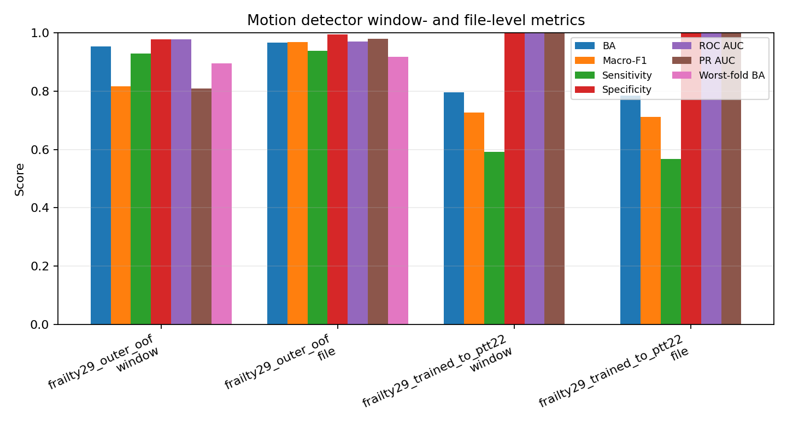
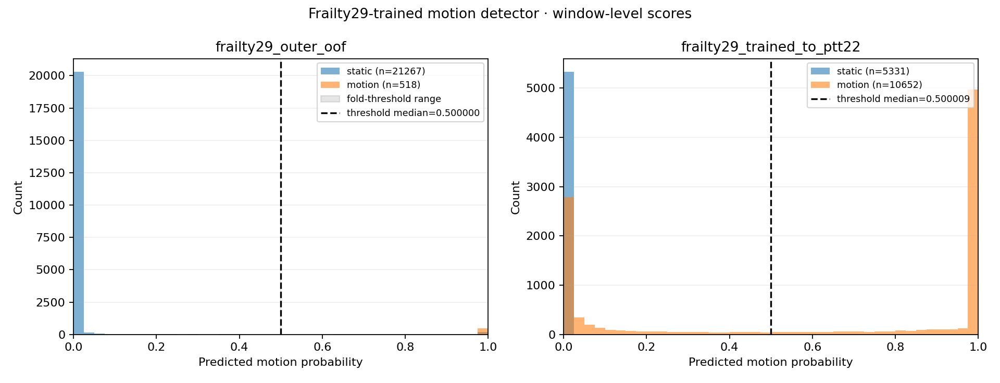
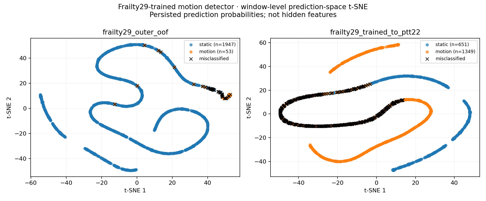
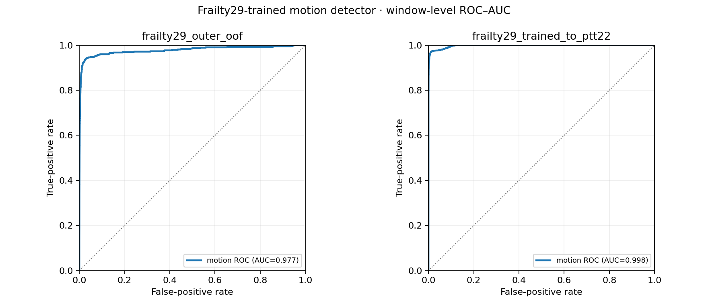
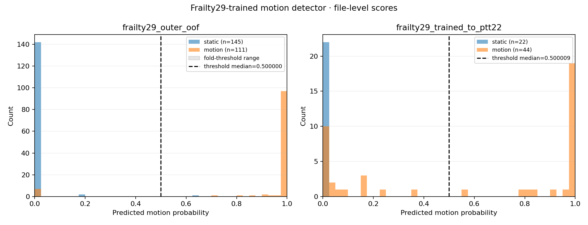
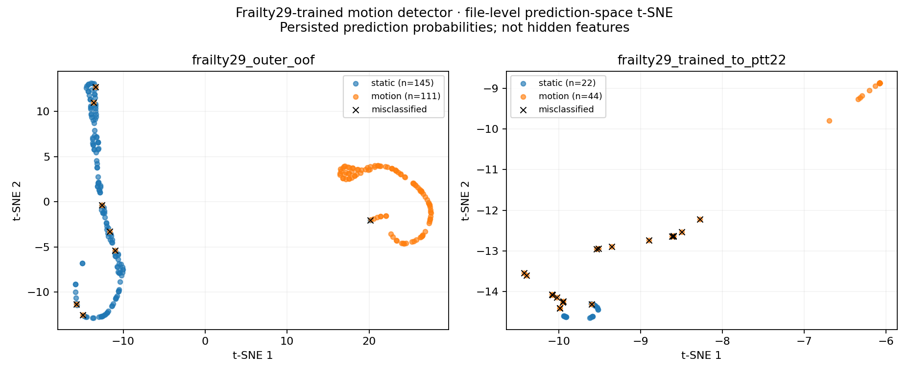
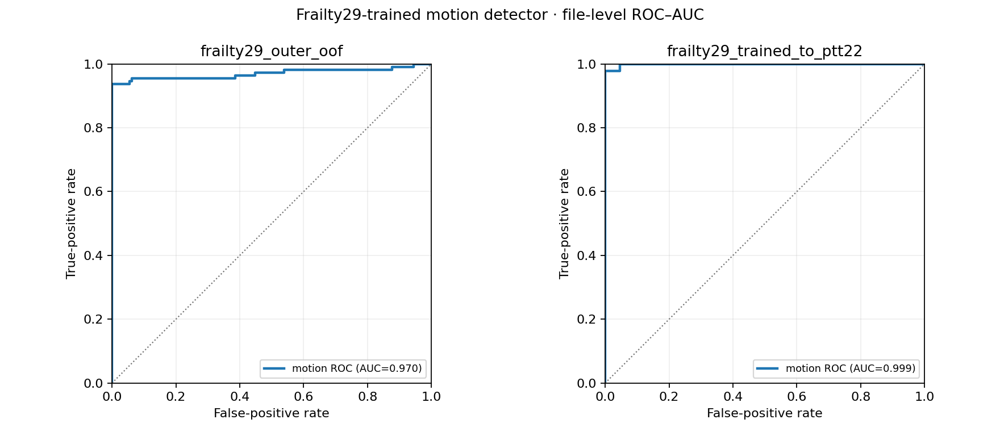
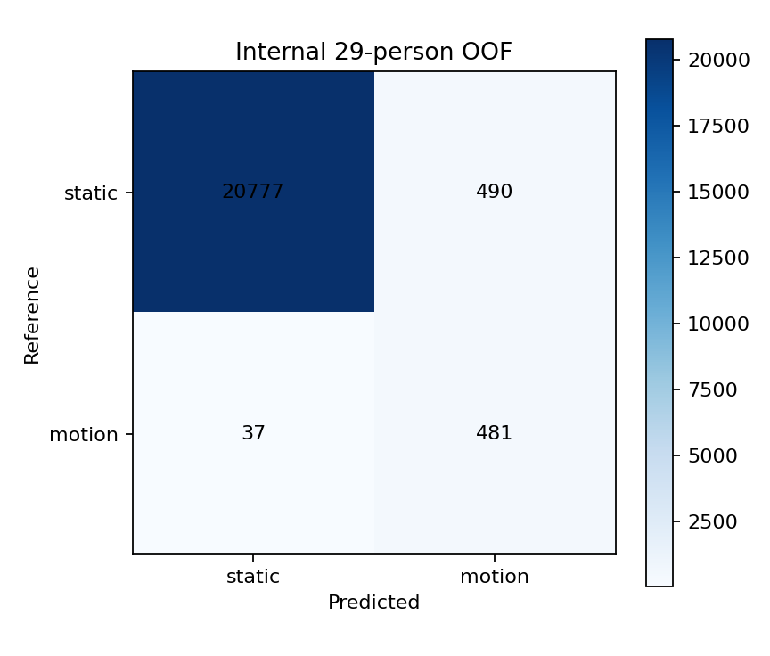
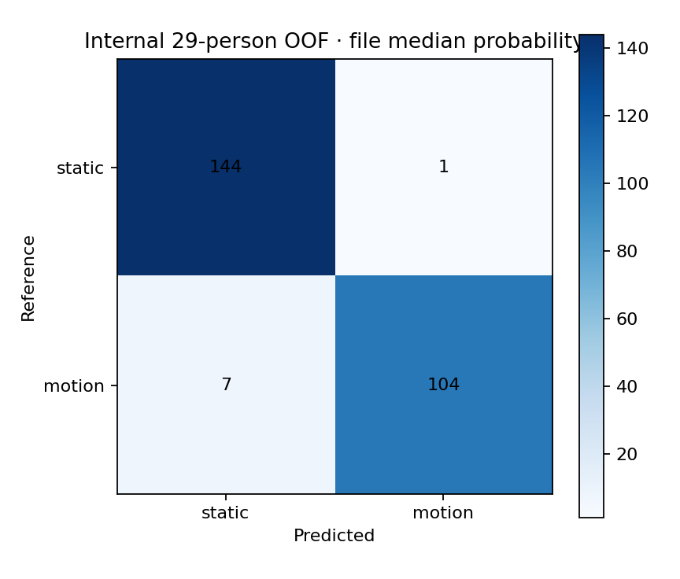
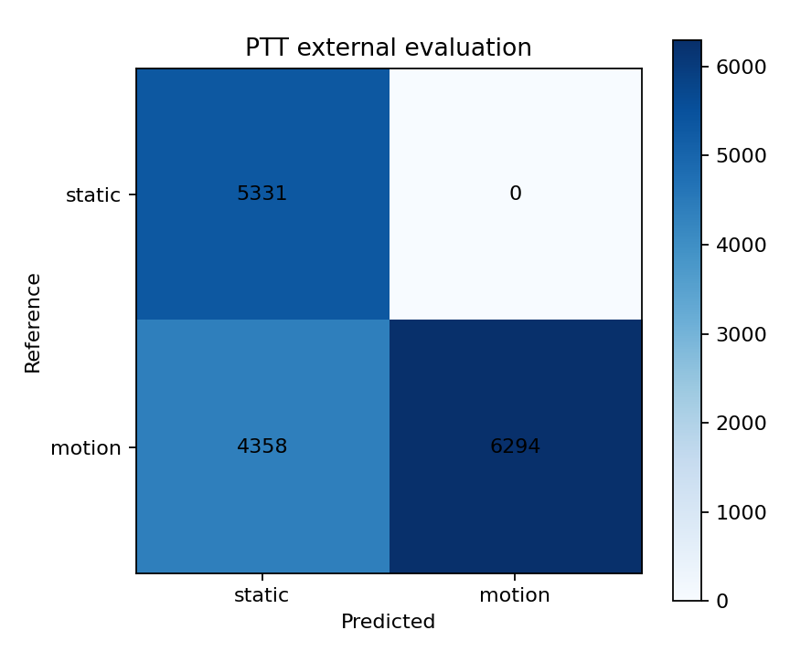

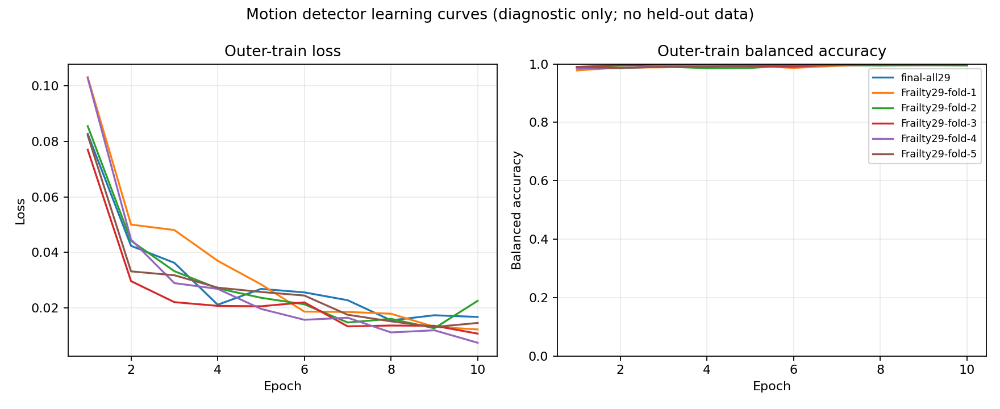
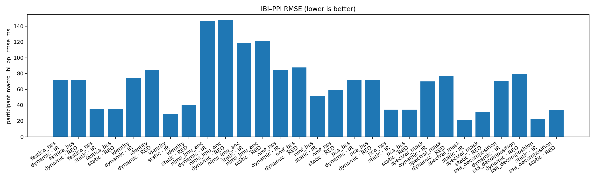
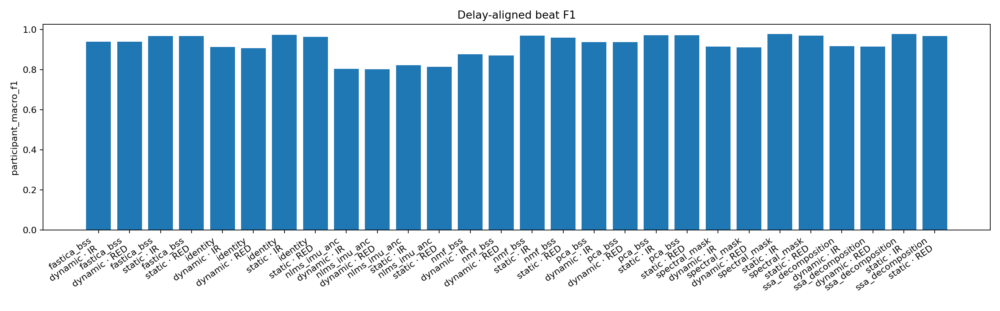
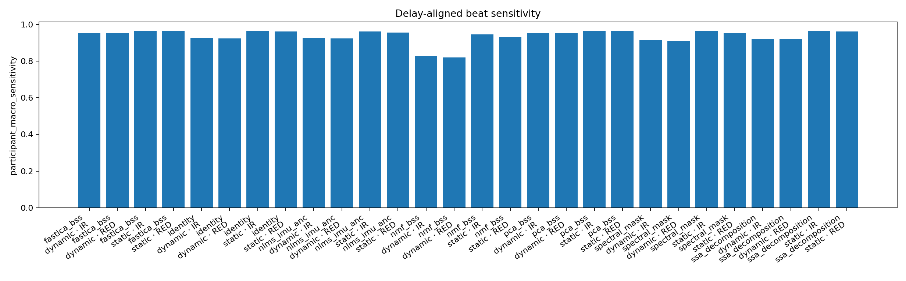
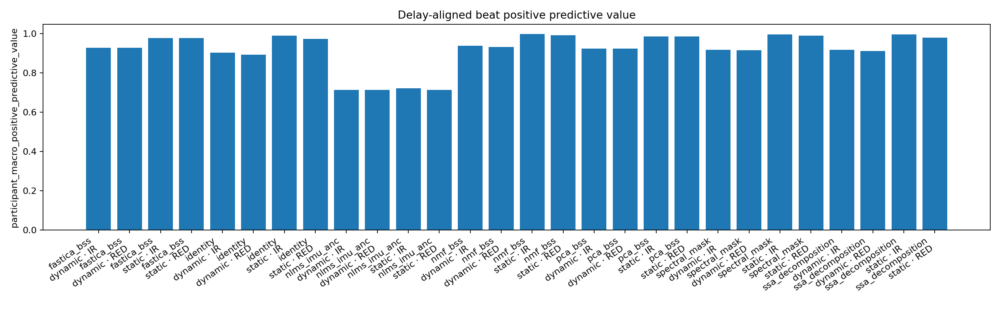
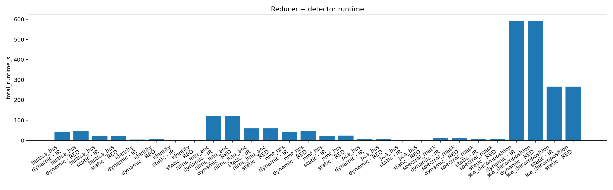

## Numerical outputs

### Detector results: one endpoint per table

Each table is intentionally narrow. `mean ± SD` is the arithmetic mean and between-participant sample SD of the named window- or file-level participant endpoint; CI95 is a percentile bootstrap of participants. Complete numerical and applicability fields remain in `motion_detector_participant_macro_statistics.json`.

#### Detector — Balanced accuracy

| model_id | evaluation | level | participant_macro_mean_sd | participant_bootstrap_ci95 | holm_p_vs_reference |
| --- | --- | --- | --- | --- | --- |
| frailty29_trained_motion_detector | frailty29_outer_oof (source_grouped_oof) | file | 96.6 ± 10.9 | [92.2, 100.0] | N/A |
| frailty29_trained_motion_detector | frailty29_outer_oof (source_grouped_oof) | window | 95.5 ± 9.9 | [91.5, 98.4] | N/A |
| frailty29_trained_motion_detector | frailty29_trained_to_ptt22 (frozen_cross_dataset) | file | 78.4 ± 14.0 | [72.7, 84.1] | N/A |
| frailty29_trained_motion_detector | frailty29_trained_to_ptt22 (frozen_cross_dataset) | window | 79.5 ± 11.7 | [74.6, 84.2] | N/A |

Column definitions and formulas

- **model_id** (`model_id`): Direct identifier, provenance, configuration, grouping, or status value. Formula: `N/A — identifier, provenance, configuration, status, or other non-arithmetic field.`
- **evaluation** (`evaluation`): Persisted source-table value for `evaluation`; producer-specific semantics are not reinterpreted by the shared table renderer. Formula: `N/A — direct persisted/source-defined value; the table renderer applies no additional arithmetic.`
- **level** (`level`): Persisted source-table value for `level`; producer-specific semantics are not reinterpreted by the shared table renderer. Formula: `N/A — direct persisted/source-defined value; the table renderer applies no additional arithmetic.`
- **participant_macro_mean_sd** (`participant_macro_mean_sd`): Participant-macro arithmetic mean and between-participant sample SD, rendered in the endpoint unit named by the table title. Formula: `display = s*mean_i(m_i) ± s*sqrt[sum_i(m_i-mean_i(m_i))^2/(n-1)]; s=100 for unitless score endpoints and s=1 for native-unit endpoints`
- **participant_bootstrap_ci95** (`participant_bootstrap_ci95`): Percentile-bootstrap 95% interval for the participant-macro arithmetic mean. Formula: `CI95 = [Q_0.025(mean(x_i*)), Q_0.975(mean(x_i*))], where participant IDs are sampled with replacement; use the same endpoint scale s as the adjacent mean ± SD column`
- **holm_p_vs_reference** (`holm_p_vs_reference`): Holm-adjusted two-sided participant-paired sign-flip P value for the table's named candidate versus configurable reference on an identical participant roster. Formula: `raw p=(1+sum_b I(\|mean(s_b*d)\|>=\|mean(d)\|))/(B+1); Holm p_(i)=max_(j<=i)[(m-j+1)p_(j)], capped at 1`

#### Detector — Macro-F1

| model_id | evaluation | level | participant_macro_mean_sd | participant_bootstrap_ci95 | holm_p_vs_reference |
| --- | --- | --- | --- | --- | --- |
| frailty29_trained_motion_detector | frailty29_outer_oof (source_grouped_oof) | file | 96.1 ± 13.1 | [90.8, 100.0] | N/A |
| frailty29_trained_motion_detector | frailty29_outer_oof (source_grouped_oof) | window | 88.1 ± 15.0 | [82.3, 93.1] | N/A |
| frailty29_trained_motion_detector | frailty29_trained_to_ptt22 (frozen_cross_dataset) | file | 70.5 ± 20.4 | [61.7, 78.8] | N/A |
| frailty29_trained_motion_detector | frailty29_trained_to_ptt22 (frozen_cross_dataset) | window | 72.0 ± 16.7 | [64.9, 78.6] | N/A |

Column definitions and formulas

- **model_id** (`model_id`): Direct identifier, provenance, configuration, grouping, or status value. Formula: `N/A — identifier, provenance, configuration, status, or other non-arithmetic field.`
- **evaluation** (`evaluation`): Persisted source-table value for `evaluation`; producer-specific semantics are not reinterpreted by the shared table renderer. Formula: `N/A — direct persisted/source-defined value; the table renderer applies no additional arithmetic.`
- **level** (`level`): Persisted source-table value for `level`; producer-specific semantics are not reinterpreted by the shared table renderer. Formula: `N/A — direct persisted/source-defined value; the table renderer applies no additional arithmetic.`
- **participant_macro_mean_sd** (`participant_macro_mean_sd`): Participant-macro arithmetic mean and between-participant sample SD, rendered in the endpoint unit named by the table title. Formula: `display = s*mean_i(m_i) ± s*sqrt[sum_i(m_i-mean_i(m_i))^2/(n-1)]; s=100 for unitless score endpoints and s=1 for native-unit endpoints`
- **participant_bootstrap_ci95** (`participant_bootstrap_ci95`): Percentile-bootstrap 95% interval for the participant-macro arithmetic mean. Formula: `CI95 = [Q_0.025(mean(x_i*)), Q_0.975(mean(x_i*))], where participant IDs are sampled with replacement; use the same endpoint scale s as the adjacent mean ± SD column`
- **holm_p_vs_reference** (`holm_p_vs_reference`): Holm-adjusted two-sided participant-paired sign-flip P value for the table's named candidate versus configurable reference on an identical participant roster. Formula: `raw p=(1+sum_b I(\|mean(s_b*d)\|>=\|mean(d)\|))/(B+1); Holm p_(i)=max_(j<=i)[(m-j+1)p_(j)], capped at 1`

#### Detector — Sensitivity

| model_id | evaluation | level | participant_macro_mean_sd | participant_bootstrap_ci95 | holm_p_vs_reference |
| --- | --- | --- | --- | --- | --- |
| frailty29_trained_motion_detector | frailty29_outer_oof (source_grouped_oof) | file | 94.0 ± 20.8 | [85.3, 100.0] | N/A |
| frailty29_trained_motion_detector | frailty29_outer_oof (source_grouped_oof) | window | 93.4 ± 19.3 | [85.3, 98.6] | N/A |
| frailty29_trained_motion_detector | frailty29_trained_to_ptt22 (frozen_cross_dataset) | file | 56.8 ± 28.0 | [45.5, 68.2] | N/A |
| frailty29_trained_motion_detector | frailty29_trained_to_ptt22 (frozen_cross_dataset) | window | 58.9 ± 23.5 | [49.1, 68.4] | N/A |

Column definitions and formulas

- **model_id** (`model_id`): Direct identifier, provenance, configuration, grouping, or status value. Formula: `N/A — identifier, provenance, configuration, status, or other non-arithmetic field.`
- **evaluation** (`evaluation`): Persisted source-table value for `evaluation`; producer-specific semantics are not reinterpreted by the shared table renderer. Formula: `N/A — direct persisted/source-defined value; the table renderer applies no additional arithmetic.`
- **level** (`level`): Persisted source-table value for `level`; producer-specific semantics are not reinterpreted by the shared table renderer. Formula: `N/A — direct persisted/source-defined value; the table renderer applies no additional arithmetic.`
- **participant_macro_mean_sd** (`participant_macro_mean_sd`): Participant-macro arithmetic mean and between-participant sample SD, rendered in the endpoint unit named by the table title. Formula: `display = s*mean_i(m_i) ± s*sqrt[sum_i(m_i-mean_i(m_i))^2/(n-1)]; s=100 for unitless score endpoints and s=1 for native-unit endpoints`
- **participant_bootstrap_ci95** (`participant_bootstrap_ci95`): Percentile-bootstrap 95% interval for the participant-macro arithmetic mean. Formula: `CI95 = [Q_0.025(mean(x_i*)), Q_0.975(mean(x_i*))], where participant IDs are sampled with replacement; use the same endpoint scale s as the adjacent mean ± SD column`
- **holm_p_vs_reference** (`holm_p_vs_reference`): Holm-adjusted two-sided participant-paired sign-flip P value for the table's named candidate versus configurable reference on an identical participant roster. Formula: `raw p=(1+sum_b I(\|mean(s_b*d)\|>=\|mean(d)\|))/(B+1); Holm p_(i)=max_(j<=i)[(m-j+1)p_(j)], capped at 1`

#### Detector — Specificity

| model_id | evaluation | level | participant_macro_mean_sd | participant_bootstrap_ci95 | holm_p_vs_reference |
| --- | --- | --- | --- | --- | --- |
| frailty29_trained_motion_detector | frailty29_outer_oof (source_grouped_oof) | file | 99.3 ± 3.7 | [97.9, 100.0] | N/A |
| frailty29_trained_motion_detector | frailty29_outer_oof (source_grouped_oof) | window | 97.7 ± 4.8 | [95.8, 99.2] | N/A |
| frailty29_trained_motion_detector | frailty29_trained_to_ptt22 (frozen_cross_dataset) | file | 100.0 ± 0.0 | [100.0, 100.0] | N/A |
| frailty29_trained_motion_detector | frailty29_trained_to_ptt22 (frozen_cross_dataset) | window | 100.0 ± 0.0 | [100.0, 100.0] | N/A |

Column definitions and formulas

- **model_id** (`model_id`): Direct identifier, provenance, configuration, grouping, or status value. Formula: `N/A — identifier, provenance, configuration, status, or other non-arithmetic field.`
- **evaluation** (`evaluation`): Persisted source-table value for `evaluation`; producer-specific semantics are not reinterpreted by the shared table renderer. Formula: `N/A — direct persisted/source-defined value; the table renderer applies no additional arithmetic.`
- **level** (`level`): Persisted source-table value for `level`; producer-specific semantics are not reinterpreted by the shared table renderer. Formula: `N/A — direct persisted/source-defined value; the table renderer applies no additional arithmetic.`
- **participant_macro_mean_sd** (`participant_macro_mean_sd`): Participant-macro arithmetic mean and between-participant sample SD, rendered in the endpoint unit named by the table title. Formula: `display = s*mean_i(m_i) ± s*sqrt[sum_i(m_i-mean_i(m_i))^2/(n-1)]; s=100 for unitless score endpoints and s=1 for native-unit endpoints`
- **participant_bootstrap_ci95** (`participant_bootstrap_ci95`): Percentile-bootstrap 95% interval for the participant-macro arithmetic mean. Formula: `CI95 = [Q_0.025(mean(x_i*)), Q_0.975(mean(x_i*))], where participant IDs are sampled with replacement; use the same endpoint scale s as the adjacent mean ± SD column`
- **holm_p_vs_reference** (`holm_p_vs_reference`): Holm-adjusted two-sided participant-paired sign-flip P value for the table's named candidate versus configurable reference on an identical participant roster. Formula: `raw p=(1+sum_b I(\|mean(s_b*d)\|>=\|mean(d)\|))/(B+1); Holm p_(i)=max_(j<=i)[(m-j+1)p_(j)], capped at 1`

#### Detector — ROC-AUC

| model_id | evaluation | level | participant_macro_mean_sd | participant_bootstrap_ci95 | holm_p_vs_reference |
| --- | --- | --- | --- | --- | --- |
| frailty29_trained_motion_detector | frailty29_outer_oof (source_grouped_oof) | file | 98.3 ± 7.6 | [95.2, 100.0] | N/A |
| frailty29_trained_motion_detector | frailty29_outer_oof (source_grouped_oof) | window | 99.3 ± 2.0 | [98.5, 99.9] | N/A |
| frailty29_trained_motion_detector | frailty29_trained_to_ptt22 (frozen_cross_dataset) | file | 100.0 ± 0.0 | [100.0, 100.0] | N/A |
| frailty29_trained_motion_detector | frailty29_trained_to_ptt22 (frozen_cross_dataset) | window | 99.8 ± 0.6 | [99.5, 100.0] | N/A |

Column definitions and formulas

- **model_id** (`model_id`): Direct identifier, provenance, configuration, grouping, or status value. Formula: `N/A — identifier, provenance, configuration, status, or other non-arithmetic field.`
- **evaluation** (`evaluation`): Persisted source-table value for `evaluation`; producer-specific semantics are not reinterpreted by the shared table renderer. Formula: `N/A — direct persisted/source-defined value; the table renderer applies no additional arithmetic.`
- **level** (`level`): Persisted source-table value for `level`; producer-specific semantics are not reinterpreted by the shared table renderer. Formula: `N/A — direct persisted/source-defined value; the table renderer applies no additional arithmetic.`
- **participant_macro_mean_sd** (`participant_macro_mean_sd`): Participant-macro arithmetic mean and between-participant sample SD, rendered in the endpoint unit named by the table title. Formula: `display = s*mean_i(m_i) ± s*sqrt[sum_i(m_i-mean_i(m_i))^2/(n-1)]; s=100 for unitless score endpoints and s=1 for native-unit endpoints`
- **participant_bootstrap_ci95** (`participant_bootstrap_ci95`): Percentile-bootstrap 95% interval for the participant-macro arithmetic mean. Formula: `CI95 = [Q_0.025(mean(x_i*)), Q_0.975(mean(x_i*))], where participant IDs are sampled with replacement; use the same endpoint scale s as the adjacent mean ± SD column`
- **holm_p_vs_reference** (`holm_p_vs_reference`): Holm-adjusted two-sided participant-paired sign-flip P value for the table's named candidate versus configurable reference on an identical participant roster. Formula: `raw p=(1+sum_b I(\|mean(s_b*d)\|>=\|mean(d)\|))/(B+1); Holm p_(i)=max_(j<=i)[(m-j+1)p_(j)], capped at 1`

#### Detector — PR-AUC

| model_id | evaluation | level | participant_macro_mean_sd | participant_bootstrap_ci95 | holm_p_vs_reference |
| --- | --- | --- | --- | --- | --- |
| frailty29_trained_motion_detector | frailty29_outer_oof (source_grouped_oof) | file | 98.8 ± 5.1 | [96.7, 100.0] | N/A |
| frailty29_trained_motion_detector | frailty29_outer_oof (source_grouped_oof) | window | 92.8 ± 14.9 | [86.8, 97.4] | N/A |
| frailty29_trained_motion_detector | frailty29_trained_to_ptt22 (frozen_cross_dataset) | file | 100.0 ± 0.0 | [100.0, 100.0] | N/A |
| frailty29_trained_motion_detector | frailty29_trained_to_ptt22 (frozen_cross_dataset) | window | 99.9 ± 0.4 | [99.7, 100.0] | N/A |

Column definitions and formulas

- **model_id** (`model_id`): Direct identifier, provenance, configuration, grouping, or status value. Formula: `N/A — identifier, provenance, configuration, status, or other non-arithmetic field.`
- **evaluation** (`evaluation`): Persisted source-table value for `evaluation`; producer-specific semantics are not reinterpreted by the shared table renderer. Formula: `N/A — direct persisted/source-defined value; the table renderer applies no additional arithmetic.`
- **level** (`level`): Persisted source-table value for `level`; producer-specific semantics are not reinterpreted by the shared table renderer. Formula: `N/A — direct persisted/source-defined value; the table renderer applies no additional arithmetic.`
- **participant_macro_mean_sd** (`participant_macro_mean_sd`): Participant-macro arithmetic mean and between-participant sample SD, rendered in the endpoint unit named by the table title. Formula: `display = s*mean_i(m_i) ± s*sqrt[sum_i(m_i-mean_i(m_i))^2/(n-1)]; s=100 for unitless score endpoints and s=1 for native-unit endpoints`
- **participant_bootstrap_ci95** (`participant_bootstrap_ci95`): Percentile-bootstrap 95% interval for the participant-macro arithmetic mean. Formula: `CI95 = [Q_0.025(mean(x_i*)), Q_0.975(mean(x_i*))], where participant IDs are sampled with replacement; use the same endpoint scale s as the adjacent mean ± SD column`
- **holm_p_vs_reference** (`holm_p_vs_reference`): Holm-adjusted two-sided participant-paired sign-flip P value for the table's named candidate versus configurable reference on an identical participant roster. Formula: `raw p=(1+sum_b I(\|mean(s_b*d)\|>=\|mean(d)\|))/(B+1); Holm p_(i)=max_(j<=i)[(m-j+1)p_(j)], capped at 1`

#### Detector — worst-fold balanced accuracy

| model_id | evaluation | level | worst_fold_balanced_accuracy |
| --- | --- | --- | --- |
| frailty29_trained_motion_detector | frailty29_outer_oof (source_grouped_oof) | window | 89.5 |
| frailty29_trained_motion_detector | frailty29_outer_oof (source_grouped_oof) | file | 91.7 |

Column definitions and formulas

- **model_id** (`model_id`): Direct identifier, provenance, configuration, grouping, or status value. Formula: `N/A — identifier, provenance, configuration, status, or other non-arithmetic field.`
- **evaluation** (`evaluation`): Persisted source-table value for `evaluation`; producer-specific semantics are not reinterpreted by the shared table renderer. Formula: `N/A — direct persisted/source-defined value; the table renderer applies no additional arithmetic.`
- **level** (`level`): Persisted source-table value for `level`; producer-specific semantics are not reinterpreted by the shared table renderer. Formula: `N/A — direct persisted/source-defined value; the table renderer applies no additional arithmetic.`
- **worst_fold_balanced_accuracy** (`worst_fold_balanced_accuracy`): Macro-average recall across the K declared classes. Formula: `BA = (1/K) * sum_c [TP_c / (TP_c + FN_c)]`

Worst-fold BA is a separate robustness endpoint and applies only to grouped-OOF evaluations; frozen transfer has no training fold axis.

#### Detector — per-class performance

| model_id | evaluation | level | activity | sensitivity | specificity | balanced_accuracy_ovr | f1 |
| --- | --- | --- | --- | --- | --- | --- | --- |
| frailty29_trained_motion_detector | frailty29_outer_oof | file | static | 99.3 | 93.7 | 96.5 | 97.3 |
| frailty29_trained_motion_detector | frailty29_outer_oof | file | motion | 93.7 | 99.3 | 96.5 | 96.3 |
| frailty29_trained_motion_detector | frailty29_outer_oof | window | static | 97.7 | 92.9 | 95.3 | 98.7 |
| frailty29_trained_motion_detector | frailty29_outer_oof | window | motion | 92.9 | 97.7 | 95.3 | 64.6 |
| frailty29_trained_motion_detector | frailty29_trained_to_ptt22 | file | static | 100.0 | 56.8 | 78.4 | 69.8 |
| frailty29_trained_motion_detector | frailty29_trained_to_ptt22 | file | motion | 56.8 | 100.0 | 78.4 | 72.5 |
| frailty29_trained_motion_detector | frailty29_trained_to_ptt22 | window | static | 100.0 | 59.1 | 79.5 | 71.0 |
| frailty29_trained_motion_detector | frailty29_trained_to_ptt22 | window | motion | 59.1 | 100.0 | 79.5 | 74.3 |

Column definitions and formulas

- **model_id** (`model_id`): Direct identifier, provenance, configuration, grouping, or status value. Formula: `N/A — identifier, provenance, configuration, status, or other non-arithmetic field.`
- **evaluation** (`evaluation`): Persisted source-table value for `evaluation`; producer-specific semantics are not reinterpreted by the shared table renderer. Formula: `N/A — direct persisted/source-defined value; the table renderer applies no additional arithmetic.`
- **level** (`level`): Persisted source-table value for `level`; producer-specific semantics are not reinterpreted by the shared table renderer. Formula: `N/A — direct persisted/source-defined value; the table renderer applies no additional arithmetic.`
- **activity** (`activity`): Direct identifier, provenance, configuration, grouping, or status value. Formula: `N/A — identifier, provenance, configuration, status, or other non-arithmetic field.`
- **sensitivity** (`sensitivity`): True-positive rate for the positive class. Formula: `sensitivity = TP / (TP + FN)`
- **specificity** (`specificity`): True-negative rate for the negative class. Formula: `specificity = TN / (TN + FP)`
- **balanced_accuracy_ovr** (`balanced_accuracy_ovr`): One-vs-rest balanced accuracy for the named class. Formula: `BA_c = 0.5 * [TP_c/(TP_c+FN_c) + TN_c/(TN_c+FP_c)]`
- **f1** (`f1`): Harmonic mean of precision and recall for the named class. Formula: `F1 = 2 * precision * recall / (precision + recall)`

#### Detector — per-class discrimination

| model_id | evaluation | level | activity | precision | roc_auc_ovr | pr_auc_ovr |
| --- | --- | --- | --- | --- | --- | --- |
| frailty29_trained_motion_detector | frailty29_outer_oof | file | static | 95.4 | 97.0 | 95.5 |
| frailty29_trained_motion_detector | frailty29_outer_oof | file | motion | 99.0 | 97.0 | 97.9 |
| frailty29_trained_motion_detector | frailty29_outer_oof | window | static | 99.8 | 97.7 | 99.9 |
| frailty29_trained_motion_detector | frailty29_outer_oof | window | motion | 49.5 | 97.7 | 80.9 |
| frailty29_trained_motion_detector | frailty29_trained_to_ptt22 | file | static | 53.7 | 99.9 | 99.8 |
| frailty29_trained_motion_detector | frailty29_trained_to_ptt22 | file | motion | 100.0 | 99.9 | 99.9 |
| frailty29_trained_motion_detector | frailty29_trained_to_ptt22 | window | static | 55.0 | 99.8 | 99.5 |
| frailty29_trained_motion_detector | frailty29_trained_to_ptt22 | window | motion | 100.0 | 99.8 | 99.9 |

Column definitions and formulas

- **model_id** (`model_id`): Direct identifier, provenance, configuration, grouping, or status value. Formula: `N/A — identifier, provenance, configuration, status, or other non-arithmetic field.`
- **evaluation** (`evaluation`): Persisted source-table value for `evaluation`; producer-specific semantics are not reinterpreted by the shared table renderer. Formula: `N/A — direct persisted/source-defined value; the table renderer applies no additional arithmetic.`
- **level** (`level`): Persisted source-table value for `level`; producer-specific semantics are not reinterpreted by the shared table renderer. Formula: `N/A — direct persisted/source-defined value; the table renderer applies no additional arithmetic.`
- **activity** (`activity`): Direct identifier, provenance, configuration, grouping, or status value. Formula: `N/A — identifier, provenance, configuration, status, or other non-arithmetic field.`
- **precision** (`precision`): Positive predictive value for the named class. Formula: `precision = TP / (TP + FP)`
- **roc_auc_ovr** (`roc_auc_ovr`): One-vs-rest ROC area for the named class. Formula: `ROC-AUC_c = integral_0^1 TPR_c(FPR_c) dFPR_c`
- **pr_auc_ovr** (`pr_auc_ovr`): One-vs-rest average precision for the named class. Formula: `AP_c = sum_n (recall_(c,n) - recall_(c,n-1)) * precision_(c,n)`

#### Detector — window-level confusion counts

| model_id | dataset | aggregation_level | true_static_predicted_static | true_static_predicted_motion | true_motion_predicted_static | true_motion_predicted_motion |
| --- | --- | --- | --- | --- | --- | --- |
| frailty29_trained_motion_detector | frailty29_outer_oof | window | 20777 | 490 | 37 | 481 |
| frailty29_trained_motion_detector | frailty29_trained_to_ptt22 | window | 5331 | 0 | 4358 | 6294 |

Column definitions and formulas

- **model_id** (`model_id`): Direct identifier, provenance, configuration, grouping, or status value. Formula: `N/A — identifier, provenance, configuration, status, or other non-arithmetic field.`
- **dataset** (`dataset`): Direct identifier, provenance, configuration, grouping, or status value. Formula: `N/A — identifier, provenance, configuration, status, or other non-arithmetic field.`
- **aggregation_level** (`aggregation_level`): Persisted source-table value for `aggregation_level`; producer-specific semantics are not reinterpreted by the shared table renderer. Formula: `N/A — direct persisted/source-defined value; the table renderer applies no additional arithmetic.`
- **true_static_predicted_static** (`true_static_predicted_static`): Persisted source-table value for `true_static_predicted_static`; producer-specific semantics are not reinterpreted by the shared table renderer. Formula: `N/A — direct persisted/source-defined value; the table renderer applies no additional arithmetic.`
- **true_static_predicted_motion** (`true_static_predicted_motion`): Persisted source-table value for `true_static_predicted_motion`; producer-specific semantics are not reinterpreted by the shared table renderer. Formula: `N/A — direct persisted/source-defined value; the table renderer applies no additional arithmetic.`
- **true_motion_predicted_static** (`true_motion_predicted_static`): Persisted source-table value for `true_motion_predicted_static`; producer-specific semantics are not reinterpreted by the shared table renderer. Formula: `N/A — direct persisted/source-defined value; the table renderer applies no additional arithmetic.`
- **true_motion_predicted_motion** (`true_motion_predicted_motion`): Persisted source-table value for `true_motion_predicted_motion`; producer-specific semantics are not reinterpreted by the shared table renderer. Formula: `N/A — direct persisted/source-defined value; the table renderer applies no additional arithmetic.`

#### Detector — file-level confusion counts

| model_id | dataset | aggregation_level | true_static_predicted_static | true_static_predicted_motion | true_motion_predicted_static | true_motion_predicted_motion |
| --- | --- | --- | --- | --- | --- | --- |
| frailty29_trained_motion_detector | frailty29_outer_oof | file_median_window_probability | 144 | 1 | 7 | 104 |
| frailty29_trained_motion_detector | frailty29_trained_to_ptt22 | file_median_window_probability | 22 | 0 | 19 | 25 |

Column definitions and formulas

- **model_id** (`model_id`): Direct identifier, provenance, configuration, grouping, or status value. Formula: `N/A — identifier, provenance, configuration, status, or other non-arithmetic field.`
- **dataset** (`dataset`): Direct identifier, provenance, configuration, grouping, or status value. Formula: `N/A — identifier, provenance, configuration, status, or other non-arithmetic field.`
- **aggregation_level** (`aggregation_level`): Persisted source-table value for `aggregation_level`; producer-specific semantics are not reinterpreted by the shared table renderer. Formula: `N/A — direct persisted/source-defined value; the table renderer applies no additional arithmetic.`
- **true_static_predicted_static** (`true_static_predicted_static`): Persisted source-table value for `true_static_predicted_static`; producer-specific semantics are not reinterpreted by the shared table renderer. Formula: `N/A — direct persisted/source-defined value; the table renderer applies no additional arithmetic.`
- **true_static_predicted_motion** (`true_static_predicted_motion`): Persisted source-table value for `true_static_predicted_motion`; producer-specific semantics are not reinterpreted by the shared table renderer. Formula: `N/A — direct persisted/source-defined value; the table renderer applies no additional arithmetic.`
- **true_motion_predicted_static** (`true_motion_predicted_static`): Persisted source-table value for `true_motion_predicted_static`; producer-specific semantics are not reinterpreted by the shared table renderer. Formula: `N/A — direct persisted/source-defined value; the table renderer applies no additional arithmetic.`
- **true_motion_predicted_motion** (`true_motion_predicted_motion`): Persisted source-table value for `true_motion_predicted_motion`; producer-specific semantics are not reinterpreted by the shared table renderer. Formula: `N/A — direct persisted/source-defined value; the table renderer applies no additional arithmetic.`

Window-level metrics retain every persisted 8 s window. File-level metrics first take the median probability within one physical file and apply its frozen threshold once.

Detector P is N/A because `ptt22_trained_motion_detector` and `frailty29_trained_motion_detector` do not both predict the same target units in this artifact. Cross-dataset rows and window/file rows are not treated as paired model comparisons.

The detailed classification-diagnostic and reporter-applicability audits are separate files: `motion_detector_diagnostic_status.*` and `reporter_output_status.*`; they are not result columns.

ROC figures are empirical ROC curves with AUC annotated. t-SNE embeds persisted prediction-probability vectors, not hidden features.

### Denoiser results: static

| denoiser | IR/RED | RMSE ± SD (ms) | F1 ± SD (%) | RMSE P versus identity |
| --- | --- | --- | --- | --- |
| spectral_mask* | IR | 21.1 ± 11.0* | 97.7 ± 6.9 | 0.0092 |
| ssa_decomposition* | IR | 22.3 ± 14.0 | 97.7 ± 6.8* | 0.0032 |
| identity | IR | 28.6 ± 21.4 | 97.3 ± 7.1 | Reference |
| spectral_mask | RED | 31.5 ± 30.8 | 96.8 ± 7.0 | 0.0005 |
| ssa_decomposition | RED | 33.9 ± 34.1 | 96.6 ± 7.2 | 0.0143 |
| pca_bss | IR | 34.4 ± 26.9 | 97.1 ± 7.1 | 0.0312 |
| pca_bss | RED | 34.4 ± 26.9 | 97.1 ± 7.1 | 0.4628 |
| fastica_bss | IR | 34.8 ± 20.5 | 96.7 ± 6.9 | 0.2271 |
| fastica_bss | RED | 34.8 ± 20.5 | 96.7 ± 6.9 | 0.5337 |
| identity | RED | 40.0 ± 37.0 | 96.3 ± 7.1 | Reference |
| nmf_bss | IR | 51.7 ± 22.5 | 96.9 ± 5.3 | 0.0006 |
| nmf_bss | RED | 58.8 ± 30.4 | 95.8 ± 6.4 | 0.0014 |
| nlms_imu_anc | IR | 119.1 ± 17.7 | 82.1 ± 6.7 | 6.00e-05 |
| nlms_imu_anc | RED | 121.6 ± 19.9 | 81.3 ± 6.5 | 6.00e-05 |

Column definitions and formulas

- **denoiser** (`denoiser`): Persisted source-table value for `denoiser`; producer-specific semantics are not reinterpreted by the shared table renderer. Formula: `N/A — direct persisted/source-defined value; the table renderer applies no additional arithmetic.`
- **IR/RED** (`IR/RED`): Optical PPG channel for the denoiser endpoint row. Formula: `N/A — categorical channel identifier, either IR or RED`
- **RMSE ± SD (ms)** (`RMSE ± SD (ms)`): Participant-macro IBI–PPI RMSE mean and between-participant sample SD in milliseconds; a trailing star marks the minimum mean in the activity table. Formula: `mean_RMSE ± sqrt[sum_i(RMSE_i-mean_RMSE)^2/(n-1)] ms`
- **F1 ± SD (%)** (`F1 ± SD (%)`): Participant-macro ECG-aligned beat-detection F1 mean and between-participant sample SD in percent; a trailing star marks the maximum mean in the activity table. Formula: `100*mean_i(F1_i) ± 100*sqrt[sum_i(F1_i-mean_i(F1_i))^2/(n-1)]`
- **RMSE P versus identity** (`RMSE P versus identity`): Holm-adjusted two-sided participant-paired sign-flip P value for the denoiser RMSE versus identity on identical successful segments; the identity row is the reference. Formula: `raw p=(1+sum_b I(\|mean(s_b*d)\|>=\|mean(d)\|))/(B+1); Holm p_(i)=max_(j<=i)[(m-j+1)p_(j)], capped at 1`

### Denoiser results: dynamic

| denoiser | IR/RED | RMSE ± SD (ms) | F1 ± SD (%) | RMSE P versus identity |
| --- | --- | --- | --- | --- |
| spectral_mask* | IR | 70.0 ± 45.5* | 91.4 ± 8.1 | 0.0656 |
| ssa_decomposition | IR | 70.4 ± 48.7 | 91.7 ± 8.0 | 0.0154 |
| pca_bss | IR | 71.4 ± 43.4 | 93.7 ± 5.3 | 0.1547 |
| pca_bss | RED | 71.4 ± 43.4 | 93.7 ± 5.3 | 1.00e-04 |
| fastica_bss* | IR | 71.7 ± 39.9 | 93.8 ± 5.0* | 0.3947 |
| fastica_bss* | RED | 71.7 ± 39.9 | 93.8 ± 5.0* | 0.0530 |
| identity | IR | 74.3 ± 48.7 | 91.3 ± 8.0 | Reference |
| spectral_mask | RED | 76.8 ± 43.9 | 91.1 ± 7.8 | 0.0028 |
| ssa_decomposition | RED | 79.5 ± 47.6 | 91.4 ± 7.8 | 0.0530 |
| identity | RED | 83.9 ± 46.0 | 90.6 ± 7.7 | Reference |
| nmf_bss | IR | 84.2 ± 37.6 | 87.6 ± 9.2 | 0.0656 |
| nmf_bss | RED | 87.8 ± 38.7 | 87.0 ± 8.6 | 0.2525 |
| nlms_imu_anc | IR | 146.9 ± 19.4 | 80.4 ± 5.5 | 6.00e-05 |
| nlms_imu_anc | RED | 147.5 ± 18.3 | 80.2 ± 5.4 | 6.00e-05 |

Column definitions and formulas

- **denoiser** (`denoiser`): Persisted source-table value for `denoiser`; producer-specific semantics are not reinterpreted by the shared table renderer. Formula: `N/A — direct persisted/source-defined value; the table renderer applies no additional arithmetic.`
- **IR/RED** (`IR/RED`): Optical PPG channel for the denoiser endpoint row. Formula: `N/A — categorical channel identifier, either IR or RED`
- **RMSE ± SD (ms)** (`RMSE ± SD (ms)`): Participant-macro IBI–PPI RMSE mean and between-participant sample SD in milliseconds; a trailing star marks the minimum mean in the activity table. Formula: `mean_RMSE ± sqrt[sum_i(RMSE_i-mean_RMSE)^2/(n-1)] ms`
- **F1 ± SD (%)** (`F1 ± SD (%)`): Participant-macro ECG-aligned beat-detection F1 mean and between-participant sample SD in percent; a trailing star marks the maximum mean in the activity table. Formula: `100*mean_i(F1_i) ± 100*sqrt[sum_i(F1_i-mean_i(F1_i))^2/(n-1)]`
- **RMSE P versus identity** (`RMSE P versus identity`): Holm-adjusted two-sided participant-paired sign-flip P value for the denoiser RMSE versus identity on identical successful segments; the identity row is the reference. Formula: `raw p=(1+sum_b I(\|mean(s_b*d)\|>=\|mean(d)\|))/(B+1); Holm p_(i)=max_(j<=i)[(m-j+1)p_(j)], capped at 1`

Both tables are sorted by participant-macro IBI–PPI RMSE ascending across RED and IR rows. `*` marks a best metric value (minimum RMSE or maximum F1); `**` on the denoiser name marks a row best on both. SD uses ddof=1 and measures between-subject dispersion, not repeat-training uncertainty. Best-value marks use the unrounded participant mean. Coverage/failure counts and the full endpoint audit remain in `denoiser_coverage.*`, `denoiser_summary.json`, and `denoiser_compact_statistics.json` rather than widening these two result tables.

The displayed RMSE P is the retrospective exploratory two-sided participant-paired Monte-Carlo sign-flip test versus `identity`, restricted to identical successfully processed segment keys; RMSE also requires matched intervals on both sides. Holm correction is applied across all non-reference reducers separately within each activity × channel × endpoint family. The raw and adjusted numeric audit is in `denoiser_paired_inference.*`.

Denoiser F1 is beat-event matching F1 after lag alignment to ECG annotations, not motion-classification F1. It guards against a deceptively low interval RMSE computed from only a small easy subset of beats.

Machine-readable values are in `study_summary.json` and `tables/`. Each report table has an individual CSV; `tables/report_tables.xlsx` contains one table per worksheet, and `tables/table_figure_pairs.csv` records every analytical figure/table pair.
