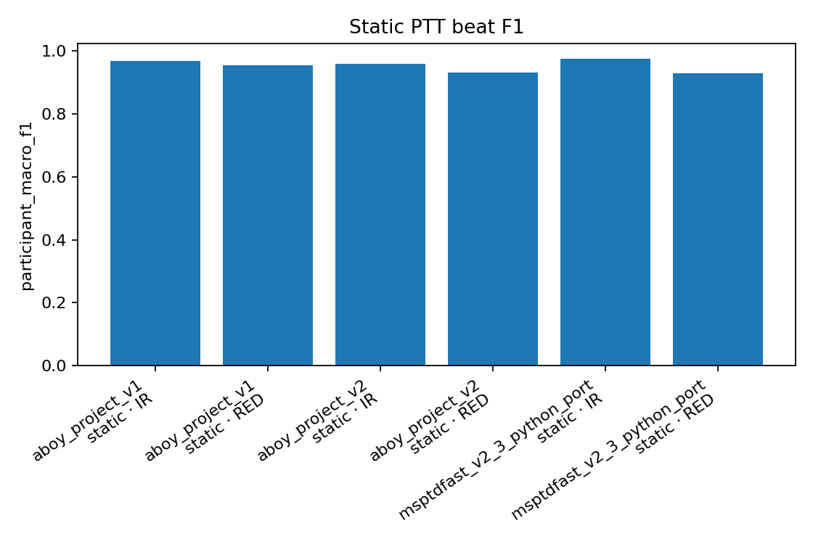
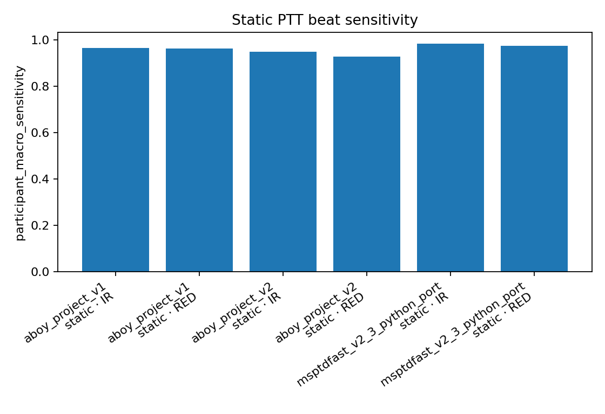
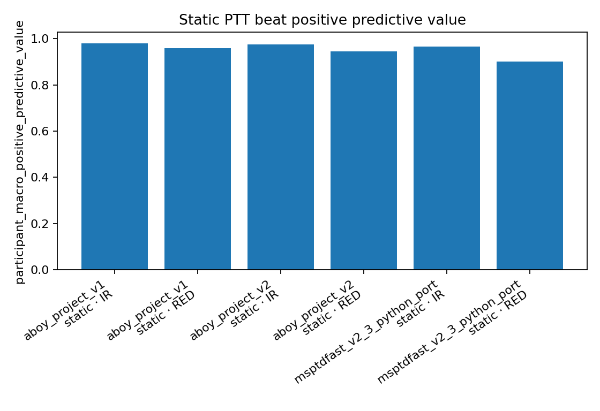
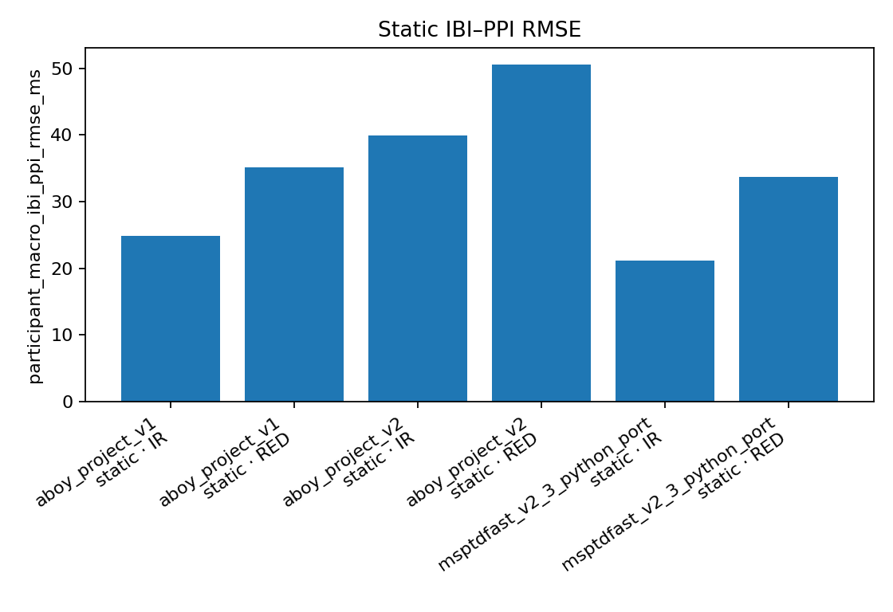
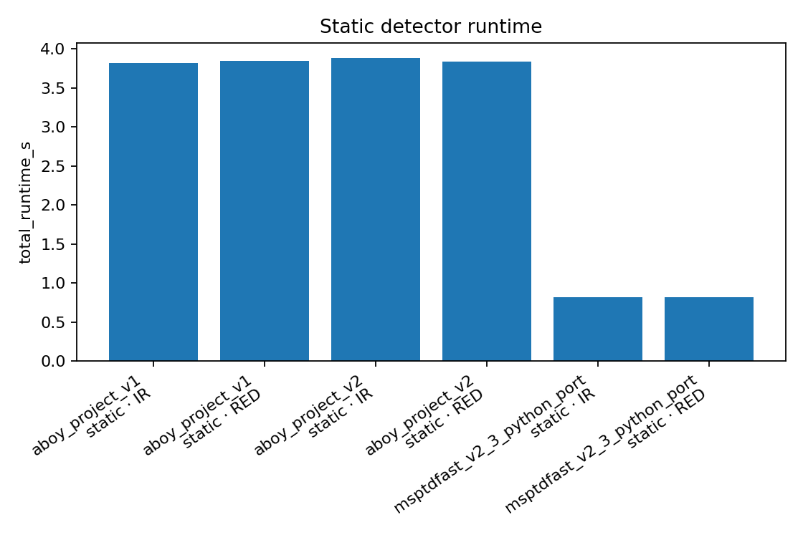

# stage-ablation-01-static-peak-detectors-v2

Status: **passed**

## Scientific scope

PTT sit-only detector comparison; no motion segments and no denoiser selection

## Test models, modules, inputs, and fixed parameters

The identical standalone table is in `TEST_COMPONENTS.md`; machine-readable copies are `tables/test_components.csv` and `.json`. Input data are named directly rather than represented by hashes.

| Cases / phases | Component role | Model / module | State | Input data (values and paths; no hashes) | Detailed fixed parameters | Algorithm and kernel (≤300 chars) |
|---|---|---|---|---|---|---|
| all | dataset_adapter | ptt_ppg_1_1_0_local | enabled | {"activities":["sit","walk","run"],"channels":{"IR":"pleth_2","RED":"pleth_1"},"dataset_id":"ptt_ppg_1_1_0_local","dataset_root":"physionet.org/files/pulse-transit-time-ppg/1.1.0","ecg_peak_annotation_column":"peaks","participants":22,"pipeline_fs_hz":400.0,"records":66,"source_fs_hz":500.0} | {"activities":["sit","walk","run"],"dataset_id":"ptt_ppg_1_1_0_local","distal_channels":{"IR":"pleth_2","RED":"pleth_1"},"ecg_peak_annotation_column":"peaks","participant_count":22,"record_count":66,"root":"physionet.org/files/pulse-transit-time-ppg/1.1.0","selected_activity":"sit","selected_record_count":22} |  |
| PTT sit static peak ablation | peak_detector | aboy_project_v1 | executed | {"activities":["sit","walk","run"],"channels":["RED","IR"],"dataset_id":"ptt_ppg_1_1_0_local","dataset_root":"physionet.org/files/pulse-transit-time-ppg/1.1.0","ecg_peak_annotation_column":"peaks","input_view":"repaired_native_ppg_each_registered_module_owns_preprocessing","participants":22,"pipeline_fs_hz":400.0,"records":66,"scoring_windows_s":60.0,"selected_activity":"sit","source_fs_hz":500.0} | {"adaptive_bandpass_hz":"0.5 to min(8,max(1.5,3*(1+HRI)))","algorithm_id":"aboy_project_v1","bandpass_order":2,"block_s":10.0,"implementation":"ppg_frailty.peaks.aboy_project.detect_pulses_per_wavelength_aboy_project","initial_hri":0.0,"input_preprocessing":"shared repaired PPG then shared 0.2-8 Hz analysis filter","mad_limit":4.0,"mad_scale":1.4826,"prominence_fraction":0.25,"pulse_rate_bpm":[35.0,210.0],"role":"historical_project_reference"} |  |
| PTT sit static peak ablation | peak_detector | aboy_project_v2 | executed | {"activities":["sit","walk","run"],"channels":["RED","IR"],"dataset_id":"ptt_ppg_1_1_0_local","dataset_root":"physionet.org/files/pulse-transit-time-ppg/1.1.0","ecg_peak_annotation_column":"peaks","input_view":"repaired_native_ppg_each_registered_module_owns_preprocessing","participants":22,"pipeline_fs_hz":400.0,"records":66,"scoring_windows_s":60.0,"selected_activity":"sit","source_fs_hz":500.0} | {"adaptive_bandpass_hz":"0.5 to min(8,max(1.5,3*(1+HRI)))","algorithm_id":"aboy_project_v2","bandpass_order":2,"block_s":10.0,"implementation":"ppg_frailty.peaks.aboy_project_v2.detect_pulses_per_wavelength_aboy_project_v2","initial_hri":0.0,"interval_merge_limits":[0.5,1.8],"mad_limit":4.0,"mad_scale":1.4826,"owned_highpass_hz":0.2,"owned_highpass_order":2,"prominence_fraction":0.25,"pulse_rate_bpm":[35.0,210.0],"role":"authoritative_seven_step_candidate"} |  |
| PTT sit static peak ablation | peak_detector | msptdfast_v2_3_python_port | executed | {"activities":["sit","walk","run"],"channels":["RED","IR"],"dataset_id":"ptt_ppg_1_1_0_local","dataset_root":"physionet.org/files/pulse-transit-time-ppg/1.1.0","ecg_peak_annotation_column":"peaks","input_view":"repaired_native_ppg_each_registered_module_owns_preprocessing","participants":22,"pipeline_fs_hz":400.0,"records":66,"scoring_windows_s":60.0,"selected_activity":"sit","source_fs_hz":500.0} | {"algorithm_id":"msptdfast_v2_3_python_port","implementation":"ppg_frailty.peaks.msptdfast_v2.detect_msptdfast_v2","parameters":{"minimum_heart_rate_bpm":30.0,"overlap_fraction":0.2,"target_downsample_hz":20.0,"window_s":6.0},"parity_status":"equation_level_port_not_bitwise_matlab_validated","role":"paper_method_comparator"} |  |
| PTT sit static peak ablation | peak_validation | paper_toolbox_style_lag_search_in_consecutive_time_windows | executed | {"annotation_column":"peaks","predictions":"detected PPG pulse times","reference":"synchronized_manually_verified_ecg_peak_annotations"} | {"aggregation":"per_record_then_equal_participant_then_equal_wavelength_reporting","alignment":"paper_toolbox_style_lag_search_in_consecutive_time_windows","beat_tolerance_s":0.2,"efficiency_metric":"execution_time_as_fraction_of_signal_duration","lag_step_s":0.02,"lag_window_s":60.0,"max_lag_s":10.0,"primary_metrics":["participant_macro_f1","sensitivity","positive_predictive_value"],"reference":"synchronized_manually_verified_ecg_peak_annotations","secondary_delay_invariant_metrics":["participant_macro_ibi_ppi_rmse_ms","ibi_ppi_mae_ms"],"statistical_scope":"paired_within_participant_algorithm_comparison_no_model_training"} |  |

## Figures

## Numerical outputs

N/A

| activity_group | algorithm_or_reducer | channel | participant_count | participant_macro_f1_mean_sd | participant_macro_ibi_ppi_rmse_ms_mean_sd | participant_macro_positive_predictive_value_mean_sd | participant_macro_sensitivity_mean_sd | segment_count | total_runtime_s |
| --- | --- | --- | --- | --- | --- | --- | --- | --- | --- |
| static | aboy_project_v1 | IR | 22 | 96.8 ± 7.9 | 24.8 ± 20.5 | 98.0 ± 5.4 | 96.6 ± 10.9 | 198 | 3.819918212975608 |
| static | aboy_project_v1 | RED | 22 | 95.6 ± 7.8 | 35.1 ± 37.6 | 96.0 ± 7.7 | 96.4 ± 10.2 | 198 | 3.8481006002693903 |
| static | aboy_project_v2 | IR | 22 | 95.8 ± 7.8 | 39.9 ± 16.9 | 97.6 ± 3.7 | 95.1 ± 11.1 | 198 | 3.8827220770181157 |
| static | aboy_project_v2 | RED | 22 | 93.2 ± 9.5 | 50.6 ± 26.8 | 94.5 ± 8.2 | 93.0 ± 11.7 | 198 | 3.837244098132942 |
| static | msptdfast_v2_3_python_port | IR | 22 | 97.6 ± 0.7 | 21.2 ± 17.4 | 96.7 ± 1.0 | 98.5 ± 0.7 | 198 | 0.8150521422503516 |
| static | msptdfast_v2_3_python_port | RED | 22 | 93.0 ± 8.4 | 33.7 ± 29.6 | 90.0 ± 12.0 | 97.6 ± 2.7 | 198 | 0.8212758342851885 |

Machine-readable values are in `study_summary.json` and `tables/`. Each report table has an individual CSV; `tables/report_tables.xlsx` contains one table per worksheet, and `tables/table_figure_pairs.csv` records every analytical figure/table pair.
