# staged-static-05-pre-motion-ptt-v1

Status: **passed**

## Scientific scope

paired motion-detector training-dataset ablation: Frailty29 grouped OOF/final to PTT and PTT repeat-0 grouped OOF/final to Frailty29; optional PTT denoiser comparison; PTT is not claimed independent

## Test models, modules, inputs, and fixed parameters

The identical standalone table is in `TEST_COMPONENTS.md`; machine-readable copies are `tables/test_components.csv` and `.json`. Input data are named directly rather than represented by hashes.

| Cases / phases | Component role | Model / module | State | Input data (values and paths; no hashes) | Detailed fixed parameters | Algorithm and kernel (≤300 chars) |
|---|---|---|---|---|---|---|
| all | dataset_adapter | ptt_ppg_1_1_0_local | enabled | {"activities":["sit","walk","run"],"channels":{"IR":"pleth_2","RED":"pleth_1"},"dataset_id":"ptt_ppg_1_1_0_local","dataset_root":"physionet.org/files/pulse-transit-time-ppg/1.1.0","ecg_peak_annotation_column":"peaks","participants":22,"pipeline_fs_hz":400.0,"records":66,"source_fs_hz":500.0} | {"activities":["sit","walk","run"],"dataset_id":"ptt_ppg_1_1_0_local","distal_channels":{"IR":"pleth_2","RED":"pleth_1"},"ecg_peak_annotation_column":"peaks","independence_claim":"none_same_ptt_cohort_used_for_external_characterization","participant_count":22,"pipeline_fs_hz":400.0,"record_count":66,"root":"physionet.org/files/pulse-transit-time-ppg/1.1.0","source_fs_hz":500.0} |  |
| PTT denoiser benchmark | denoiser | fastica_bss | configured_not_executed | {"activities":["sit","walk","run"],"channels":{"IR":"pleth_2","RED":"pleth_1"},"dataset_id":"ptt_ppg_1_1_0_local","dataset_root":"physionet.org/files/pulse-transit-time-ppg/1.1.0","ecg_peak_annotation_column":"peaks","input_imu":"processed_imu_physical six axes","input_ppg":"shared 0.2-8 Hz filtered RED/IR","participants":22,"pipeline_fs_hz":400.0,"records":66,"scoring_peak_detector":"aboy_project_v1","segments_s":30.0,"source_fs_hz":500.0} | {"fit_scope":"within_record_signal_only","reducer_version":"fastica_component_select_v2","resolved_parameters":{"imu_reference_profile":"imu_axes6_reference_v2","max_iter":1000,"random_state":42,"tolerance":1e-05},"validation":{"alignment":"constant_lag_grid_search_per_segment","beat_tolerance_s":0.2,"interval_delay_property":"ppi_minus_ibi_cancels_constant_ecg_ppg_transit_delay","interval_pairing":"consecutive_one_to_one_matched_ecg_ppg_beats","lag_step_s":0.02,"max_lag_s":10.0,"primary_metric":"participant_macro_ibi_ppi_rmse_ms","secondary_metrics":["participant_macro_f1","positive_predictive_value","sensitivity","runtime_s"]}} | 对同步 RED/IR 做固定随机种子的双源 FastICA，再按心率带集中度减 IMU 相关惩罚选分量并回投；内核：unit-variance whitening、FastICA 不动点迭代与线性 mixing 重建。 |
| PTT denoiser benchmark | denoiser | identity | configured_not_executed | {"activities":["sit","walk","run"],"channels":{"IR":"pleth_2","RED":"pleth_1"},"dataset_id":"ptt_ppg_1_1_0_local","dataset_root":"physionet.org/files/pulse-transit-time-ppg/1.1.0","ecg_peak_annotation_column":"peaks","input_imu":"processed_imu_physical six axes","input_ppg":"shared 0.2-8 Hz filtered RED/IR","participants":22,"pipeline_fs_hz":400.0,"records":66,"scoring_peak_detector":"aboy_project_v1","segments_s":30.0,"source_fs_hz":500.0} | {"fit_scope":"within_record_signal_only","reducer_version":"identity_exact_v1","resolved_parameters":{},"validation":{"alignment":"constant_lag_grid_search_per_segment","beat_tolerance_s":0.2,"interval_delay_property":"ppi_minus_ibi_cancels_constant_ecg_ppg_transit_delay","interval_pairing":"consecutive_one_to_one_matched_ecg_ppg_beats","lag_step_s":0.02,"max_lag_s":10.0,"primary_metric":"participant_macro_ibi_ppi_rmse_ms","secondary_metrics":["participant_macro_f1","positive_predictive_value","sensitivity","runtime_s"]}} | 逐样本复制双波长 PPG，不估计或抑制伪影；内核：恒等映射与同时间网格校验，作为未去噪直接对照。 |
| PTT denoiser benchmark | denoiser | nlms_imu_anc | configured_not_executed | {"activities":["sit","walk","run"],"channels":{"IR":"pleth_2","RED":"pleth_1"},"dataset_id":"ptt_ppg_1_1_0_local","dataset_root":"physionet.org/files/pulse-transit-time-ppg/1.1.0","ecg_peak_annotation_column":"peaks","input_imu":"processed_imu_physical six axes","input_ppg":"shared 0.2-8 Hz filtered RED/IR","participants":22,"pipeline_fs_hz":400.0,"records":66,"scoring_peak_detector":"aboy_project_v1","segments_s":30.0,"source_fs_hz":500.0} | {"fit_scope":"within_record_signal_only","reducer_version":"nlms_delay_taps_v1","resolved_parameters":{"delay_taps":[0,4,8,16],"epsilon":1e-06,"imu_reference_profile":"imu_axes6_reference_v2","leakage":1e-05,"step_size":0.15,"taps_per_delay":8,"update_gate_reference_rms":0.1},"validation":{"alignment":"constant_lag_grid_search_per_segment","beat_tolerance_s":0.2,"interval_delay_property":"ppi_minus_ibi_cancels_constant_ecg_ppg_transit_delay","interval_pairing":"consecutive_one_to_one_matched_ecg_ppg_beats","lag_step_s":0.02,"max_lag_s":10.0,"primary_metric":"participant_macro_ibi_ppi_rmse_ms","secondary_metrics":["participant_macro_f1","positive_predictive_value","sensitivity","runtime_s"]}} | 以六轴物理单位 IMU 为参考，对 RED/IR 分别运行带泄漏的归一化 LMS 自适应噪声抵消；内核：多延迟 tapped-reference 线性滤波，参考 RMS 达阈值时按 NLMS 规则更新权重。 |
| PTT denoiser benchmark | denoiser | nmf_bss | configured_not_executed | {"activities":["sit","walk","run"],"channels":{"IR":"pleth_2","RED":"pleth_1"},"dataset_id":"ptt_ppg_1_1_0_local","dataset_root":"physionet.org/files/pulse-transit-time-ppg/1.1.0","ecg_peak_annotation_column":"peaks","input_imu":"processed_imu_physical six axes","input_ppg":"shared 0.2-8 Hz filtered RED/IR","participants":22,"pipeline_fs_hz":400.0,"records":66,"scoring_peak_detector":"aboy_project_v1","segments_s":30.0,"source_fs_hz":500.0} | {"fit_scope":"within_record_signal_only","reducer_version":"nmf_shared_spectral_basis_v1","resolved_parameters":{"max_iter":1000,"nmf_rank":2,"nperseg":512,"overlap_fraction":0.75,"random_state":42,"tolerance":1e-05},"validation":{"alignment":"constant_lag_grid_search_per_segment","beat_tolerance_s":0.2,"interval_delay_property":"ppi_minus_ibi_cancels_constant_ecg_ppg_transit_delay","interval_pairing":"consecutive_one_to_one_matched_ecg_ppg_beats","lag_step_s":0.02,"max_lag_s":10.0,"primary_metric":"participant_macro_ibi_ppi_rmse_ms","secondary_metrics":["participant_macro_f1","positive_predictive_value","sensitivity","runtime_s"]}} | 拼接 RED/IR 的非负 STFT 幅度并拟合共享谱基，选择心率带能量占比最高的基后复用原相位重建；内核：Hann STFT、NNDSVDA 初始化的坐标下降 NMF 与 ISTFT。 |
| PTT denoiser benchmark | denoiser | pca_bss | configured_not_executed | {"activities":["sit","walk","run"],"channels":{"IR":"pleth_2","RED":"pleth_1"},"dataset_id":"ptt_ppg_1_1_0_local","dataset_root":"physionet.org/files/pulse-transit-time-ppg/1.1.0","ecg_peak_annotation_column":"peaks","input_imu":"processed_imu_physical six axes","input_ppg":"shared 0.2-8 Hz filtered RED/IR","participants":22,"pipeline_fs_hz":400.0,"records":66,"scoring_peak_detector":"aboy_project_v1","segments_s":30.0,"source_fs_hz":500.0} | {"fit_scope":"within_record_signal_only","reducer_version":"pca_component_select_v2","resolved_parameters":{"imu_reference_profile":"imu_axes6_reference_v2"},"validation":{"alignment":"constant_lag_grid_search_per_segment","beat_tolerance_s":0.2,"interval_delay_property":"ppi_minus_ibi_cancels_constant_ecg_ppg_transit_delay","interval_pairing":"consecutive_one_to_one_matched_ecg_ppg_beats","lag_step_s":0.02,"max_lag_s":10.0,"primary_metric":"participant_macro_ibi_ppi_rmse_ms","secondary_metrics":["participant_macro_f1","positive_predictive_value","sensitivity","runtime_s"]}} | 对同步 RED/IR 做确定性双源 PCA，再按心率带集中度减 IMU 最大相关惩罚选择单一分量并投影回双通道；内核：full-SVD PCA、Welch 频谱评分和线性 mixing 重建。 |
| PTT denoiser benchmark | denoiser | spectral_mask | configured_not_executed | {"activities":["sit","walk","run"],"channels":{"IR":"pleth_2","RED":"pleth_1"},"dataset_id":"ptt_ppg_1_1_0_local","dataset_root":"physionet.org/files/pulse-transit-time-ppg/1.1.0","ecg_peak_annotation_column":"peaks","input_imu":"processed_imu_physical six axes","input_ppg":"shared 0.2-8 Hz filtered RED/IR","participants":22,"pipeline_fs_hz":400.0,"records":66,"scoring_peak_detector":"aboy_project_v1","segments_s":30.0,"source_fs_hz":500.0} | {"fit_scope":"within_record_signal_only","reducer_version":"spectral_mask_v1","resolved_parameters":{"imu_mask_quantile":0.75,"imu_reference_profile":"imu_axes6_reference_v2","mask_strength":0.8,"preserve_band_hz":[0.5,3.0],"stft_hop_s":1.0,"stft_window_s":4.0},"validation":{"alignment":"constant_lag_grid_search_per_segment","beat_tolerance_s":0.2,"interval_delay_property":"ppi_minus_ibi_cancels_constant_ecg_ppg_transit_delay","interval_pairing":"consecutive_one_to_one_matched_ecg_ppg_beats","lag_step_s":0.02,"max_lag_s":10.0,"primary_metric":"participant_macro_ibi_ppi_rmse_ms","secondary_metrics":["participant_macro_f1","positive_predictive_value","sensitivity","runtime_s"]}} | 由六轴 IMU 时频幅度构造软污染掩膜，在心率频带内抑制 RED/IR、带外置零；内核：Hann STFT/ISTFT、逐帧 IMU 分位数归一化和有下限的乘性谱增益。 |
| PTT denoiser benchmark | denoiser | ssa_decomposition | configured_not_executed | {"activities":["sit","walk","run"],"channels":{"IR":"pleth_2","RED":"pleth_1"},"dataset_id":"ptt_ppg_1_1_0_local","dataset_root":"physionet.org/files/pulse-transit-time-ppg/1.1.0","ecg_peak_annotation_column":"peaks","input_imu":"processed_imu_physical six axes","input_ppg":"shared 0.2-8 Hz filtered RED/IR","participants":22,"pipeline_fs_hz":400.0,"records":66,"scoring_peak_detector":"aboy_project_v1","segments_s":30.0,"source_fs_hz":500.0} | {"fit_scope":"within_record_signal_only","reducer_version":"ssa_hankel_cardiac_select_v1","resolved_parameters":{"cardiac_high_hz":3.5,"cardiac_low_hz":0.5,"embedding_samples":160,"max_components":12,"minimum_cardiac_concentration":0.45},"validation":{"alignment":"constant_lag_grid_search_per_segment","beat_tolerance_s":0.2,"interval_delay_property":"ppi_minus_ibi_cancels_constant_ecg_ppg_transit_delay","interval_pairing":"consecutive_one_to_one_matched_ecg_ppg_beats","lag_step_s":0.02,"max_lag_s":10.0,"primary_metric":"participant_macro_ibi_ppi_rmse_ms","secondary_metrics":["participant_macro_f1","positive_predictive_value","sensitivity","runtime_s"]}} | RED/IR 分别构造 Hankel 轨迹矩阵并做 SSA，选择心率频带能量占比达阈值的分量后重建；内核：全矩阵 SVD、逐分量对角平均与 Welch 0.5–3.5 Hz 浓度筛选。 |
| all motion-detector phases | imu_preprocessing | calibrated_roll_pitch_ekf | executed | {"input_channels":["AX","AY","AZ","GX","GY","GZ"],"internal_units":{"ACC":"g","GYRO":"deg/s"},"output_view":"processed_imu_physical","ptt_units":{"ACC":"m/s² identity conversion","GYRO":"deg/s → rad/s"}} | {"accelerometer_lowpass_hz":20.0,"calibration_start_s":5.0,"calibration_stop_s":100.0,"dynamic_observation_scale":3.0,"gravity_filter_order":4,"gravity_lowpass_hz":0.3,"gravity_mps2":9.81,"gyroscope_lowpass_hz":40.0,"initial_covariance_diagonal":[1.0,1.0,0.5,0.5,0.5],"observation_covariance_diagonal_rad2":[0.5,0.5],"process_covariance_diagonal_per_second":[5.0,5.0,0.05,0.05,0.05],"sensor_filter_order":3,"source_algorithm":"authoritative_calibrated_roll_pitch_bias_ekf_one_sided_dynamic_R_sensor_lpf_order3_v4"} |  |
| Frailty29 OOF + all-29 final → PTT22 | motion_detector | formal_local_supervised_motion_detector_v2 | executed | {"frozen_evaluation":{"activities":["sit","walk","run"],"channels":{"IR":"pleth_2","RED":"pleth_1"},"dataset_id":"ptt_ppg_1_1_0_local","dataset_root":"physionet.org/files/pulse-transit-time-ppg/1.1.0","ecg_peak_annotation_column":"peaks","participants":22,"pipeline_fs_hz":400.0,"records":66,"source_fs_hz":500.0},"training":{"channels":["RED","IR","A_dyn_x","A_dyn_y","A_dyn_z","GX","GY","GZ"],"dataset_id":"frailty3_m2_20260815_a054800abda272f6","fs_hz":400.0,"hop_s":2.0,"labels":{"motion":["S1","S2","W1","W2"],"static":["B","R1","R2","R3","R4"]},"manifest_path":"final_v0/M2_data_manifest_and_evaluation_protocol/manifests/frailty3_file_manifest.csv","participants":29,"roles":["B","R1","R2","R3","R4","S1","S2","W1","W2"],"units":["window_robust_z","window_robust_z","m/s^2","m/s^2","m/s^2","rad/s","rad/s","rad/s"],"window_s":8.0}} | {"architecture":{"activation":"gelu","base_channels":12,"channel_names":["RED","IR","A_dyn_x","A_dyn_y","A_dyn_z","GX","GY","GZ"],"kernel_sizes":[9,7,5],"normalization":"group_norm_one_group","output":"single_motion_logit","pooling":"avgpool2_avgpool2_adaptiveavgpool1"},"external_fit_or_recalibration":false,"split":{"folds":5,"groups":"participant_id","method":"StratifiedGroupKFold","repeats":1,"seed":42},"tensor":{"channel_schema":["RED","IR","A_dyn_x","A_dyn_y","A_dyn_z","GX","GY","GZ"],"channel_units":["window_robust_z","window_robust_z","m/s^2","m/s^2","m/s^2","rad/s","rad/s","rad/s"],"derived_motion_channels_are_frailty_predictors":false,"derived_motion_channels_included":false,"fs_hz":400.0,"hop_s":2.0,"hop_samples":800,"imu_channel_count":6,"imu_normalization":"outer_training_participant_only_median_iqr_over_1p349_population_sd_then_one","imu_per_window_amplitude_normalization":false,"ppg_normalization":"per_window_median_iqr_mad_then_one","profile_id":"motion_8ch_axes_reference_v2","profile_role":"canonical_reference","schema_version":"ppg_frailty.motion_network_tensor.imu_iqr_over_1p349.v3","silent_channel_derivation":false,"tensor_layout":"window_channel_sample","window_s":8.0,"window_samples":3200},"threshold":"participant-balanced midpoint fitted from strict OOF only","training":{"augmentation":"none","batch_size":16,"class_weighting":"none_balancing_is_sampler_only","device":"cuda","dropout":0.0,"fixed_epochs":10,"gradient_clip_norm":1.0,"inference_timed_iterations":50,"inference_warmup_iterations":10,"label_smoothing":0.0,"learning_rate":0.001,"loss":"binary_cross_entropy_with_logits","num_workers":0,"optimizer":"adam","sampler":"historical_dataset_class_inverse_x_participant_sqrt","schema_version":"ppg_frailty.formal_motion_trainer.v2","seed":42,"weight_decay":0.0}} |  |
| PTT22 OOF + all-22 final → Frailty29 | motion_detector_reverse_ablation | formal_local_supervised_motion_detector_v2 | executed | {"frozen_evaluation":{"channels":["RED","IR","A_dyn_x","A_dyn_y","A_dyn_z","GX","GY","GZ"],"dataset_id":"frailty3_m2_20260815_a054800abda272f6","fs_hz":400.0,"hop_s":2.0,"labels":{"motion":["S1","S2","W1","W2"],"static":["B","R1","R2","R3","R4"]},"manifest_path":"final_v0/M2_data_manifest_and_evaluation_protocol/manifests/frailty3_file_manifest.csv","participants":29,"roles":["B","R1","R2","R3","R4","S1","S2","W1","W2"],"units":["window_robust_z","window_robust_z","m/s^2","m/s^2","m/s^2","rad/s","rad/s","rad/s"],"window_s":8.0},"training":{"activities":["sit","walk","run"],"channels":{"IR":"pleth_2","RED":"pleth_1"},"dataset_id":"ptt_ppg_1_1_0_local","dataset_root":"physionet.org/files/pulse-transit-time-ppg/1.1.0","ecg_peak_annotation_column":"peaks","participants":22,"pipeline_fs_hz":400.0,"records":66,"source_fs_hz":500.0}} | {"architecture":{"activation":"gelu","base_channels":12,"channel_names":["RED","IR","A_dyn_x","A_dyn_y","A_dyn_z","GX","GY","GZ"],"kernel_sizes":[9,7,5],"normalization":"group_norm_one_group","output":"single_motion_logit","pooling":"avgpool2_avgpool2_adaptiveavgpool1"},"reverse_ablation":{"enabled":true,"evaluation_dataset":"frailty29","evaluation_fit_or_recalibration":false,"folds":[0,1,2,3,4],"repeat_indices":[0],"split_registry":"splits/ptt_formal_repeated_grouped_5x5_v2.csv","split_seed":42,"training_dataset":"ptt_ppg_1_1_0_local"},"tensor":{"channel_schema":["RED","IR","A_dyn_x","A_dyn_y","A_dyn_z","GX","GY","GZ"],"channel_units":["window_robust_z","window_robust_z","m/s^2","m/s^2","m/s^2","rad/s","rad/s","rad/s"],"derived_motion_channels_are_frailty_predictors":false,"derived_motion_channels_included":false,"fs_hz":400.0,"hop_s":2.0,"hop_samples":800,"imu_channel_count":6,"imu_normalization":"outer_training_participant_only_median_iqr_over_1p349_population_sd_then_one","imu_per_window_amplitude_normalization":false,"ppg_normalization":"per_window_median_iqr_mad_then_one","profile_id":"motion_8ch_axes_reference_v2","profile_role":"canonical_reference","schema_version":"ppg_frailty.motion_network_tensor.imu_iqr_over_1p349.v3","silent_channel_derivation":false,"tensor_layout":"window_channel_sample","window_s":8.0,"window_samples":3200},"threshold":"participant-balanced midpoint fitted from strict PTT OOF only","training":{"augmentation":"none","batch_size":16,"class_weighting":"none_balancing_is_sampler_only","device":"cuda","dropout":0.0,"fixed_epochs":10,"gradient_clip_norm":1.0,"inference_timed_iterations":50,"inference_warmup_iterations":10,"label_smoothing":0.0,"learning_rate":0.001,"loss":"binary_cross_entropy_with_logits","num_workers":0,"optimizer":"adam","sampler":"historical_dataset_class_inverse_x_participant_sqrt","schema_version":"ppg_frailty.formal_motion_trainer.v2","seed":42,"weight_decay":0.0}} |  |
| all motion-detector phases | motion_threshold | participant_balanced_midpoint | executed | {"input_data":"strict grouped-OOF probabilities and protocol activity labels"} | {"deployment_application":"frozen once","fit_scope":"OOF training dataset only","held_out_or_cross_dataset_tuning":false} |  |

## Figures

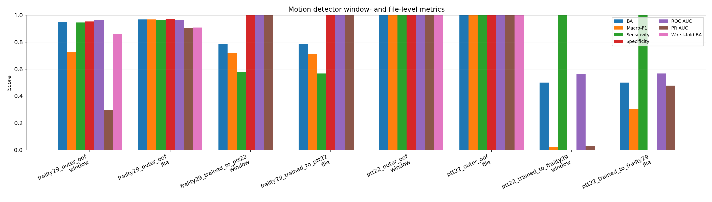
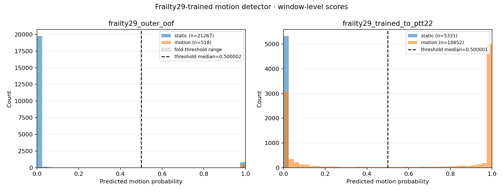
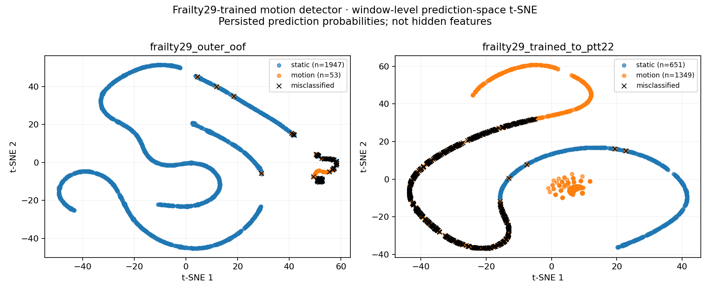
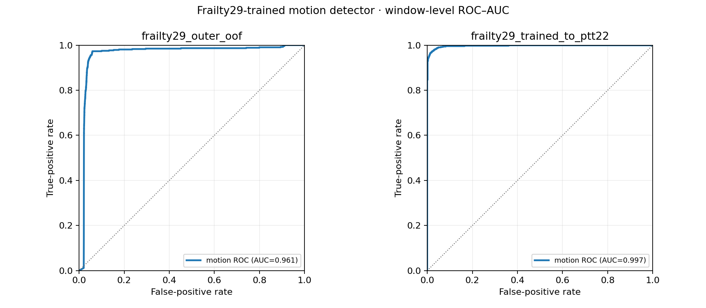
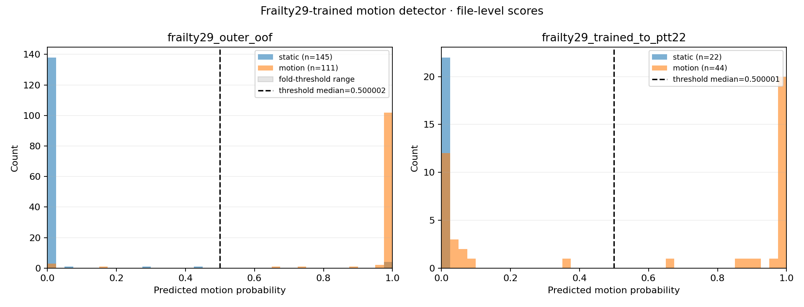
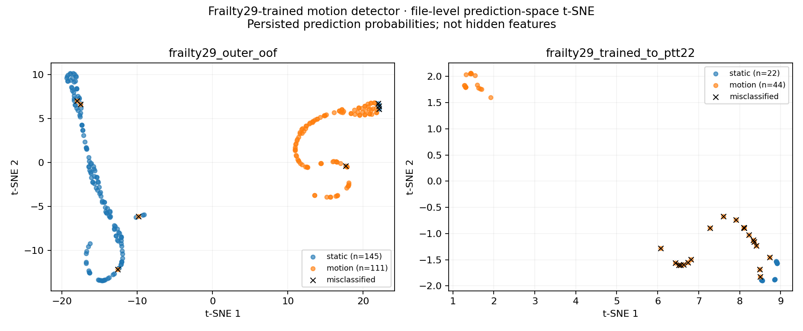
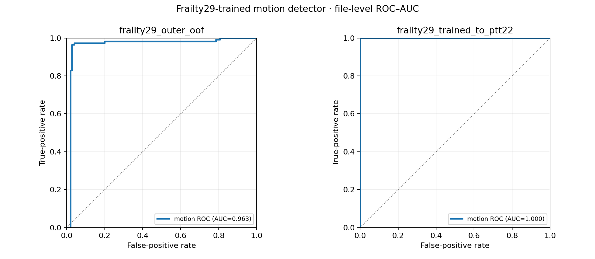
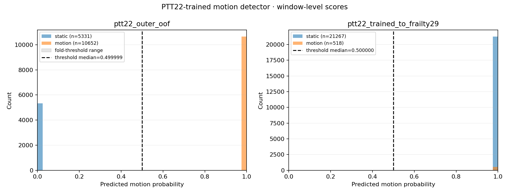
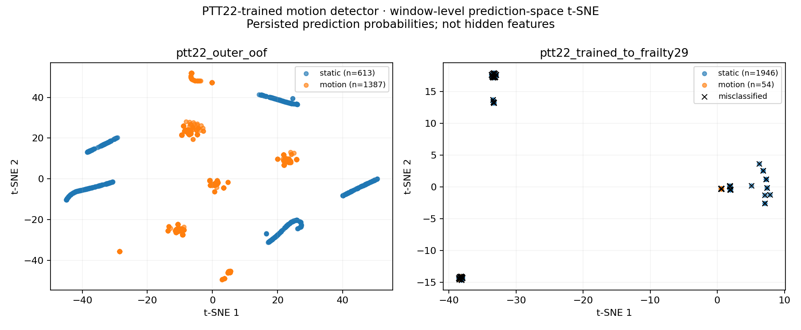
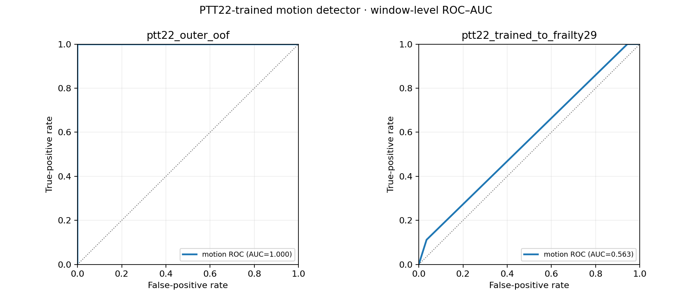
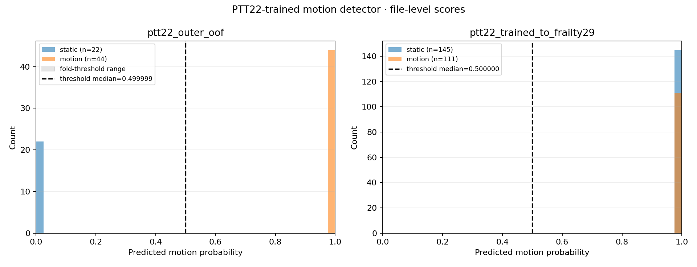
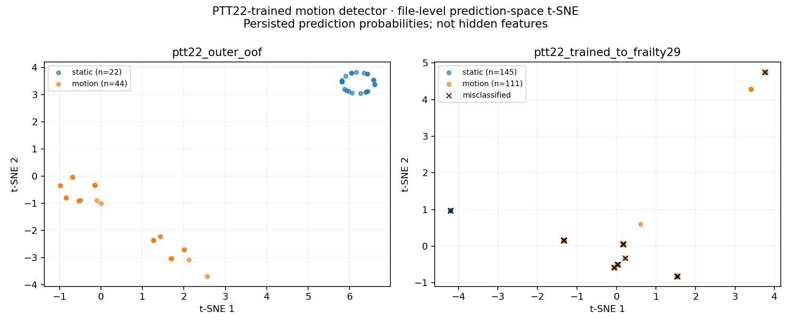
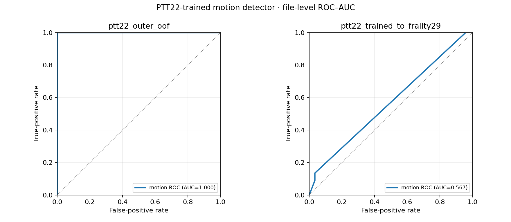
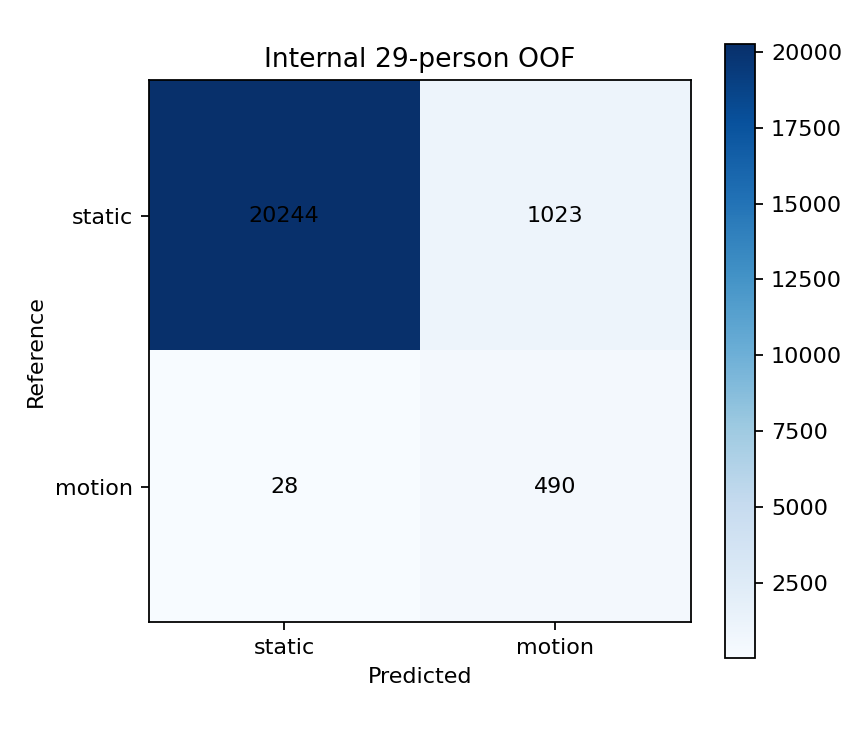
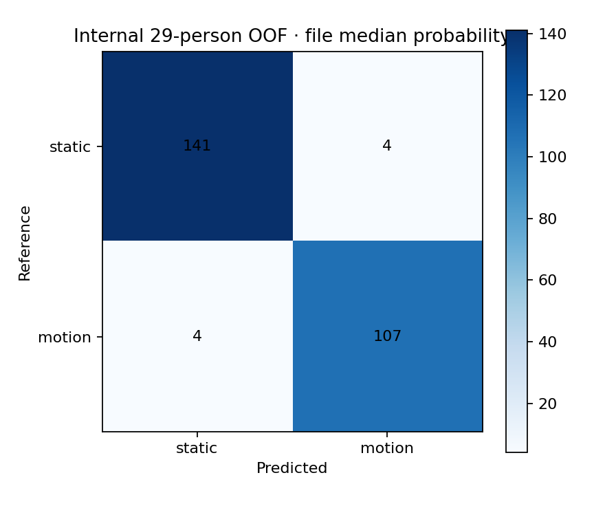

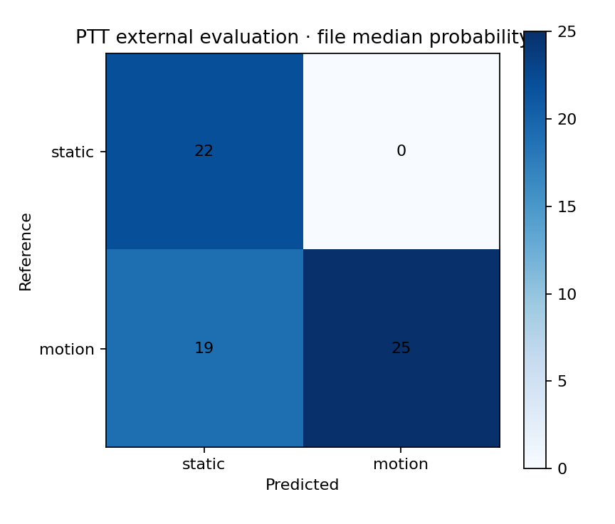
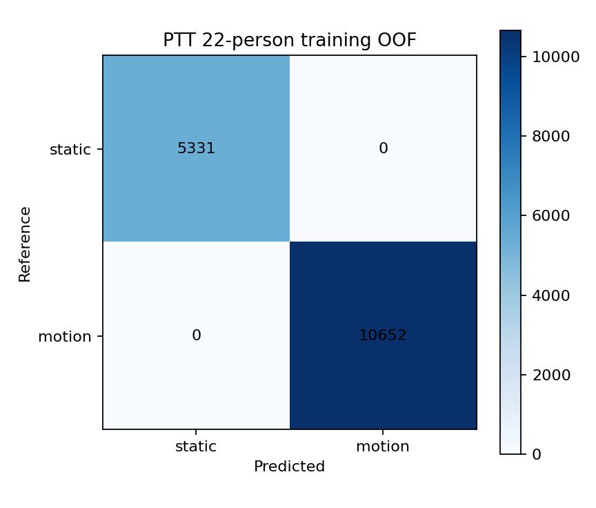
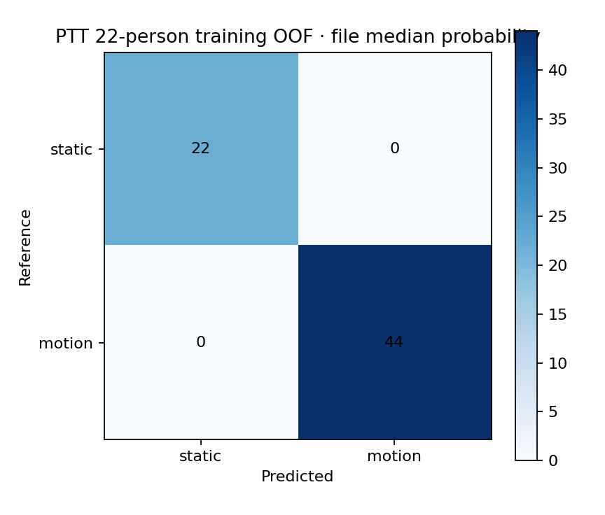
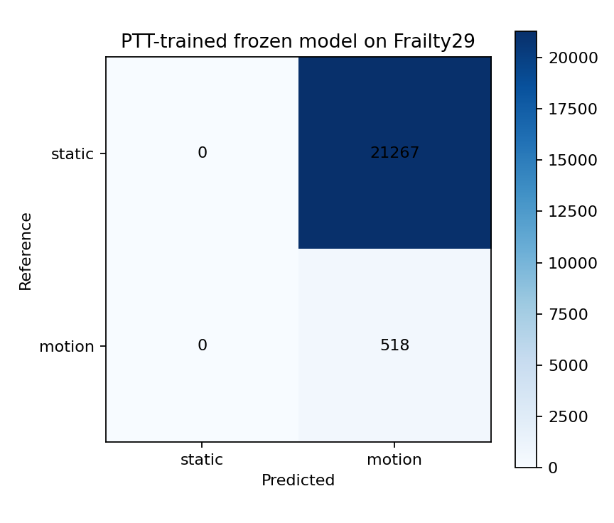
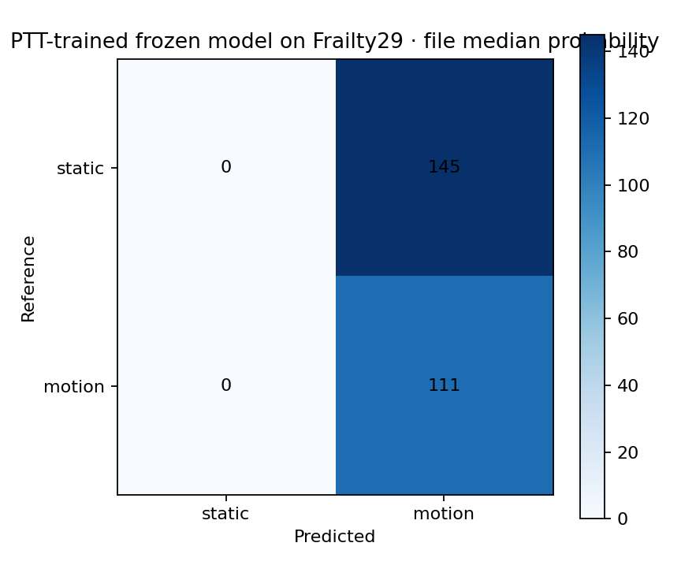
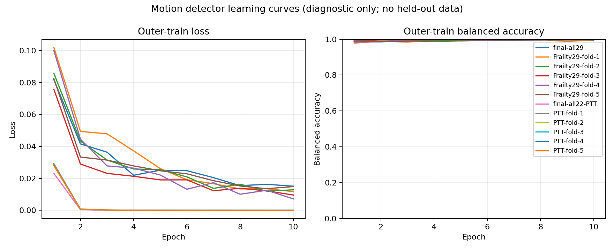

## Numerical outputs

### Detector internal grouped-OOF evaluation

| aggregation_level | balanced_accuracy | dataset | evaluation_scope | file_count | file_score_aggregation | macro_f1 | model_id | observation_count | participant_count | pr_auc | roc_auc | sensitivity | specificity | window_count | worst_fold_balanced_accuracy |
| --- | --- | --- | --- | --- | --- | --- | --- | --- | --- | --- | --- | --- | --- | --- | --- |
| window | 0.948921625815405 | frailty29_outer_oof | source_grouped_oof | 256 | not_applicable | 0.7286097008916265 | frailty29_trained_motion_detector | 21785 | 29 | 0.29467998560424485 | 0.9611526767684194 | 0.9459459459459459 | 0.9518973056848639 | 21785 | 0.8577964307320025 |
| file | 0.968188878533706 | frailty29_outer_oof | source_grouped_oof | 256 | median | 0.968188878533706 | frailty29_trained_motion_detector | 256 | 29 | 0.9035386118005547 | 0.9625970798384591 | 0.963963963963964 | 0.9724137931034482 | 21785 | 0.9083333333333333 |
| window | 1.0 | ptt22_outer_oof | source_grouped_oof | 66 | not_applicable | 1.0 | ptt22_trained_motion_detector | 15983 | 22 | 1.0 | 1.0 | 1.0 | 1.0 | 15983 | 1.0 |
| file | 1.0 | ptt22_outer_oof | source_grouped_oof | 66 | median | 1.0 | ptt22_trained_motion_detector | 66 | 22 | 1.0 | 1.0 | 1.0 | 1.0 | 15983 | 1.0 |

### Detector frozen cross-dataset evaluation

| aggregation_level | balanced_accuracy | dataset | evaluation_scope | file_count | file_score_aggregation | macro_f1 | model_id | observation_count | participant_count | pr_auc | roc_auc | sensitivity | specificity | window_count | worst_fold_balanced_accuracy |
| --- | --- | --- | --- | --- | --- | --- | --- | --- | --- | --- | --- | --- | --- | --- | --- |
| window | 0.7888659406684191 | frailty29_trained_to_ptt22 | frozen_cross_dataset | 66 | not_applicable | 0.717827822203215 | frailty29_trained_motion_detector | 15983 | 22 | 0.9986372474882552 | 0.9970923018587812 | 0.5777318813368382 | 1.0 | 15983 | None |
| file | 0.7840909090909092 | frailty29_trained_to_ptt22 | frozen_cross_dataset | 66 | median | 0.7115251897860594 | frailty29_trained_motion_detector | 66 | 22 | 1.0 | 1.0 | 0.5681818181818182 | 1.0 | 15983 | None |
| window | 0.5 | ptt22_trained_to_frailty29 | frozen_cross_dataset | 256 | not_applicable | 0.02322557503474869 | ptt22_trained_motion_detector | 21785 | 29 | 0.030404784971438684 | 0.5634732731643438 | 1.0 | 0.0 | 21785 | None |
| file | 0.5 | ptt22_trained_to_frailty29 | frozen_cross_dataset | 256 | median | 0.3024523160762943 | ptt22_trained_motion_detector | 256 | 29 | 0.4778438438438438 | 0.5674433053743398 | 1.0 | 0.0 | 21785 | None |

### Detector window-level confusion counts

| aggregation_level | dataset | true_motion_predicted_motion | true_motion_predicted_static | true_static_predicted_motion | true_static_predicted_static |
| --- | --- | --- | --- | --- | --- |
| window | frailty29_outer_oof | 490 | 28 | 1023 | 20244 |
| window | frailty29_trained_to_ptt22 | 6154 | 4498 | 0 | 5331 |
| window | ptt22_outer_oof | 10652 | 0 | 0 | 5331 |
| window | ptt22_trained_to_frailty29 | 518 | 0 | 21267 | 0 |

### Detector file-level confusion counts

| aggregation_level | dataset | true_motion_predicted_motion | true_motion_predicted_static | true_static_predicted_motion | true_static_predicted_static |
| --- | --- | --- | --- | --- | --- |
| file_median_window_probability | frailty29_outer_oof | 107 | 4 | 4 | 141 |
| file_median_window_probability | frailty29_trained_to_ptt22 | 25 | 19 | 0 | 22 |
| file_median_window_probability | ptt22_outer_oof | 44 | 0 | 0 | 22 |
| file_median_window_probability | ptt22_trained_to_frailty29 | 111 | 0 | 145 | 0 |

### Detector classification diagnostic availability

| classifier_id | prediction_row_count | prediction_score_status | prediction_tsne_status | roc_auc_curve_status | roc_curve_point_count | tsne_point_count |
| --- | --- | --- | --- | --- | --- | --- |
| frailty29_trained_motion_detector | 38090 | available | available | available | 3184 | 4322 |
| ptt22_trained_motion_detector | 38090 | available | available | available | 2010 | 4322 |

Window-level metrics weight every persisted 8 s window equally. File-level metrics first take the median motion probability across all windows sharing one physical `file_id`, then apply that file's frozen threshold once. No participant-level aggregation is used in these detector report tables. Worst-fold BA is reported only for grouped-OOF rows; a final frozen cross-dataset application has no training fold, so that cell is N/A.
The ROC figures are empirical ROC curves with AUC annotated on the curve; `motion_detector_metrics.png` remains a separate metric summary bar plot. t-SNE uses only persisted prediction probability vectors and must not be described as a hidden-feature embedding.

### Frozen motion-model comparison candidates

| candidate_id | model_path | model_sha256 | preprocessing_ekf_config_sha256 | source_evidence_path | source_evidence_sha256 | threshold_derivation | threshold_path | threshold_sha256 | training_dataset | training_participant_count |
| --- | --- | --- | --- | --- | --- | --- | --- | --- | --- | --- |
| frailty29_trained_legacy_reference | frailty29_trained_legacy_reference/formal_motion_model.pt | 4a20624f0414400a471f1a74a1a6fe708790c056a1f7bc7ac82ec33f961b5247 | 832271ff52c7fcb5e9f461a6dae457209363db8124867b99fa643e48556d2275 | /home/trinker/Code/github/PPG-Frailty-pipeline/final_v0/final_pipeline_v2/artifacts/studies/static_line_b_staged_v2/20260820_182324_staged-static-05-pre-motion-ptt-v1/motion_internal/motion_internal_evidence.json | c716bc34972561c8eca69a500da232224260a2353239b3e0e85532b554c195d0 | strict_training_dataset_outer_oof_only | frailty29_trained_legacy_reference/deployment_threshold.json | 1602e5612c90710dcf838fbc6ea6f900f0337ac15d47a1864781ea17140de70f | frailty29 | 29 |
| ptt22_trained_reverse_ablation | ptt22_trained_reverse_ablation/formal_motion_model.pt | f3687dc3984bdfc33c3b977df35e1d902be72173c87b75945aac02e412ff70b6 | cd160a20a38011ee31f57f455862c03a62492d900f1a4000a68ad6822bd2c292 | /home/trinker/Code/github/PPG-Frailty-pipeline/final_v0/final_pipeline_v2/artifacts/studies/static_line_b_staged_v2/20260820_225546_staged-static-05-pre-motion-ptt-v1/motion_ptt_training/motion_ptt_training_evidence.json | 2cf9ebc2ded1b26d744299f161465d39a84d164e69403f212ad3d30c046ef7f8 | strict_training_dataset_outer_oof_only | ptt22_trained_reverse_ablation/deployment_threshold.json | f04b7d5e4bdcff9504f65d3628f0279878aff4370af5aba52705c5a2b52bc268 | ptt_ppg_1_1_0_local | 22 |

These two parameter sets are packaged for a later paired single-factor comparison in the selected final frailty classifier; Stage5-pre does not train that downstream classifier.

### Denoiser benchmark

Skipped by execution option.

Machine-readable values are in `study_summary.json` and `tables/`. Each report table has an individual CSV; `tables/report_tables.xlsx` contains one table per worksheet, and `tables/table_figure_pairs.csv` records every analytical figure/table pair.
