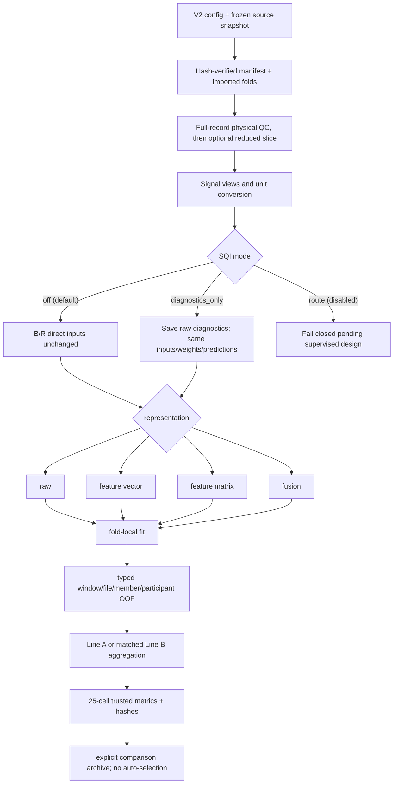

# End-to-end V2 workflow

All fitted preprocessing and models see outer-training participants only.
Source bytes are checked before and after numeric parsing. Outputs are staged
and published without overwrite. Reduced execution cannot be promoted to a
complete 5×5 result.

The safe gate exercises build-data identity and representation construction,
not training or scientific metrics. Formal ShapeFormer, motion, ablation,
comparison, final-refit and ONNX routes have explicit gates and are never
triggered by validation.

