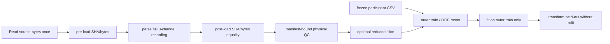

# V2 data, folds and leakage boundary

Physical admission currently checks finite values, nonfinite gap zero,
minimum-duration requirements and exact constant-channel rejection. Device
rails, clipping/saturation and absolute limits are explicitly deferred and
represented as null, never placeholder numbers. CSV timestamps are not
required; the manifest sampling grid is used.

The single seed42 fold artifact is for the internal motion reference. Frailty
formal execution uses the distinct repeated 5×5 artifact. Membership is copied
from the frozen authority; runtime splitter calls are prohibited.

